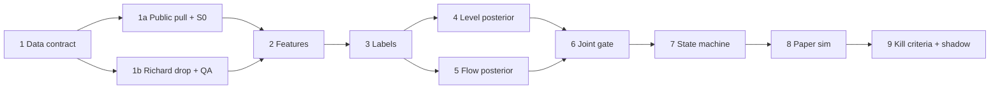
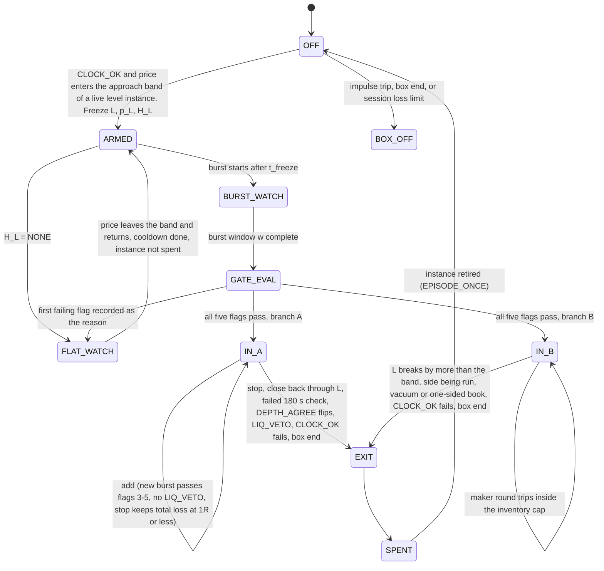

# Level × live-flow aggression Bayes: morning build framework and research program

**PAPER ONLY.** No live orders, no exchange keys, no order path, no sizing in currency. No Sharpe ratio, hit rate, PnL or volume figure in this file was computed, and none is claimed.

Every number in this file comes from one of four sources, and each is tagged:

| Tag | Source | Verified by this run? |
|---|---|---|
| `[still]` | The two desk stills of Fri 2 Oct 2026 (board 1: 16:30 ET crosshair, shot 17:32:17; board 2: 17:25 ET crosshair, shot 17:29:47) | Read directly |
| `[PR7]` | The Grok 4.7 tape read, [PR #7](https://github.com/Czegledi92/mm-regime-logger/pull/7), `desk-briefs/tape-reads/20261002-post-us-close-btc-shorts-grok47.md` | **No.** The 2 Oct archive files were not yet published, and the Binance futures REST API returns HTTP 451 from this VM |
| `[BAYES-0102]` | Overnight study JOB-20261002-CASH-VWAP-LEVEL-BAYES, as relayed in the task. The brief is on Richard's machine (`/Users/I350507/Desktop/desk-inbox-staging/cash_vwap_level_bayes_20261002.md`), not in this repo | **No** |
| `[ARCHIVE]` | This run's listing and sampling of the public Binance archive (`data.binance.vision`), checked 2026-10-02 22:06–22:10 UTC | Yes |

Anything without one of these tags is a definition, a proposal or a placeholder, and is labelled as such. Anything else is **unknown**.

| | |
|---|---|
| Track | HFT-strategies, sub-track `aggression-bayes` |
| Instrument | Binance USDⓈ-M BTCUSDT perpetual. Binance spot BTCUSDT is used only as a control |
| Status | v0 framework. Study 1 has a computable spec, [`20261003-s1-level-x-bar-flow-spec.md`](20261003-s1-level-x-bar-flow-spec.md) (v1.1). **S0 and S1 v1.1 have been run:** H1 Pass, H2 Fail, G Fail, and placebo levels respect as often as real ones ([`results/s1_v1.1/20261003-s1-results.md`](results/s1_v1.1/20261003-s1-results.md)). S2 is next; DOM work stays on hold |
| Iteration log | 01: [`20261003-iter01-gate-after-1002-stills.md`](20261003-iter01-gate-after-1002-stills.md), proposed joint-gate changes after the 2 Oct stills. Proposals only; the locked gate below is unchanged until Desk Floor decides |
| Gate names | Locked by Desk Floor: `CLOCK_OK`, `INDEPENDENT_AGREE`, `PRINT_CONFIRM`, `DEPTH_AGREE`, `EDGE_OK`. The default state is `FLAT_WATCH` |
| Inputs this run has not seen | Richard's live 1 s tape, his DOM recordings, his historical files, the 168 MB mp4 (not attached, **not watched**), and the Bayes brief |
| Related packets | VWAP SD mean reversion ([PR #5](https://github.com/Czegledi92/mm-regime-logger/pull/5)); VWAP regime-follow with an EMA ribbon, VRF-EMA v0 ([PR #6](https://github.com/Czegledi92/mm-regime-logger/pull/6)); paper regime logger ([PR #1](https://github.com/Czegledi92/mm-regime-logger/pull/1)), whose `FLAT_WATCH`, quote-walk veto and `SIG-PULL` vocabulary this file reuses |

## Contents

- [Morning framework: how we build this](#morning-framework--how-we-build-this)
  - [Joint gate (Desk Floor, locked)](#joint-gate-desk-floor-locked-names-and-order)
  - [A. Ordered build steps](#a-ordered-build-steps)
  - [B. Exact inputs he must provide](#b-exact-inputs-he-must-provide)
  - [C. Volume-first mid-frequency design](#c-volume-first-mid-frequency-design)
  - [D. What I will have by morning vs what waits on his files](#d-what-i-will-have-by-morning-vs-what-waits-on-his-files)
- [Research program](#research-program)
  1. [Thesis in operational language](#1-thesis-in-operational-language)
  2. [Pattern catalog: aggression and adverse selection](#2-pattern-catalog-aggression-and-adverse-selection)
  3. [Live DOM against subsequent price: what is testable](#3-live-dom-against-subsequent-price-what-is-testable)
  4. [Edge: mid-frequency vs high-frequency](#4-edge-mid-frequency-vs-high-frequency)
  5. [Study ladder](#5-study-ladder)
  6. [Level set](#6-level-set)
  7. [Entry and scale-in paper state machine](#7-entry-and-scale-in-paper-state-machine)
  8. [Creative proposals: first tests](#8-creative-proposals-first-tests)
  9. [Overnight loop plan](#9-overnight-loop-plan)
- [Appendix A. Worked example: the 2 Oct stills under the locked gate](#appendix-a-worked-example-the-2-oct-stills-under-the-locked-gate)
- [Appendix B. Prior desk facts: verification status](#appendix-b-prior-desk-facts-verification-status)
- [Appendix C. Open questions for Desk Floor](#appendix-c-open-questions-for-desk-floor)
- [Appendix D. Sources](#appendix-d-sources)

---

## Morning framework — how we build this

**Goal.** Build a **mid-frequency** paper model that decides on a 1-second clock and holds for minutes. It is not a latency race. The model should produce **as much paper volume as possible**, but only enter or scale when the level posterior and the live-flow posterior agree. Profitability is the constraint; volume is the objective inside that constraint. PAPER ONLY. No live orders. No invented Sharpe.

**The plan in one paragraph.** Freeze a level and its posterior before anything happens. The level is the active session's VWAP, or the high, low or mid of a finished initial balance (IB). Then wait for a 1-second aggression burst at that level. The burst may only confirm or veto what the level already said. Walk the five Desk Floor flags in order; any miss is `FLAT_WATCH`. Volume comes from three places. First, switching on more cells (level type × branch × session box × entry type), each of which has passed the fee and adverse-selection check on held-out data. Second, zero-fee maker fills in the two-sided-rest branch. Third, scale-ins that add units without adding risk. Volume never comes from loosening a gate.

### Joint gate (Desk Floor, locked names and order)

All five flags are required, in this order. The first miss sets `FLAT_WATCH` and records that flag as the reason. Later flags are still computed for the log but cannot override the miss.

| # | Flag (owner) | Passes when | Sub-vetoes | Fails (`FLAT_WATCH`) when | Live data needed | Testable in Study 1 (public bars)? |
|---|---|---|---|---|---|---|
| 1 | `CLOCK_OK` (Macro) | The active session box has a **finished IB**; prints are scored on **that box's** session VWAP; `event_window` is off | Impulse day kills the box | Pre-IB; VWAP from another box or from an unknown anchor; inside an event window; impulse rule tripped | Clock, box config, event calendar, causal impulse flag | Yes |
| 2 | `INDEPENDENT_AGREE` (Lucas) | The level (session VWAP or finished IB) and its posterior were **frozen before** the 1 s burst, and the burst **confirms** the frozen hypothesis. The burst only confirms or vetoes | `LIQ_VETO`: oi_Δ down during the aggression. `EPISODE_ONCE`: one agree per frozen level | Level not frozen first; the burst would have to originate the direction; the same prints feed both posteriors; OI falls during the aggression; the level instance is already spent | Level registry with freeze timestamps, tape, OI | Yes at 1 m resolution. `LIQ_VETO` only on 5 m OI, which is approximate |
| 3 | `PRINT_CONFIRM` (QA) | Real prints, or a sweep, **at the level** | `ABSORB_VETO`; `SPOOF_PULL_VETO` | Mid quote-walks across the level with no prints there; aggression is absorbed against the hypothesis; size at the level is pulled or flickers | Tape with aggressor flag; L1 quotes or DOM | Partly: prints at the level from bar range and volume. Quote-walk and spoof: no |
| 4 | `DEPTH_AGREE` (MMT) | Branch **A**: continuation reload, *or* opposing fail-to-refill. Branch **B**: two-sided rest. **No vacuum.** A XOR B | none | Vacuum; both A and B hold; neither holds; the branch does not match the frozen hypothesis | DOM diffs, or book snapshots every 250 ms or faster | No. A coarse 30 s proxy from public `bookDepth` is S2b |
| 5 | `EDGE_OK` (Benjamin) | **Only** the fee and adverse-selection check: we are not the side being run, **and** the 180 s markout clears maker 0 bp / taker ~1.09 bp | none | We are the side being run; or the 180 s markout does not exceed the fee for the entry type | Tape, true mid, the held-out markout table | Proxy only (3-minute forward close) |

**This run's reading of the locked wording.** Names and order are unchanged. The readings below are this run's interpretation and need confirmation from each owner (Appendix C).

1. **Branches A and B.** Branch A is *continuation*: the frozen level hypothesis is BREAK, the burst prints through the level, and the paper book joins the aggressor. Branch B is *two-sided rest*: the hypothesis is RESPECT, the book is two-sided at the level, and the paper book rests maker quotes around it with a skew toward the hypothesis. These are **not** the Book A / Book B labels of VRF-EMA v0 ([PR #6](https://github.com/Czegledi92/mm-regime-logger/pull/6)), where Book A is the two-sided inventory book and Book B is the directional perp book. The two pairs of labels mean different things and must not be mixed up.
2. **On A, opposing fail-to-refill counts as depth agreement.** If the side that was just consumed does not come back, that supports continuation. It is scored under `DEPTH_AGREE`, and it is never an `EDGE_OK` failure.
3. **Two-sided rest is the B allow.** It is a `DEPTH_AGREE` condition; `EDGE_OK` does not check it.
4. **`EDGE_OK` at decision time cannot see the next 180 s.** It uses two inputs: (a) a live side-being-run check over the last few seconds, and (b) the held-out lower confidence bound of the 180 s markout for this gate cell, frozen from the training split. In replay, each episode's realized 180 s markout is a label. It refreshes input (b) only on the next training window, never in-sample.
5. **Fees.** Maker 0 bp and taker ~1.09 bp are read as per side, before slippage. This run does not know which fee tier they come from. For this track they replace the 5 bp taker / 1 bp maker placeholders of VRF-EMA v0.
6. **Neutral level priors.** "The burst only confirms or vetoes" means a level whose frozen posterior has no lean has nothing to confirm, so it is `FLAT_WATCH`. `[BAYES-0102]` says most cash/session levels are near coin-flip. Study 1's first job is therefore to find frozen, pre-burst level *states* that do lean. If it finds none, the gate as locked will produce almost no trades. That outcome goes back to Desk Floor; it is not patched by letting the burst choose the direction.

**Fake volume the gate must exclude.** The first ten rows are the Desk Floor list. The last two are added by this run.

| Fake volume | What it looks like | Excluded by | Detectable from |
|---|---|---|---|
| Event bursts | Aggression inside a scheduled-release window | `CLOCK_OK` (`event_window`) | Event calendar |
| Liquidation cascades | One-sided aggression while OI falls | `INDEPENDENT_AGREE`, via `LIQ_VETO` | OI polled every 5 s or faster (live); 5 m OI historically (approximate) |
| Pre-IB | Touches before the box's IB has finished | `CLOCK_OK` | Clock |
| Wrong-session VWAP | Prints scored against another box's VWAP, or against a platform VWAP whose anchor is unknown | `CLOCK_OK` | Box config |
| Quote-walk | Mid crosses the level with no prints at the level | `PRINT_CONFIRM` | L1 quotes or DOM, plus tape |
| Spoof flicker | Size appears and is cancelled at the level without trading | `PRINT_CONFIRM`, via `SPOOF_PULL_VETO` | DOM diffs |
| Touch ping-pong | Repeated touches of the same level | `INDEPENDENT_AGREE`, via `EPISODE_ONCE` | Level registry |
| Ask-vacuum (and bid-vacuum) | Price travels through an empty side on little volume | `DEPTH_AGREE` (no vacuum) | DOM |
| One sweep scored as both posteriors | The burst that confirms also moved the level prior | `INDEPENDENT_AGREE` (disjoint data) | Freeze timestamps |
| Impulse days | The box trips the impulse rule | `CLOCK_OK` kill | Causal intraday rule (§C6) |
| *Churn (added)* | Exit and re-entry inside one episode with no new burst | State machine: no re-entry after an exit in the same episode. Excluded from `V_qual` | Fill log |
| *Optimistic maker fills (added)* | A paper maker fill counted when price only touches the quote | Fill model: trade-through or queue model only | Tape, plus DOM for the queue |

0–5 bp kisses: `[BAYES-0102]` reports them as break-heavy. A kiss is its own event class, not fake volume by itself. Because it is measured on the touch bar, it is burst-side information and cannot sit in the frozen level prior (S1 spec, correction R1). Repeated kisses are ping-pong, and `EPISODE_ONCE` caps them.

### A. Ordered build steps

Each step lists what "done" means, why the next step cannot start without it, and who does it. "Agent" means a future agent run doing a study. "Richard" means an export or written confirmation from him. "Owner" means the Desk Floor flag owner signs the threshold.

| Step | Name | Done means | Blocks the next step because | Who |
|---|---|---|---|---|
| 1 | **Data contract** | The schemas in §B are frozen; the drop layout and manifest are agreed; session boxes, VWAP formula, IB length, fee numbers, event calendar and impulse rule are confirmed in writing | Every later step reads these files and clocks | Agent drafted this file. Richard confirms boxes, VWAP formula, fees and calendar. Macro defines the impulse rule |
| 1a | Public pull and S0 audits | Archive klines, aggTrades, metrics and bookDepth for the study window are downloaded with checksums; per-minute kline taker-buy volume reconciles to aggTrades; the board's VWAP anchor is identified for 2 Oct once that day is archived | Features need clean bars; `CLOCK_OK` needs to know which VWAP the board shows | Agent |
| 1b | Richard's drop and ingest QA | His tape, DOM and OI files pass schema checks; DOM update-id continuity is checked; the clock offset against the archive on overlapping days is reported | DOM features cannot be trusted before this | Richard exports. Agent validates |
| 2 | **Features** | Level-state features (pre-freeze data only) and burst features (post-freeze data only), at bar resolution (S1), 1 s tape (S2) and DOM (S3), each row carrying its source timestamps | Labels and posteriors consume them | Agent. The DOM part is blocked on 1b |
| 3 | **Labels** | Respect/break outcomes per the Bayes event algebra; signed markouts at 30 s, 60 s, 180 s, 5 m and 15 m; each fee-adjusted at maker 0 and taker 1.09 bp | Both posteriors are fit against these | Agent. Algebra definitions come from Richard's brief |
| 4 | **Level posterior** | A frozen model of P(respect or break \| level state), with chronological splits, a calibration plot, and the list of level states that lean | `INDEPENDENT_AGREE` needs a hypothesis to confirm | Agent (S1a) |
| 5 | **Flow posterior** | Burst likelihood ratios (confirm / veto) for each hypothesis, fit on post-freeze data only, at bar, then tape, then DOM resolution | The joint gate needs it | Agent (S1b, S2, S3) |
| 6 | **Joint gate** | The five flags in locked order, the sub-vetoes, `FLAT_WATCH` reason codes and a gate log | The state machine fires off it | Agent implements. Owners sign thresholds |
| 7 | **Entry / scale-in state machine** | The §7 machine coded as a replay engine with no order path | The paper sim needs it | Agent. Desk Floor approves |
| 8 | **Paper sim** | Replay over held-out sessions with the fill model, fees, 180 s markouts, the volume metrics `V_units`, `V_qual` and `V_fake_shadow`, and PnL in bp per unit | Kill criteria are evaluated on its outputs | Agent (S4) |
| 9 | **Kill criteria** and forward shadow | Pre-registered kills evaluated once on the test split; then a forward shadow on new sessions | Nothing follows. There is no live path | Agent evaluates. Richard keeps the recorder running |



Steps 1a through 5 at bar and 1 s tape resolution need **nothing** from Richard except written confirmations and the Bayes brief. Only the DOM-resolution parts of steps 2 and 5, and steps 6 to 9 in their full form, wait on his recordings.

### B. Exact inputs he must provide

#### B0. What we already have, or can pull ourselves `[ARCHIVE]`

Checked on `data.binance.vision` (S3 bucket listing), 2026-10-02 22:06–22:10 UTC. Schemas were read from the 2026-10-01 files.

| Dataset | Archive path | First file | Last file at check | Granularity | Columns |
|---|---|---|---|---|---|
| USDⓈ-M klines, 1 m | `data/futures/um/daily/klines/BTCUSDT/1m/` | 2019-12-31 | 2026-10-01 | 1 m | `open_time, open, high, low, close, volume, close_time, quote_volume, count, taker_buy_volume, taker_buy_quote_volume, ignore` |
| USDⓈ-M klines, 5 m | `…/klines/BTCUSDT/5m/` | 2019-12-31 | 2026-10-01 | 5 m | same |
| USDⓈ-M aggTrades | `data/futures/um/daily/aggTrades/BTCUSDT/` | 2019-12-31 | 2026-10-01 | tick, ms | `agg_trade_id, price, quantity, first_trade_id, last_trade_id, transact_time, is_buyer_maker`. The 2026-10-01 file is about 15 MB zipped. **Do not bucket by minute or second with it:** on 2026-10-01, 139 of 1,440 minutes disagree with the klines on volume. Use it for sweep groups only |
| USDⓈ-M trades | `data/futures/um/daily/trades/BTCUSDT/` | 2019-09-08 | 2026-10-01 | tick, ms | `id, price, qty, quote_qty, time, is_buyer_maker`. The 2026-10-01 file is about 24 MB zipped. It reconciles **exactly** with the 1 m klines (volume, taker-buy volume, trade count, in every minute), so it is the source for 1 s bars |
| USDⓈ-M bookDepth | `data/futures/um/daily/bookDepth/BTCUSDT/` | 2023-01-01 | 2026-10-01 | snapshots about every 30 s (on 2026-10-01: 2,880 snapshots, gaps 24–36 s) | `timestamp, percentage, depth, notional`. Bands are ±0.2, ±1, ±2, ±3, ±4 and ±5 % of mid; depth is cumulative BTC (negative percentages are the bid side) |
| USDⓈ-M metrics | `data/futures/um/daily/metrics/BTCUSDT/` | 2020-09-01 | 2026-10-01 | 5 m | `create_time, symbol, sum_open_interest, sum_open_interest_value, count_toptrader_long_short_ratio, sum_toptrader_long_short_ratio, count_long_short_ratio, sum_taker_long_short_vol_ratio` |
| Mark price and premium index klines, 1 m | `…/markPriceKlines/`, `…/premiumIndexKlines/` | Dec 2019 | 2026-10-01 | 1 m | OHLC |
| Funding rate | `data/futures/um/monthly/fundingRate/BTCUSDT/` | 2020-01 | 2026-09 | per funding event | funding |
| Spot klines 1 m and spot aggTrades (control only) | `data/spot/daily/…/BTCUSDT/` | 2017-08-17 | 2026-10-01 | 1 m / tick | standard |
| USDⓈ-M bookTicker (L1 quotes) | `…/bookTicker/BTCUSDT/` | 2023-05-16 | **2024-03-30** | tick | **This series stops in 2024. There is no public L1 quote history for 2026** |

Not available publicly for 2026, and therefore only obtainable from Richard's recordings: L1 and L2 quotes and diffs, open interest finer than 5 m, and a liquidation history.

Two operational notes:

- The 2026-10-01 aggTrades and trades files were last modified at about 07:37–07:44 UTC on 2 Oct. By analogy, the 2 Oct files should appear around 07:45 UTC on 3 Oct. This is an expectation, not a guarantee.
- The Binance futures REST API (`fapi.binance.com`) returned HTTP 451 from this VM. Any live or REST collection (OI polling, the depth snapshot) has to run on Richard's side.

#### B1. Trade tape: Richard's live recording at 1 s or finer

History up to the previous day (T−1) we pull from the archive. His tape is still needed for two things: days the archive has not yet published, and timestamps taken on the **same host clock** as his DOM, so the two can be aligned.

| Field | Type / unit | Required? | Binance stream field (`btcusdt@aggTrade`) | Why |
|---|---|---|---|---|
| `ts_trade_ms` | int64, epoch ms, UTC | **Required** | `T` | Ordering, labels |
| `ts_event_ms` | int64, epoch ms | Optional | `E` | Exchange-side latency check |
| `ts_recv_us` | int64, host epoch µs | **Required** | recorder | Alignment to DOM; latency |
| `venue` | string, `BINANCE_USDM` | **Required** | constant | No mixing with spot |
| `symbol` | string, `BTCUSDT` | **Required** | `s` | |
| `price` | decimal, USDT | **Required** | `p` | |
| `qty` | decimal, BTC | **Required** | `q` | |
| `is_buyer_maker` (or `aggressor` ∈ {BUY, SELL}) | bool. `true` means the taker **sold** | **Required** | `m` | Aggressor side |
| `agg_trade_id` | int64 | **Required** | `a` | De-duplication; reconciliation with the archive |
| `first_trade_id`, `last_trade_id` | int64 | **Required** | `f`, `l` | Sweep detection (one taker order filling at several prices); reconciliation |
| `quote_qty` | decimal, USDT | Optional | derived | |

If only 1-second aggregates exist, the accepted *degraded* schema is: `ts_sec, buy_qty, sell_qty, buy_count, sell_count, high, low, last, vwap`. With it, sweep detection is lost and the `PRINT_CONFIRM` at-level check is weaker. Every result built on it must say so.

#### B2. Order book / DOM

**Preferred (lossless): diff stream plus snapshots.**

| Field | Type / unit | Required? | Binance field (`btcusdt@depth@100ms`) | Why |
|---|---|---|---|---|
| `ts_event_ms` | int64, epoch ms | **Required** | `E` | |
| `ts_txn_ms` | int64, epoch ms | **Required** | `T` | Aligns with trade `T` |
| `ts_recv_us` | int64, host epoch µs | **Required** | recorder | Same clock as the tape |
| `U`, `u`, `pu` | int64 | **Required** | `U`, `u`, `pu` | Gap detection: each message's `pu` must equal the previous `u` |
| `side` | `bid` / `ask` | **Required** | `b` / `a` arrays | |
| `price` | decimal | **Required** | array element | |
| `qty_new` | decimal, BTC. The absolute quantity at the level after the update; 0 means the level was removed | **Required** | array element | Replenishment, pull, refill |
| Snapshot rows: `lastUpdateId`, full bid/ask arrays, `ts_recv_us` | | **Required** at start, at every reconnect, and at least hourly | REST depth snapshot | Book reconstruction |
| Stream name and speed (for example `btcusdt@depth@100ms`) | | **Required** (manifest) | | Cadence matters for pull and flicker detection |

**Acceptable alternative: partial-book snapshots** such as `btcusdt@depth20@100ms` or `@250ms`. Required fields: `ts_event_ms`, `ts_txn_ms`, `ts_recv_us`, `u`, and bids and asks as (price, qty) pairs. Minimum **10 levels per side**, at a cadence of **250 ms or faster**. Replenishment and pull are then only visible inside those levels.

**Strongly recommended, optional: L1 quotes** from `btcusdt@bookTicker`: `u, E, T, b, B, a, A` plus `ts_recv_us`. These give a true mid for the 180 s markouts and make quote-walk detection exact.

**Not accepted as data:** video, screenshots and heatmap images. They are an annotation index only (§3.4).

**Optional:** platform exports (footprint cells, the depth-panel series, numeric heatmap values). These are useful only to calibrate what the boards display.

One limit applies to every DOM format: Binance depth messages carry level quantities, not order IDs. A cancel can only be inferred as a quantity decrease minus the volume traded at that price in the same interval. That is why the tape and the DOM must share a clock.

#### B3. Open interest, liquidations, funding

| Item | Fields | Required? | Source | Note |
|---|---|---|---|---|
| OI poll | `ts_exchange_ms` (response `time`), `ts_recv_us`, `open_interest` (BTC), polled every 5 s or faster (1–2 s preferred) | **Required** for a live `LIQ_VETO` at burst scale | REST `GET /fapi/v1/openInterest`; there is no OI websocket stream | Historical OI is 5 m (archive `metrics`); we pull that |
| Platform 1 m OI OHLC (as drawn on the boards) | `ts_minute, oi_open, oi_high, oi_low, oi_close`, plus a source label | Optional | his charting platform | `[PR7]` quotes minute-level OI; Binance's public archive is 5 m, so the source of 1 m OI should be named |
| Liquidations | `T, S, q, p, ap, X, z` | Optional | `btcusdt@forceOrder` | Binance pushes at most one liquidation snapshot per symbol per 1000 ms, so sums are **lower bounds** |
| Mark price / funding | `E, p, i, r, T` | Optional | `btcusdt@markPrice@1s` | The archive covers history |

#### B4. Bar history

We pull bars ourselves (B0). Richard exports none, unless his platform uses a VWAP construction we need to match. In that case, optional: a `platform_vwap` series with a written description of its anchor.

#### B5. Session clocks and calendars

All rows are **required** as written confirmations. The defaults are this run's proposals.

| Item | Proposed default | What to confirm |
|---|---|---|
| UTC box anchor | 00:00:00 UTC daily; VWAP resets at the anchor (the VRF-EMA v0 convention) | Yes or no |
| UTC box IB | [00:00, 01:00) UTC, 60 minutes | Yes or no |
| NY box anchor | 09:30 America/New_York. That is 13:30 UTC during EDT and 14:30 UTC during EST. In 2026, DST started 8 March and ends 1 November | Whether the NY box VWAP is anchored at 09:30 ET |
| NY box IB | [09:30, 10:30) ET | Yes or no |
| NY box end | 16:00 ET (cash close), or 17:00 ET (CME Friday halt and daily break) | Which one |
| Other boxes (Asia, London) | None | Only if `[BAYES-0102]` used them |
| VWAP formula | Σ(typical price × volume) / Σ volume on 1 m bars, frozen at t−1 (VRF-EMA convention); trade-level VWAP in tape studies | Which one the desk uses. The board's anchor is **unknown** |
| NY opening range (NYORL in `[BAYES-0102]`) | **Unknown** length | The length used |
| `event_window` calendar | File `events.csv` with `event_id, ts_utc, name, tier, pre_min, post_min` | The file itself (required for `CLOCK_OK`) |
| Impulse-day rule | Macro to define; a causal proposal is in §C6 | The rule |
| Fees | Maker 0 bp, taker ~1.09 bp, per side | Whether per side, and whether slippage is included |

#### B6. Existing level logs and prior study artefacts

| Item | Required? | Why |
|---|---|---|
| `cash_vwap_level_bayes_20261002.md` (the brief) | **Required** for Study 1 fidelity | It holds the event algebra definitions: touch, kiss, respect, break, horizons, bands, the NY window |
| The brief's code and event table (CSV or Parquet: `ts, box, level_type, level_value, approach_side, outcome`) | Optional | Saves recompute and allows exact reconciliation |
| VWAP-IB paper defaults | **Required if they exist** | The desk says they exist. This run did not find them on any branch of this repo |
| Live level logs: `ts_utc, box, level_type, level_value, frozen_at_ts, source` | Optional | Lets us check that levels were frozen when they were drawn |
| `manifest.json` per drop: recorder name and version, host, NTP or chrony offset at start and end, streams and speeds, UTC start and end, known gaps | **Required** | Clock trust and gap handling |

Proposed drop layout (raw data is not committed to git):

```text
desk-inbox/aggression-bayes/YYYY-MM-DD/
  manifest.json
  tape/      btcusdt_aggtrade_YYYYMMDD.parquet   (or .csv.gz)
  dom/       btcusdt_depth_diff_YYYYMMDD.parquet
  dom/snap/  btcusdt_depth_snapshot_YYYYMMDDTHHMMSS.json
  l1/        btcusdt_bookticker_YYYYMMDD.parquet  (optional, recommended)
  oi/        btcusdt_oi_poll_YYYYMMDD.parquet
  liq/       btcusdt_forceorder_YYYYMMDD.parquet  (optional)
  levels/    level_log_YYYYMMDD.csv               (optional)
  calendar/  events.csv
```

#### Minimum viable bundles

| Bundle | Unblocks | Contents | Needs from Richard |
|---|---|---|---|
| **MVB-1** | Study 1 (S0, S1) at full fidelity | The public archive (we pull), plus the Bayes brief, the session box / VWAP / IB confirmation, the event calendar and the impulse rule | Four small items. No market data |
| MVB-1-lite | Study 1 tagged `ALGEBRA=RECON, CLOCK=DEFAULT` | The public archive only | Nothing. The results must be re-run once MVB-1 arrives |
| MVB-2 | S2 (tape) and S2b (coarse depth) | Public aggTrades and bookDepth (we pull) | Nothing |
| **MVB-3** | DOM aggression studies (S3) and the full gate (S4) | His DOM (diff plus snapshots, or depth20 at 250 ms or faster), same-host tape with agg/trade IDs, OI polls every 5 s or faster, and a manifest. bookTicker recommended | Yes. The number of sessions needed is set after S2 measures how many gate-eligible episodes a session produces. It is not guessed here |

### C. Volume-first mid-frequency design

#### C1. Which horizons count as mid-frequency here

| Clock | Role | In scope? |
|---|---|---|
| Under 1 s | Queue position, latency | **No.** That is the HFT race. Recorded for diagnostics, never traded |
| 1 s | Decision clock; burst resolution | Yes |
| 5–60 s | Burst window `w`. One primary value is pre-registered (proposal: 15 s); 5, 30 and 60 s are robustness checks only | Yes |
| 180 s | The locked `EDGE_OK` markout horizon | Yes |
| 5 m, 15 m | Episode evaluation and typical hold | Yes |
| Until the box ends | Maximum hold | Yes |
| Multi-session | | No |

#### C2. Objective and constraint

Maximize the median `V_qual` per session box, subject to:

1. For every cell that is allowed to trade: the held-out lower 95% confidence bound of the net 180 s markout per unit filled is above 0 at that cell's entry fee.
2. Overall: the held-out lower 95% confidence bound of net episode PnL (bp per unit) is above 0.
3. Concentration: no single month and no single hour bucket supplies more than 50% of net PnL (the VRF-EMA B9 convention).
4. Worst session: no worse than −3R (placeholder; the VRF-EMA convention).

Volume can rise only through:

1. **More cells.** Enable additional (level type × branch × box × entry type) cells, each of which passes on the validation split.
2. **Maker-first entries** at 0 bp, which lower the hurdle a cell must clear.
3. **Branch B round trips** at bounded inventory.
4. **Scale-ins** inside an episode (C3).

Loosening a flag inside a cell after seeing the test split is not one of them.

#### C3. How scale-in adds volume without doubling risk

The risk unit is **1R**: the episode's loss at the episode stop, fixed per episode. Size is in abstract units `u`. There is no currency.

| | Branch A (continuation) | Branch B (two-sided rest) |
|---|---|---|
| First entry | 1u | Quotes on both sides of the frozen level, skewed toward the hypothesis, sized so that net inventory stays within ±Q (placeholder Q = 1u) |
| Scale-in | Up to 2 adds (placeholder), each of 0.5u or less. Each add needs a **new** burst: prints after the previous decision, never the same prints. That burst must pass flags 3–5, with no `LIQ_VETO` | Net inventory may reach the cap Q in the hypothesis direction and no further |
| Risk control | Before any add, the composite stop moves so that the whole position's loss at the stop is still 1R or less. If that stop cannot be placed without breaking the level logic, there is no add | Taker flatten if the level breaks by more than the band, if `EDGE_OK`'s side-being-run check trips, or if `DEPTH_AGREE` branch B fails (vacuum or a one-sided book) |
| Where the volume comes from | More fills per episode at the same 1R | Round trips at the same inventory cap |

For both branches: no adds after any reduce, no adds in the last N minutes of the box (placeholder N = 15), and no adds once `CLOCK_OK` fails.

#### C4. What would falsely inflate volume, and how it is kept out of `V_qual`

| Source | Why it inflates | Kept out by |
|---|---|---|
| Churn | Exit and re-entry inside one episode generates fills with no new information | No re-entry after an exit in the same episode; fills after an exit are excluded |
| 0–5 bp kisses / touch ping-pong | One level produces many marginal touches | `EPISODE_ONCE`; kisses are scored as their own class |
| Optimistic maker fills | A paper fill on a touch never happens in a real queue | Trade-through by at least 1 tick (tape-only), or queue depletion (DOM) |
| Quote-walk | The mid crossing the level looks like an event | `PRINT_CONFIRM` |
| Spoof flicker | Displayed size looks like defence | `SPOOF_PULL_VETO` |
| Event bursts, liquidation cascades | Huge one-sided prints with no level information | `CLOCK_OK`; `LIQ_VETO` |
| Pre-IB, wrong-session VWAP | Touches of a level that does not exist yet, or of the wrong level | `CLOCK_OK` |
| Ask-vacuum / bid-vacuum | Fast travel on thin volume | `DEPTH_AGREE` |
| One sweep scored as both posteriors | Double-counts the evidence and the episode | `INDEPENDENT_AGREE` |
| Adversely selected maker round trips | Real volume with negative edge: fills arrive when the market runs through us | `EDGE_OK` (side being run; 180 s markout) |
| Overlapping levels (for example IBL and the VWAP within the touch band) | One touch counted as two episodes | Cluster de-duplication: one episode with all level tags; `EPISODE_ONCE` spends every member |

#### C5. Paper volume metrics, kept separate from PnL

| Metric | Definition | Unit |
|---|---|---|
| `V_units` | Σ\|Δposition\| over all paper fills in a session box: entries, adds, exits and branch B round trips | units |
| `V_qual` | `V_units` restricted to fills in episodes where all five flags passed at entry and every add passed the add rule | units |
| `V_fake_shadow[c]` | The volume an ungated touch-and-follow replay would have generated in fake-volume category `c` | units, per category |
| `episodes` | AGREE episodes per box | count |
| `fills_per_episode`, `adds_per_episode`, `maker_share` | as named | count, ratio |
| `turnover_per_risk` | `V_qual` divided by the maximum \|position\| in units | ratio |
| `flat_watch_reasons` | Histogram of the first failing flag | count |

PnL is reported separately: net bp per unit (fees maker 0 / taker 1.09), the 180 s markout distribution, and R per episode. No currency.

**Structural ceiling.** `EPISODE_ONCE` means a box offers at most one AGREE per frozen level instance: IBH, IBL, IBM, plus VWAP instances (the VWAP re-arm rule in §7 is open for Lucas). With two boxes, that is a small, fixed number of candidate episodes per day. The main volume lever is therefore volume *per episode* (adds and branch B round trips), not the number of episodes. The real episode rate is **unknown** until S1.

#### C6. Impulse-day rule: proposal for Macro

The rule must be causal. The box is killed from the first moment any of these is true, using data up to t only:

1. \|return from the box anchor to the end of the IB\| is at or above the 90th percentile of the trailing 60 boxes;
2. the IB range is at or above the trailing 90th percentile;
3. a 1 m bar has \|return\| at or above the 99.9th percentile of the trailing 30-day distribution.

All thresholds are placeholders. An end-of-day "impulse day" label would leak future information and is not allowed.

### D. What I will have by morning vs what waits on his files

| Item | By morning (this PR) | Waits on |
|---|---|---|
| Framework, locked-gate spec with reading notes, data contract, input checklist | **Yes** | |
| Verified inventory of the public Binance archive: paths, date ranges, schemas | **Yes** (checked 2026-10-02 22:06–22:10 UTC) | |
| Study ladder with pass/fail rules; Study 1 computable spec (S1 v1.1, with S0 known answers) | **Yes** | |
| Iteration 01: proposed joint-gate changes after the 2 Oct stills | **Yes** ([note](20261003-iter01-gate-after-1002-stills.md)) | Desk Floor decisions |
| The worked example (2 Oct stills) scored against the five flags | **Yes**, qualitatively. Most cells are unknown (Appendix A) | |
| Study 1 results | **Yes, in a later run of this PR** (`ALGEBRA=RECON`): [results](results/s1_v1.1/20261003-s1-results.md) | Full fidelity still needs the Bayes brief (MVB-1) |
| Verification of the `[PR7]` numbers, the board's VWAP anchor and the board's depth panel | **No** | The 2 Oct archive files (expected around 07:45 UTC on 3 Oct, not guaranteed) |
| Tape-level study (S2) | **No** | The next run. Public `trades` are enough; S0 found that `aggTrades` volume does not reconcile with the 1 m klines |
| DOM studies (S3): `DEPTH_AGREE`, `SPOOF_PULL_VETO`, quote-walk, true-mid markouts | **No** | Richard's DOM, same-host tape and OI polls (MVB-3) |
| Paper sim with queue-aware maker fills (S4) | **No** | MVB-3, and S1–S3 passing |
| Any posterior, backtest, Sharpe ratio, PnL, hit rate or volume number | **No**, apart from the S1 v1.1 label shares and 3 m paper markouts in `results/s1_v1.1/`. No Sharpe ratio, PnL or fill model exists | The studies |
| Anything from the 168 MB mp4 | **No.** It was not attached and not watched | The file. Even then it is an annotation index only (§3.4) |

**Not claimed:** that a profitable model exists, that the gate has edge, or that the flow posterior adds anything to the level posterior. Those are exactly what the studies test.

---

## Research program

### 1. Thesis in operational language

There are two probability streams. They are built from disjoint data and combined only when they agree.

| Stream | Question it answers | Built from | Frozen when | Output |
|---|---|---|---|---|
| **Level posterior** | At this level, in this state, is the next resolution more likely RESPECT or BREAK? | Bars before `t_freeze`: level type, box, distance, approach speed, time since the IB ended, VWAP slope, IB width, prior touches this box, residual σ, and pre-freeze footprint facts such as an unfinished auction at a box extreme | At arming: when price first enters the approach band of a live level instance, and in any case at least 1 s before the burst starts | `p_L`, and hypothesis `H_L` ∈ {RESPECT (branch B), BREAK (branch A), NONE} |
| **Flow posterior** | Does the aggression burst at the level confirm or veto `H_L`? | Prints, DOM and OI strictly after `t_freeze`, inside the burst window [`t_b`, `t_b` + `w`] | End of the burst window | Likelihood ratio `Λ_F` for `H_L`; status of flags 3–5 |

**Combination.** If `Λ_F` and `p_L` are conditionally independent given the outcome, the joint log-odds is log-odds(`p_L`) + log `Λ_F`. Lucas's disjoint-data rule makes that independence plausible; it does not prove it. S1 and S2 test it by checking the residual correlation between level features and burst features, given the outcome. If independence fails, the model becomes a joint fit with an interaction term, not a sum of log-odds.

**Two directions.** Everything is symmetric: long and short, RESPECT from above (support) and from below (resistance), BREAK up and BREAK down. Every table reports each direction separately.

**Agreement matrix**

| Level hypothesis `H_L` \ burst | Confirms | Neutral | Vetoes |
|---|---|---|---|
| BREAK (branch A) | Candidate A; go to flags 3–5 | `FLAT_WATCH` | `FLAT_WATCH` |
| RESPECT (branch B) | Candidate B; go to flags 3–5 | `FLAT_WATCH` | `FLAT_WATCH` |
| NONE (no lean) | `FLAT_WATCH` | `FLAT_WATCH` | `FLAT_WATCH` |

A burst **confirms BREAK** when it prints through the level in the break direction, the aggressor makes progress, and OI is not falling. A burst **confirms RESPECT** when aggression into the level is absorbed, the book is two-sided, and price fails to progress through the level.

**What this is not.** It is not a flow model that merely filters by location; proposal P1 tests whether it collapses into one. It is also not a level model with a flow trigger that can override the level; the locked gate forbids that.

### 2. Pattern catalog: aggression and adverse selection

Each row is meant to be coded later. Thresholds in the "codeable definition" column are **placeholders** to be fixed on the develop split and then frozen. "Updates" names which posterior the pattern feeds and in which direction. The worked-example column uses only `[still]` and `[PR7]` facts.

| Pattern | Codeable definition (placeholders) | What it is NOT | Updates | Flag | Minimum data | Worked example |
|---|---|---|---|---|---|---|
| **Bid hit / offer lift** | Taker prints: `is_buyer_maker = true` hits bids; `false` lifts offers. Burst = a rolling `w`-second \|Σ signed qty\| at or above the trailing-24 h 95th percentile, with one-sided share ≥ 0.8, within ±5 bp of the level | Not a price change without prints (quote-walk). Not proof of new positions: the aggressor may be closing | Flow `Λ_F`: continuation in the aggressor's direction | `PRINT_CONFIRM` | Tape with aggressor flag | 16:41 ET: about 94.7% taker sell on 1,536.8 BTC `[PR7]` |
| **Quote-then-fill** | Size ≥ q at price p displayed continuously for at least `T_display` (proposal 60 s), then at least x% of it **traded** (not cancelled) during the burst | Not spoofing, where the size is displayed and then cancelled before trading. Not a fill with no prior display | Flow: a displayed level that is *traded through* favours BREAK. Afterwards, fail-to-refill supports A | `PRINT_CONFIRM`, then `DEPTH_AGREE` | DOM and tape on one clock | Displayed at 16:30 (depth delta 94.86M, yellow bands about 84,300–84,360 `[still]`), filled at 16:41 `[PR7]` |
| **Absorption** | Within `w`: aggressive qty at the level ±1 tick at or above a high percentile, price progress beyond the level of 1 tick or less, and passive refill ratio ≥ ρ (DOM). Tape-only proxy: one-sided share ≥ 0.8 with a range of 2 ticks or less | Not a quiet market (volume must be high). Not a sweep | Flow: supports RESPECT (branch B). Vetoes continuation via `ABSORB_VETO` | `PRINT_CONFIRM` (`ABSORB_VETO` on A); `DEPTH_AGREE` (B) | Tape; DOM to confirm the refill | 16:30 bar closed up +22.20 on 379.67 BTC `[still]` with net taker selling of −58.6 BTC `[PR7]`. 17:25: a one-tick bar of 48.65 BTC `[still]`, 95% taker sell `[PR7]` |
| **Sweep** | aggTrades with the same `transact_time` and side spanning 2 or more distinct prices (one taker order walking the book). DOM version: 2 or more levels consumed within 100 ms | Not a run of small trades at one price. Not a vacuum, where there is little volume per level | Flow: BREAK / continuation (A) | `PRINT_CONFIRM` | aggTrades (public) or DOM | 16:41 travelled about 141 points in one minute `[PR7]`. Its sub-minute structure is **unknown** |
| **OI × CVD × price triad** | Over one window, take the signs of Δprice, Σ signed qty and ΔOI. ↓↓↑ = fresh shorts. ↑↑↑ = fresh longs. ↓↓↓ = long closing or liquidation. ↑↑↓ = short covering. Flat price with ↓ CVD and ↑ OI = absorption with new positions | It does not identify the counterparty. It is not valid at mismatched resolutions (5 m OI against a 15 s burst) | Flow: conviction that the move persists. OI falling during aggression is `LIQ_VETO` | `INDEPENDENT_AGREE` (`LIQ_VETO`) | Tape, plus OI every 5 s or faster (live). 5 m OI historically | 16:41: OI +967.3 BTC. 17:26: OI +67. 16:46–16:47: about +800 `[PR7]` |
| **DOM replenishment vs pull** | Replenish: after a trade at p lowers the quantity, the quantity at p returns to ≥ ρ × its pre-trade level within R s. Pull: the quantity at p falls through **cancels** (quantity drop minus traded qty) as the best price comes within k ticks | Replenishment is not the same thing as volume. A pull is not necessarily a spoof; it can be a quote re-priced for queue reasons | Flow: replenish supports RESPECT (B). Pull feeds `SPOOF_PULL_VETO`, or fail-to-refill (A) | `DEPTH_AGREE`; `PRINT_CONFIRM` (`SPOOF_PULL_VETO`) | DOM diffs at 250 ms or faster, plus aligned tape | **Unknown.** Cancels are not visible on the stills; `[PR7]` says the same |
| **Fail-to-refill** | After consumption, the quantity at the consumed prices stays below ρ_low × its pre-consumption level for R s | Not a vacuum that existed beforehand (a vacuum is thin *before* the move) | Flow: continuation (A). Scored as depth agreement, not as an `EDGE_OK` failure | `DEPTH_AGREE` (A) | DOM | The board 1 depth panel is lower after the sell candle than before it (94.86M at the crosshair, 30.39M at the right edge `[still]`). Sub-minute timing is unknown |
| **Vacuum** | Cumulative depth within k bp in the direction of travel is below the trailing-day 10th percentile | Not aggression. The prints are small because nothing is there | Neither stream. It voids `DEPTH_AGREE` | `DEPTH_AGREE` (no vacuum) | DOM | Unknown |
| **Spoof flicker** | Within k ticks of the level: n or more add/cancel cycles of size ≥ q within S s, with traded qty at that price below ε | Not a resting order modified for queue reasons. That is hard to tell apart without order IDs, so the threshold must be conservative | Veto | `PRINT_CONFIRM` (`SPOOF_PULL_VETO`) | DOM diffs at 100 ms preferred | Unknown |
| **Quote-walk** | The mid crosses the level, but traded qty within ±tol of the level during the crossing is below ε | Not a sweep, which leaves prints at every price | Veto | `PRINT_CONFIRM` | L1 quotes or DOM, plus tape | Unknown |
| **Unfinished auction** | At a box extreme (or a local profile extreme), both bid-side and ask-side traded volume at the extreme price are above 0, so there is no one-sided excess | Not a fade signal on its own | Level: P(the extreme is revisited within H). It is a level-state feature **only if computed from prints before `t_freeze`** | Level posterior input | Tape | Board 1 is labelled "UNFINISHED AUCTION"; footprint cells at 84,310 read 223.57 / 215.05 and at 84,300 read 147.20 / 143.89 `[still]` |
| **Touch ping-pong** | 2 or more touches of the same frozen level instance | Not new information | Neither. Capped | `INDEPENDENT_AGREE` (`EPISODE_ONCE`) | Level registry | Unknown |
| **Perp leads spot (control)** | Perp burst with no matching spot volume, and the perp–spot gap widens | Not a cash seller | Flow: perp-only aggression (descriptive; a candidate feature) | None (feature only) | Spot and perp tape | Spot traded about 30 BTC on the climax minutes; the perp was about $40 under spot at the lows `[PR7]` |

**Adverse selection, in operational terms.** For a resting paper order, adverse selection is the signed markout of its fills, conditional on the flow that filled it. A maker bid filled by a one-sided sweep that keeps going is the textbook case of being the side being run (Glosten and Milgrom 1985; Kyle 1985). `EDGE_OK`'s side-being-run check is that case expressed as a live rule: in the last `W` seconds (proposal 5–15 s), aggression has been against our side, printing through our quote price, with price progressing at least 2 ticks beyond it.

### 3. Live DOM against subsequent price: what is testable

#### 3.1 Features

Every feature is computed from data strictly before the start of the label window.

| Feature | Definition | Resolution | Known use |
|---|---|---|---|
| L1 queue imbalance `QI` | (B1 − A1) / (B1 + A1), where B1 and A1 are best bid and ask sizes | per L1 update | Gould and Bonart 2016: next mid-move direction |
| Depth imbalance `DI_k` | (ΣB within k bp − ΣA within k bp) / sum | per snapshot | Cushion; the board's "0–5% delta" is a wide version of this |
| Order flow imbalance `OFI_w` | Sum over events of e_n = 1{Pb_n ≥ Pb_{n−1}}·qb_n − 1{Pb_n ≤ Pb_{n−1}}·qb_{n−1} − 1{Pa_n ≤ Pa_{n−1}}·qa_n + 1{Pa_n ≥ Pa_{n−1}}·qa_{n−1} | per L1 update, summed over `w` | Cont, Kukanov and Stoikov 2014: a roughly linear relation to short-horizon mid changes |
| Imbalance-weighted mid | (A1·Pb + B1·Pa) / (A1 + B1) | per L1 update | A simple form of the micro-price (Stoikov 2018 develops the full estimator) |
| Refill ratio `RR_R` | Quantity at the hit price R s after the hit, divided by the quantity just before it | per hit | Replenish vs fail-to-refill |
| Cancel-to-trade ratio `CTR` | Cancelled qty / traded qty within ±k ticks of the level over the window | per window | Pull and spoof screening |
| Pull distance | Ticks from the best price at which displayed size is cancelled as price approaches | per pull | `SPOOF_PULL_VETO` |
| Vacuum index | Depth within k bp in the direction of travel, divided by its trailing median | per snapshot | `DEPTH_AGREE` |
| Band persistence | Time that displayed size ≥ q has sat in a price band (heatmap-like) | per band | Quote-then-fill |
| Taker imbalance `TI_w` | Σ signed qty / Σ qty over `w` | tape | Burst |
| Sweep count / size | Multi-price same-timestamp aggTrade groups | tape | `PRINT_CONFIRM` |
| Trade intensity | Trades per second, as a z-score against the same hour | tape | Burst |
| `oi_Δ` over the burst | OI change over the smallest polled interval containing the burst | OI poll | `LIQ_VETO` |

#### 3.2 Horizons and labels

| Horizon | Use |
|---|---|
| 1 s, 5 s | Recorded only. A signal that lives this short belongs to faster participants (§4) |
| 30 s, 60 s | Diagnostics of the burst's immediate follow-through |
| **180 s** | The locked `EDGE_OK` markout |
| 5 m, 15 m | Episode hold evaluation |

| Label | Definition |
|---|---|
| Mid return | Sign and size of the mid change from the end of the burst to the horizon, using the L1 mid when recorded and the last trade price otherwise (biased by bid-ask bounce; flagged) |
| Level outcome | RESPECT or BREAK within H, per the Bayes event algebra |
| Hypothetical-fill markout | Signed (mid at fill + H − fill price) / fill price in bp, net of fee, for a maker fill at the level or a taker fill at the end of the burst |
| Touch-through | Whether price trades through the level by x bp or more within H |

#### 3.3 Test design

- **Event study at frozen levels.** The unit is an episode, not a bar. Each episode carries its freeze time, burst window and labels.
- **Chronological splits** with purging and an embargo (López de Prado 2018): develop, then validate, then a test split touched once. Confidence intervals come from a block bootstrap by session.
- **Baselines.** The level-only posterior; the tape-only model (for DOM studies); unconditional drift.
- **Placebos.** The same features at placebo levels (shifted levels, a randomly anchored VWAP) and at random non-level times. The level × flow interaction must beat the placebo.
- **Calibration.** Reliability curves and the Brier score, not just accuracy.
- **Mechanical-correlation control.** Depth within ±k bp changes *because* price moves. DOM features are therefore always taken before the label window starts, and the burst window and the label window never overlap.
- **Power.** Report episodes per cell and the minimum detectable lift before reading any effect.

#### 3.4 What a video can and cannot prove, against 1 s tape plus DOM

The 168 MB mp4 is **not attached**. This run has not watched it, and nothing in this file is a video observation.

| Question | Screen video | 1 s (or tick) tape plus DOM recording |
|---|---|---|
| Did a visual pattern appear on the platform at time T? | Yes, to about 1 s if the clock is on screen | Yes |
| Was displayed size cancelled, or traded? | **No.** A fading heatmap cell looks the same either way, and the platform's rendering and aggregation are unknown | Yes at level-quantity granularity (cancel = quantity drop minus traded qty); not at order-ID level |
| What was the sub-second order of events? | **No.** Frame rate and rendering lag | Yes, with exchange timestamps (`E`, `T`) and update IDs |
| Base rates and probabilities | **No.** One episode, selected because it looked interesting | Yes, across many sessions |
| Quote-walk vs prints at the level | Possibly by eye; not measurable | Yes |
| Heatmap colour as size | **No.** The colour scale is not printed (as on the stills) | Numeric |
| Footprint column meaning | **No.** Columns are unlabelled on the stills | We compute the columns ourselves |
| Who traded | No | No (no account IDs in public data) |
| **Correct use** | An annotation index: the timestamps of moments Richard flags, used to pull the same windows from the recordings | The data |

### 4. Edge: mid-frequency vs high-frequency

There are no Sharpe ratios, hit rates or capacity figures here, because none has been measured.

| Possible edge source | Mid-frequency (this design) | High-frequency | Where it does not hold |
|---|---|---|---|
| Conditional drift after level × flow agreement | The target edge. It must clear ~1.09 bp taker or 0 bp maker at 180 s | Not the mechanism | `[BAYES-0102]` puts most level priors near coin-flip, so the level alone gives little; any edge has to come from the interaction (P1) |
| Maker fee of 0 bp | Lets branch B cells clear `EDGE_OK` with small positive markouts; this is the volume engine | HFT market makers compete on queue position and cancel speed | Adverse selection on maker fills: fills arrive when the market runs through the quote. `EDGE_OK`'s side-being-run check exists for this |
| Information in book imbalance | Only the part that persists for several seconds or more is usable | The sub-second part belongs to co-located, faster participants | A 100–250 ms recording and a non-co-located reaction cannot harvest sub-second signal; any signal that decays within 1–5 s is out of scope |
| OI conviction (`LIQ_VETO`) | Filters out closing and liquidation flow | Not applicable | 5 m historical OI is too coarse for a 15 s burst; live polling is needed |
| Session structure (IB, VWAP) | Defines *when* to look and limits multiple testing | Not applicable | Impulse and event days (killed by `CLOCK_OK`); hours when VWAP is far away, as in the worked example, where VWAP was about 1,300–1,450 points above price `[still]` |
| Volume | Paper turnover from cells that pass | | Volume from failing cells is fake by definition |

**Honest limits.** Paper fills are optimistic unless the queue is modelled (S4 needs DOM for that). Capacity is unknown. BTCUSDT perp microstructure changes over months, so a forward shadow (S5) is required before anyone reads S4 as more than a replay.

### 5. Study ladder

| ID | Question | Data | Label | Horizon | Baseline | Pass | Fail leads to |
|---|---|---|---|---|---|---|---|
| **S0** Data and clock audits | Are bars, tape and boards consistent? Which VWAP anchor does the board use? | Archive 1 m klines, trades, aggTrades, bookDepth (2026-10-01; 2026-10-02 once published); the stills | None (reconciliation) | n/a | n/a | The S1 spec §2.2 known answers are reproduced: per-minute volume, taker-buy volume and count from `trades` equal the kline fields exactly; a candidate anchor reproduces the board VWAP (85,740.86 at 16:30 ET and 85,699.91 at 17:25 ET `[still]`) to within 1 USDT (placeholder) | Board levels are treated as not `CLOCK_OK`; we use our own levels only |
| **S1** Level × bar-flow (public) | Are there frozen level states that lean? Does touch-minute bar flow confirm or veto them better than at placebo levels? | Public 1 m and 5 m klines with `taker_buy_volume`, 5 m metrics OI, spot 1 m (control), the event algebra | Respect/break; signed forward returns | 3 m (proxy for 180 s), 5 m, 15 m, 30 m | Level-only (`[BAYES-0102]`); flow at placebo levels; unconditional | See the S1 pre-registration below | Escalate to Desk Floor (no lean states), or flow adds nothing at 1 m and S2 must justify itself |
| **S2** Level × 1 s tape (public) | Does tape-resolution evidence (sweeps, prints at the level, the absorption proxy, `TI_w`) add lift over S1? | `trades` built into 1 s bars; aggTrades for sweep groups only; 5 m OI | 180 s markout on a trade-price mid proxy; respect/break | 30 s, 60 s, 180 s, 5 m, 15 m | S1 bar model on the same episodes; placebo levels | Held-out log-loss or Brier improvement over S1, with CI excluding 0; AGREE-cell net 180 s proxy lower bound above 0 (maker 0 for B, 1.09 bp for taker A) | Keep the bar model. DOM work must then beat S1, not S2 |
| **S2b** Coarse depth (public) | Do the 30 s depth cushion (±0.2% and ±1% bands) at arming, and its change across the burst, add over S2? | bookDepth since 2023-01-01 | as S2 | as S2 | S2 | Lift with CI excluding 0 | Drop coarse depth; wait for DOM |
| **S3** Level × DOM (Richard) | Do `DEPTH_AGREE` (A reload or fail-to-refill; B two-sided rest; vacuum), `SPOOF_PULL_VETO` and quote-walk detection add over S2? Do the vetoes remove worse-than-kept episodes? | MVB-3 | True-mid 180 s markout; respect/break | 30 s, 60 s, 180 s, 5 m, 15 m | S2 tape-only on the same sessions | Lift with CI excluding 0 on held-out sessions; vetoed episodes have worse net markouts than kept ones | Flags 3–4 become log-only, pending Desk Floor |
| **S4** Joint-gate paper sim | Does the full five-flag gate with the §7 state machine produce held-out net-positive markouts, and how much `V_qual`? | S2 and S3 data | Fills, markouts, bp per unit, R | Episode | Ungated touch-and-follow; level-only; flow-only; random entries with the same timing distribution | Every C2 constraint holds on the test split; `V_qual`, `V_fake_shadow` and the reason histogram are reported | Kill (step 9) |
| **S5** Forward shadow | Does live paper behaviour match S4? | The recorder, going forward | as S4 | as S4 | S4 confidence intervals | Forward net markouts sit inside the S4 interval after N episodes (N from S4 power) | Stop and investigate drift |
| **S6** Extra references (research only) | Do PDH/PDL, the NY opening range or round-number handles have lean states like the primaries? | as S1 and S2 | as S1 | as S1 | Primary levels | Lean states that pass multiple-testing control | Not proposed to Desk Floor. Never auto-admitted |

#### Study 1 pre-registration: S1-LXF-BAR (level × bar-flow, public data)

| Item | Specification |
|---|---|
| Hypotheses | **H1:** there exist frozen level states with held-out \|P(respect) − 0.5\| ≥ δ (placeholder δ = 0.05) and enough events. **H2:** within lean states, a touch-minute bar-flow confirmation raises P(hypothesis) more at real levels than at placebo levels (positive interaction) |
| Data | `data/futures/um/daily/klines/BTCUSDT/1m/` and `/5m/` for 2026-01-01 to 2026-10-01 (the `[BAYES-0102]` window); `data/futures/um/daily/metrics/BTCUSDT/`; `data/spot/daily/klines/BTCUSDT/1m/` (control); the event calendar (MVB-1) |
| Splits | Develop: January–June. Validate: July–August. Test: September plus 1 October, touched once. Block bootstrap by day |
| Session boxes | UTC box (anchor 00:00 UTC, IB 00:00–01:00) and NY box (anchor 09:30 ET with DST handled, IB 09:30–10:30 ET). Each box has its own VWAP. A touch near levels of both boxes is one cluster episode |
| Levels | Box VWAP: Σ(typical price × volume) / Σ volume on 1 m bars, frozen at t−1. IBH, IBL, and IBM = (IBH + IBL) / 2, available only after the IB finishes |
| Event algebra | From the brief (`ALGEBRA=BRIEF`) if available; otherwise reconstruction v0 (`ALGEBRA=RECON`), to be reconciled later. RECON v0: a *touch* when bar t's [low, high] comes within 0 bp of L (a cross); a *kiss* when it comes within 5 bp without crossing. The approach side is the side of the close at t−1. *RESPECT* if price reaches +r bp on the approach side before closing −r bp beyond L, within H bars. *BREAK* in the mirror case. *NONE* otherwise. r and H are taken from the brief; placeholders r = 10 bp, H = 30 m |
| Level features (bars ≤ t−1 only) | Level type, box, approach side, distance bucket, approach speed over 5 and 15 bars, minutes since the IB ended, VWAP slope, IB width relative to the trailing 20 boxes, residual σ, prior touches this box, hour bucket, day of week |
| Burst features (touch bar t only) | `TI_t` = (2·taker_buy_volume − volume) / volume; volume z-score against the same hour; trade count; average trade size (volume / count); where the close sits in the bar's range; whether the close is beyond L; spot `TI_t` (control) |
| Disjointness | The touch bar is the "burst". Level features stop at t−1. No feature of bar t enters `p_L` |
| Labels | Level outcome; signed forward returns from the close of t at 3 m (180 s proxy), 5 m, 15 m and 30 m, net of maker 0 and taker 1.09 bp |
| Gate at bar resolution | `CLOCK_OK`: fully computed. `INDEPENDENT_AGREE`: lean state from the frozen model; burst confirms (BREAK: `TI_t` ≥ τ in the break direction and close beyond L; RESPECT: `TI_t` ≥ τ toward L but close back on the approach side); `LIQ_VETO_5m` from metrics OI over the 5 m bucket containing t (approximate); `EPISODE_ONCE`. `PRINT_CONFIRM`: proxy only (L inside the bar range and volume z ≥ z0); quote-walk and spoof are **not testable**. `DEPTH_AGREE`: **not testable** (S2b gives a coarse proxy). `EDGE_OK`: 3 m proxy only. Every result row carries the tag `GATE_PARTIAL` |
| Models | Level posterior: beta-binomial by cell (level type × box × approach side × distance bucket × time bucket) with partial pooling, cross-checked by logistic regression. Flow: a logistic likelihood ratio on burst features per hypothesis, fit on develop |
| Metrics | Brier score, log loss, calibration curve; interaction lift = (lift at real levels − lift at placebo levels); net forward return in AGREE cells against `FLAT_WATCH` cells, at maker and taker fees; event counts per cell; the `FLAT_WATCH` reason histogram; `V_fake_shadow` by category |
| Placebos | Levels shifted by ±0.5σ and by ±X bp; a VWAP anchored at a random time; the same burst features at random non-level minutes |
| Multiple testing | The cell list is declared before the run. Benjamini–Hochberg at q = 0.10 on the lean-state search. Every cell is reported, including failures |
| Power | Report events per cell and the minimum detectable lift at 80% power before interpreting anything |
| **Pass** | H1 holds on validate **and** test; H2 interaction lower confidence bound above 0 on validate **and** test; AGREE-cell net 3 m proxy above 0 at maker fee (taker reported); no month or hour bucket supplies more than 50% of the effect |
| **Fail** | No lean states: the level is a "where to look" selector only, and the locked gate will produce almost no trades. Escalate to Desk Floor. Interaction at or below 0: the flow stream adds nothing at 1 m; S2 must show it at 1 s or the thesis is weakened |
| Known limits | No DOM. 5 m OI. A 1 m burst is a crude stand-in for a 15 s burst. The 3 m forward close is a biased proxy for the 180 s markout. Trade-price mid proxies carry bid-ask bounce |
| Outputs | `desk-briefs/hft-strategies/aggression-bayes/YYYYMMDD-s1-level-x-bar-flow.md`; code under `…/aggression-bayes/tools/`; small result CSVs under `…/aggression-bayes/results/`; no raw data in git |

### 6. Level set

**Primary (in the locked gate):** the active box's session VWAP, frozen; and IBH, IBL and IBM of the finished IB.

**Not a separate level:** the VWAP ±σ bands. `[BAYES-0102]` reports a mild break bias at VWAP ±σ. The bands are derived from the primary, so they enter the level posterior as a feature (distance from VWAP in σ), not as a separate gate level, unless Desk Floor decides otherwise.

**At most three extras: research only, shadow-logged until Desk Floor admits them.** The locked `INDEPENDENT_AGREE` admits only the session VWAP or a finished IB.

| Extra | Quantitative motivation | Freezing | How it enters the same Bayes update |
|---|---|---|---|
| **Prior-day high / low (PDH/PDL) of the same box** | A widely referenced prior extreme, where stop and breakout orders plausibly sit beyond the level. Published evidence of order clustering is stronger for round numbers (Osler 2003); for prior extremes it is a hypothesis to test | Known at the box anchor, so independence is clean | The same event algebra gives a level-type-specific `p_L`. The same flow likelihood ratio and the same five flags apply, with a `level_type` tag |
| **NY opening range high / low** (first N minutes of NY cash; N as used for NYORL) | Already in `[BAYES-0102]`, with a mild break bias at NYORL. It is a decision point for US-hours flow | Finished at 09:30 ET + N, so freezing is clean | As above |
| **Round-number handles** (every 1,000 USDT, for example 84,000 / 85,000) | Published evidence that stop-loss and take-profit orders cluster at round numbers (Osler 2003, FX) | Frozen by construction | As above |

Considered and not proposed:

- **Weekly open.** It is on the board (84,433.00 `[still]`) and price crossed it repeatedly in the worked example, but one session is an anecdote. It is the first substitute if one of the three extras fails S6.
- **DOM bands as levels.** A displayed band is book data, the same source as the flow posterior. It would break `INDEPENDENT_AGREE` unless it were frozen well before the burst. This idea is parked.
- **VWAPs from other anchors.** Wrong-session VWAP is fake volume by definition.

**Shadow handling.** Extras run through the full gate with `gate=SHADOW_EXTRA`. They never generate paper fills in the primary S4 results and are reported in a separate table.

### 7. Entry and scale-in paper state machine

No orders. Every transition below writes a gate-log row; no row places anything.



#### When the two posteriors must agree, and when they conflict

| Situation | Action |
|---|---|
| `H_L` = BREAK, burst confirms with prints through L, no absorption, branch A depth | Candidate A. Flags 3–5 decide |
| `H_L` = RESPECT, burst absorbed at L, two-sided book | Candidate B. Flags 3–5 decide |
| `H_L` = RESPECT, but the burst prints through L (looks like BREAK) | `FLAT_WATCH`. The burst cannot originate a direction |
| `H_L` = BREAK, but the burst is absorbed (`ABSORB_VETO`) | `FLAT_WATCH` |
| Depth supports both A and B, or neither | `FLAT_WATCH` |
| Two levels in one band disagree (for example IBH leans RESPECT, VWAP leans BREAK) | `FLAT_WATCH` (cluster conflict) |
| UTC-box and NY-box levels disagree at the same price | `FLAT_WATCH` |
| An episode is open and another level arms in the opposite direction | No new episode while one is open (proposal: one episode at a time) |
| `LIQ_VETO` appears during `IN_A` | No adds; exit at the next decision (proposal) |
| A veto or conflict at a level | Does **not** spend the instance, but starts a cooldown until price leaves the band and returns (proposal for Lucas) |

#### First entry vs scale-in

| | First entry | Scale-in (A add, or B fill up to the cap) |
|---|---|---|
| Needs | All five flags at the end of the burst | A live episode; a **new** burst after the last decision with no reused prints; flags 3–5 pass again; no `LIQ_VETO`; `CLOCK_OK` still true |
| Level posterior | Frozen at arming | Not recomputed, and not updated with the episode's own prints |
| Counts as an AGREE? | Yes; it spends the instance | No (this run's reading of `EPISODE_ONCE`; confirm with Lucas) |
| Entry type | B: maker at or inside the level (0 bp). A: maker on the first pullback within `w2` if one is offered, else taker (~1.09 bp). Which one is pre-registered per cell | A: maker preferred. B: maker only |
| Size | A: 1u. B: quotes sized so that \|inventory\| ≤ Q | A: 0.5u or less per add, at most 2 adds. B: nothing beyond the cap |
| Risk | The stop defines 1R | The composite stop moves so that the total loss at the stop is 1R or less; if that is impossible, no add |
| Forbidden | Pre-IB, event window, impulse box, spent instance | After any reduce; in the last N minutes of the box; after a failed 180 s check |

#### Exits (both branches unless marked)

1. **Stop.** A: beyond the level on the wrong side by the stop distance. B: the level breaks by more than the band.
2. **180 s check.** If the position's 180 s markout does not exceed the entry fee, exit at the next decision. This keeps realised behaviour tied to the locked `EDGE_OK` horizon.
3. **Depth flip.** A: the consumed side refills hard against us, or a vacuum appears. B: the book turns one-sided.
4. **`LIQ_VETO`** during the episode (A).
5. **Side being run** (B, and A while resting a maker add).
6. **Clock.** `CLOCK_OK` fails (an event window approaches, an impulse trips) or the box ends: flatten.

**Paper fill model.** A maker fill counts only if price trades through the quote by at least 1 tick (tape-only) or the queue ahead is consumed (DOM). A taker fill takes the next available price plus book-walk slippage (DOM), or plus 1 tick in tape-only mode (placeholder). Fees are maker 0 and taker 1.09 bp. A decision made at the end of second s can fill no earlier than second s+1.

**VWAP re-arm rule (proposal for Lucas).** A VWAP level instance is the frozen VWAP value at arming. After an AGREE, the instance is spent. A new VWAP instance arms only after price has spent at least 15 minutes with \|price − VWAP\| ≥ max(0.5σ_resid, 10 bp). Both numbers are placeholders.

### 8. Creative proposals: first tests

These are **proposals**, not results.

**P1. Placebo-level interaction test (add-on to S1 and S2).** Shift every level by several placebo offsets (±0.5σ_resid, ±X bp, and a randomly anchored VWAP), then run the identical gate and burst model. If the burst's confirm lift at real levels is no larger than at placebo levels, the level is only a location filter. In that case the "two posteriors" framing is wrong, and the program should be restated as a flow model with a session filter. This is cheap, uses public data, and goes first because it can falsify the thesis itself, not just a threshold.

**P2. Board forensics from public data (2 Oct 2026).** Once the 2 Oct archive lands:

1. Find which VWAP anchor reproduces the board's 85,740.86 at 16:30 ET and 85,699.91 at 17:25 ET `[still]`. Candidates: 00:00 UTC, 09:30 ET, 18:00 ET the previous day (CME session open), and the weekly open.
2. Test whether bookDepth bid notional at −5% minus ask notional at +5% reproduces the board's "Order Book Depth 0–5%" delta: 94.86M at 16:30, 40.31M at 17:25, and about 30M at the right edge `[still]`.
3. Recompute the `[PR7]` taker splits for 16:41 and 17:26 from aggTrades, and look for sweep groups (same `transact_time`, several prices).

Why it matters: if step 2 holds, the depth panel Richard watches has a public history back to 2023-01-01, and S2b becomes a direct study of that panel. If step 1 shows the board's VWAP matches none of the desk's box anchors, then reading prints off that board breaks `CLOCK_OK` ("prints scored on THAT session VWAP"), and the desk should know that before the next live read.

### 9. Overnight loop plan

Do not wait on sibling agents. Each trigger below is independent.

| Trigger | Do | Do NOT |
|---|---|---|
| The 2 Oct archive is published | S0 audits and P2 forensics; verify the `[PR7]` numbers; record pass or fail per number | Re-narrate the PR #7 tape read |
| The Bayes brief arrives | Reconcile the event algebra; re-tag S1 as `ALGEBRA=BRIEF`; re-run S1 | Change level definitions to chase a result |
| Richard's 1 s tape arrives | Validate against §B1; reconcile with archive aggTrades on overlapping days; append days the archive does not yet have | Treat 1 s aggregates as tick data (sweep detection stays off) |
| Richard's DOM arrives | Ingest QA (`U`/`u`/`pu` gaps, snapshots, clock offset); build S3 features. If it covers 2 Oct 20:20–21:50 UTC, run a sanity pass on the worked example | Fit anything on 2 Oct alone, or use the worked example as a training label |
| The mp4 arrives | Annotation index only: list the timestamps Richard flags and pull the same windows from the recordings | Extract numbers from frames, or infer cancels vs fills from heatmap fading |
| Nothing new arrives | Run S1 (`RECON` if no brief), S2 and P1 on public data | Idle |

**Standing do-not-redo list**

- The PR #7 tape read and its still transcription. Reuse its Appendix A.
- The public data inventory in §B0. Re-check only if it is more than 7 days old.
- The `[BAYES-0102]` level posteriors. Reuse its tables once supplied; recompute only to reconcile definitions.
- The locked flag names and order.
- The test split, which is touched once.
- There is never a live order path or exchange keys.

**Output conventions.** Briefs go to `desk-briefs/hft-strategies/aggression-bayes/YYYYMMDD-<study-id>-<slug>.md`, code to `…/aggression-bayes/tools/`, and small result tables to `…/aggression-bayes/results/`. Raw data is never committed.

---

## Appendix A. Worked example: the 2 Oct stills under the locked gate

This is a teaching example of the pattern language, not evidence. Facts are tagged; everything else is a reading.

| Moment (ET) | Pattern | `CLOCK_OK` | `INDEPENDENT_AGREE` (with `LIQ_VETO`) | `PRINT_CONFIRM` (with `ABSORB_VETO`, `SPOOF_PULL_VETO`) | `DEPTH_AGREE` | `EDGE_OK` | Gate result |
|---|---|---|---|---|---|---|---|
| 16:30, shown bid | Absorption; quote displayed; unfinished auction | **Unknown.** The board VWAP anchor is unknown; whether this falls in an event window is unknown; the impulse status is unknown. It is after the NY cash close, so only the UTC box can be active | **Fail or unknown.** No frozen session VWAP or IB level is visible at 84,300–84,330: VWAP is 85,740.86 `[still]`, about 1,400 points away, and the IB is not on the stills. The yellow band is DOM, not a level | Prints are two-sided at 84,300–84,310 `[still]`. For A, `ABSORB_VETO` would fire: the bar closed up on net taker selling `[still]` `[PR7]` | Depth delta 94.86M `[still]` reads like B-type two-sided rest; this cannot be checked at sub-minute | Unknown | `FLAT_WATCH` (no level) |
| 16:41, sweep | Bid hit; quote-then-fill; triad ↓↓↑ | Unknown, as above | No primary level visible. `LIQ_VETO` not triggered: OI +967.3 `[PR7]` | Real prints, 1,536.8 BTC `[PR7]`; not a quote-walk | The depth panel is lower after the candle `[still]`, consistent with fail-to-refill (A); timing unknown | Unknown. The 180 s markout needs the 16:44 close, which is not on the stills or in `[PR7]`'s table | `FLAT_WATCH` (no level) |
| 16:46–16:47, bounce | Offer lift; triad ↑↑↑ | Unknown | No primary level; OI up about 800 `[PR7]` | Prints `[PR7]` | Unknown | Unknown | `FLAT_WATCH` |
| 17:25, one-tick coil | Absorption | Unknown | Nearest marked reference is the weekly open 84,433.00 `[still]`, which is not in the locked level set; shadow-only if admitted as an extra | 95% taker sell inside one tick `[PR7]` | Depth delta 40.31M `[still]` | Unknown | `FLAT_WATCH`; at most a `SHADOW_EXTRA` row |
| 17:26, −25M box | Bid hit; triad ↓↓ with OI flat-to-up | Unknown | No primary level. `LIQ_VETO` not triggered (OI +67 `[PR7]`), but conviction is weak | Real prints, about 358 BTC sold vs 24 bought `[PR7]` | Unknown | Unknown | `FLAT_WATCH` |

**What the example teaches.**

1. The most dramatic flow of the hour happened roughly 1,300–1,450 points from the session VWAP shown on the board `[still]`. Unless an IB level of the active box happened to sit between about 84,190 and 84,510, which is **unknown** from the stills and computable once 2 Oct is archived, the locked gate stands down on the whole hour. For a level-anchored strategy, that is the correct behaviour.
2. The pattern vocabulary still applies cleanly. 16:30 and 17:25 are absorption, which supports a B hypothesis and vetoes an A hypothesis. 16:41 is quote-then-fill with fail-to-refill, which is A-type evidence. 17:26 shows real aggression with weak OI conviction.
3. The stills cannot settle `SPOOF_PULL_VETO`, `DEPTH_AGREE` at sub-minute resolution, or `EDGE_OK`. Those need the recordings.

## Appendix B. Prior desk facts: verification status

| Fact (as relayed) | Status in this run | What would verify it |
|---|---|---|
| `[BAYES-0102]` BTCUSDT 5 m, 2026-01-01 to 2026-10-01: most cash/session levels near coin-flip; IBH mild respect (P ≈ 0.525); NYORL and VWAP ±σ mild break bias; 0–5 bp kisses break-heavy; lower respect in the NY window | Not verified. The brief is not in this repo | The brief plus its event table. One specific check: whether the NY window was DST-aware. 09:30 ET was 14:30 UTC before 8 March 2026 and 13:30 UTC after. A fixed-UTC window would misplace January to early March by one hour |
| VWAP-IB paper defaults exist | Not found on any branch of this repo. VRF-EMA v0 has VWAP defaults (00:00 UTC anchor, frozen at t−1) but no IB defaults | Richard supplies the file |
| `[PR7]`: the fresh-short print is 16:41 ET, not the 16:30 crosshair | Consistent with the stills (the long red candle and delta stack sit right of the crosshair; the 16:30 bar closed up `[still]`). The minute data is not re-verified | 2 Oct aggTrades and klines (S0, P2) |
| `[PR7]`: liquidations negligible | Not re-verified. Binance's public liquidation stream pushes at most one snapshot per symbol per 1000 ms, so sums built from it are lower bounds. The stronger evidence against a liquidation-driven move is that OI **rose** (+967.3 BTC `[PR7]`), because liquidations close positions | Polled OI at 1 m or finer, plus a recorded `forceOrder` stream |
| `[PR7]`: spot did not lead | Not re-verified | 2 Oct spot aggTrades (public) |
| `[PR7]`: minute-level OI values | The source of 1 m OI is not named in what this run read. Binance's public archive provides 5 m | Name the source, or poll OI going forward |

## Appendix C. Open questions for Desk Floor

1. **Branches A and B (MMT, Benjamin).** Is A continuation and B two-sided rest, as read here?
2. **`ABSORB_VETO` scope (QA).** Does it apply to branch A only? Under B, absorption is the allow condition.
3. **`EPISODE_ONCE` and scale-ins (Lucas).** Are adds inside an episode outside the "one agree" count, as read here?
4. **VWAP re-arm (Lucas).** VWAP moves, so when does a new VWAP instance exist? A proposal is in §7.
5. **Neutral priors (Lucas).** Confirm that a no-lean level is `FLAT_WATCH`, even when that starves volume.
6. **Fees (Benjamin).** Is ~1.09 bp taker per side, and does it include slippage? Which tier is it?
7. **Side-being-run window (Benjamin).** What are `W` and the progress threshold?
8. **Impulse rule (Macro).** Adopt, change or replace the causal proposal in §C6.
9. **NY box end (Macro).** 16:00 ET or 17:00 ET? Is there any post-close box, given that the worked example sits in 16:30–17:30 ET?
10. **Extras (all).** Is the shadow-only status for PDH/PDL, the NY opening range and round numbers acceptable?

## Appendix D. Sources

- Cont, R., Kukanov, A. and Stoikov, S. (2014). The price impact of order book events. *Journal of Financial Econometrics* 12(1).
- Gould, M. D. and Bonart, J. (2016). Queue imbalance as a one-tick-ahead price predictor in a limit order book. *Market Microstructure and Liquidity* 2(2).
- Glosten, L. R. and Milgrom, P. R. (1985). Bid, ask and transaction prices in a specialist market with heterogeneously informed traders. *Journal of Financial Economics* 14(1).
- Kyle, A. S. (1985). Continuous auctions and insider trading. *Econometrica* 53(6).
- Easley, D., López de Prado, M. and O'Hara, M. (2012). Flow toxicity and liquidity in a high-frequency world. *Review of Financial Studies* 25(5).
- Osler, C. L. (2003). Currency orders and exchange rate dynamics: an explanation for the predictive success of technical analysis. *Journal of Finance* 58(5).
- Stoikov, S. (2018). The micro-price: a high-frequency estimator of future prices. *Quantitative Finance* 18(12).
- López de Prado, M. (2018). *Advances in Financial Machine Learning*. Wiley. (Purged and embargoed cross-validation.)
- Binance USDⓈ-M futures documentation: websocket market streams (`aggTrade`, `depth`, `depth<levels>`, `bookTicker`, `forceOrder`, `markPrice`) and REST `openInterest` / `openInterestHist`.
- Binance public data archive, `data.binance.vision`: listing and file samples as in §B0.
- In this repo: [PR #7](https://github.com/Czegledi92/mm-regime-logger/pull/7) (tape read), [PR #6](https://github.com/Czegledi92/mm-regime-logger/pull/6) (VRF-EMA v0 contract: VWAP anchor, freeze, cost and concentration conventions), [PR #1](https://github.com/Czegledi92/mm-regime-logger/pull/1) (regime logger: `FLAT_WATCH`, quote-walk veto, `SIG-PULL`).
