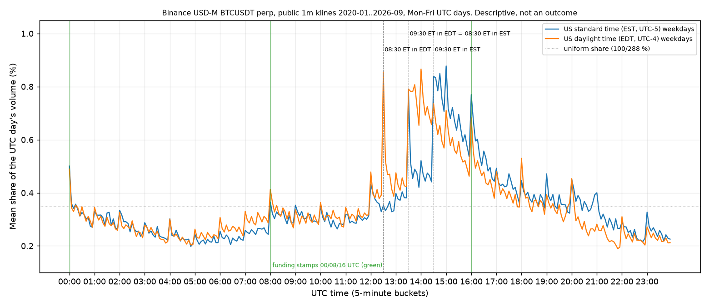

# BTC perp time-based ranges: what we need to run the Daily Profiler investigation on Binance BTCUSDT perpetual

**PAPER ONLY.** No signals, no sizing, no order path, no exchange keys. No BTC reversal, continuation or excursion rate appears in this file, because none was computed.

Every number in this file comes from one of four sources, and each is tagged:

| Tag | Source | Verified by this run? |
|---|---|---|
| `[NQ-ART]` | The article Richard pasted about tradesdontlie / The Daily Profiler (NQ, Jan 2006 – Sep 2026), as relayed in the task | **No.** NQ only. Never applied to BTC |
| `[PR9]` | The aggression-Bayes program, [PR #9](https://github.com/Czegledi92/mm-regime-logger/pull/9): locked joint gate, session box defaults, archive inventory | Read; not re-verified |
| `[ARCHIVE]` | This run's S0-lite audit of the public Binance archive (`data.binance.vision`), run 2026-10-02 22:25–22:58 UTC. Code: [`tools/s0_archive_audit.py`](tools/s0_archive_audit.py), [`tools/s0_tape_reconcile.py`](tools/s0_tape_reconcile.py). Outputs: [`results/`](results/), [`figures/fig01`](figures/fig01_volume_share_by_utc_clock_edt_vs_est.png). Every zip was checked against its published SHA-256 | **Yes.** Descriptive only: coverage, clocks, gaps, volume by time of day. No range, break, label or forward return was computed |
| `[SYN]` | The reference labeler's tests on synthetic random walks ([`tools/test_tr_labels.py`](tools/test_tr_labels.py)) | Yes, synthetic only. Says nothing about BTC |

Anything untagged is a definition, a proposal or a placeholder, and is labelled as such.

| | |
|---|---|
| Track | HFT-strategies, sub-track `time-ranges` |
| Instrument | Binance USDⓈ-M **BTCUSDT perpetual**. Binance spot BTCUSDT is a control only, never pooled |
| Status | Spec, data contract, label algebra with a tested reference implementation, and a descriptive archive audit. **No study has been run.** The spec is the deliverable |
| Reference labeler | [`tools/tr_labels.py`](tools/tr_labels.py). Where it and this file disagree, one of them is wrong: fix it, do not interpret |
| Next compute job | `JOB-20261003-TR-S1` (§8) |
| Related | Locked gate and level set: [PR #9](https://github.com/Czegledi92/mm-regime-logger/pull/9). 00:00 UTC anchor and funding warning: [PR #6](https://github.com/Czegledi92/mm-regime-logger/pull/6) |

## Bottom line

**What do we need to investigate the same thing for BTC perps?** Six things, none of which is a BTC rate:

1. **The right source data, which turns out to be public.** Binance's BTCUSDT perp did not exist in 2018: its first archived trade is 2019-09-08 17:57:50 UTC `[ARCHIVE]`. Richard's "1 s back to 2018" is therefore almost certainly Binance **spot** (whose public 1 s klines start 2017-08-17 `[ARCHIVE]`) or another venue. The perp study runs 2020-01-01 onward and should be built from the public **raw `trades`** files (about 69 GB zipped for 2020-01 to 2026-09 `[ARCHIVE]`). 1 m klines are not safe as a label source: 192 of the 369 zero-volume minutes in the perp kline archive are minutes in which the raw tape has trades `[ARCHIVE]`.
2. **A session clock with its own clock per box.** The bookkeeping day is the UTC day. Each range uses its own legal clock: UTC for Asia, London time for London, New York time for the US boxes. The public 1 m data shows that BTC's US-hours activity moves with New York time, not UTC (fig01 `[ARCHIVE]`). Four anchors, no more (§2).
3. **The same label algebra, made exact.** Continuation, reversal and unresolved, with IFE, heat, MFE, reversal extension and the reversal leg, in bps. First break is decided in trade-id order, so a double break inside one second has a defined answer. 1 s bars plus a drill-down into trades on the few bars that decide a label give exactly the tick-level label (§4, `[SYN]`).
4. **A small grid first.** 4 anchors × 3 lengths × 3 windows = **36** range×window combinations, split into size quintiles, before anything like the full 5,760-combination atlas (§5).
5. **A null model, because the NQ "lessons" are what a random walk does.** Longer windows, shorter ranges and smaller boxes all raise the chance of reaching the opposite edge in a driftless random walk. And under a martingale, a high reversal rate can coexist with zero expectancy. Study 1 passes only if label rates **and** the signed move after the break differ from a volatility-preserving martingale null (§1, §7).
6. **A narrow role in the locked gate.** A time-range result is a **level** posterior, frozen when the range closes. It can set the hypothesis at an edge; it never replaces the tape. Only the two ranges that coincide with the desk's IB definitions are inside the locked level set (§6).

---

## Contents

1. [What transfers from NQ and what does not](#1-what-transfers-from-nq-and-what-does-not)
2. [Session clock proposal](#2-session-clock-proposal)
3. [Data contract](#3-data-contract)
4. [Label algebra (TR v0)](#4-label-algebra-tr-v0)
5. [Grid: minimum viable and full](#5-grid-minimum-viable-and-full)
6. [How this plugs into the locked joint gate](#6-how-this-plugs-into-the-locked-joint-gate)
7. [Study 1: pass/fail, and what Richard must export](#7-study-1-passfail-and-what-richard-must-export)
8. [What is not claimed, and the next compute job](#8-what-is-not-claimed-and-the-next-compute-job)
- [Appendix A. S0-lite archive audit results](#appendix-a-s0-lite-archive-audit-results)
- [Appendix B. Open questions](#appendix-b-open-questions)
- [Appendix C. Files in this packet](#appendix-c-files-in-this-packet)

---

## 1. What transfers from NQ and what does not

**The NQ object, restated** `[NQ-ART]`. A time-based range is a fixed clock slice (for example 09:30–10:00 ET) whose high and low are marked every session. After it closes, an observation window (30 minutes to 8 hours) runs. The first break of one edge inside the window is labelled Continuation, Reversal or Unresolved, with excursions (IFE, Heat, MFE; on the reversal side, the extension past the edge and then the reversal's IFE, Heat and MFE). Results are 30th–70th percentile bands, timing in 5-minute buckets, and filters by range size in bps, over 5,125 sessions and about 169k range×window combinations.

| Element | NQ `[NQ-ART]` | BTCUSDT perp | Transfers? | Design consequence |
|---|---|---|---|---|
| Range object (clock slice, high, low) | Yes | Same | **Yes** | Unchanged |
| Observation window | 30 m – 8 h | Same | **Yes**, but nothing truncates it | BTC has no close. Windows run through 00:00 UTC, funding stamps and weekend boundaries. Those are **tagged**, never used to cut the window |
| Labels and excursions | C / R / U, IFE / Heat / MFE, extension | Same | **Yes** | §4, in bps. Two details the article does not pin down are reconciliation items (Appendix B) |
| Size filter in bps | Yes | Mandatory: the perp went from 7,189.43 (2020-01-01 00:00 UTC open) to 83,576.90 (2026-09-30 23:59 UTC close) `[ARCHIVE]` | **Yes, plus one** | Absolute bps quintiles for comparability with NQ, and a causal relative size (rank against the same slot's trailing sessions), because BTC's volatility regime shifts over years (§5) |
| Sample size | 5,125 sessions `[NQ-ART]` | 2,465 UTC days, 1,761 of them Mon–Fri, from 2020-01-01 to 2026-09-30 `[ARCHIVE]` | **No** | About half the NQ sample, and a third if only weekdays count. The grid has to be far smaller than 169k (§5) |
| Cash open and close auctions; Globex daily halt | Yes | None. The perp trades continuously | **Partly** | The NQ opening range is that market's own auction. In BTC, the "open" is imported from US equities and, since January 2024, US spot BTC ETF hours (public record; date not re-verified here). The imprint is visible in BTC volume (§2) |
| Weekends | None | 24/7. The median weekend-day volume was 0.4–0.7 times the median weekday volume, depending on the year `[ARCHIVE]` | **No** | Weekends are a separate stratum, never pooled with weekdays. Mon–Fri is the primary sample |
| US holidays | Closed or shortened | Open | **No** | US-clock boxes on US holidays have no cash open: tag `US_HOLIDAY` and keep them out of the primary NY cells |
| Funding | None | Every 8 h at 00:00, 08:00 and 16:00 UTC on all 7,395 events from 2020-01-01 to 2026-09-30 `[ARCHIVE]`. Each stamp shows a volume step that does not move with US daylight time (fig01) | **No analogue** | Funding stamps are tagged events in ranges and windows. Labels use trade prices only. The interval is read from the archive's `funding_interval_hours` field, not hardcoded ([PR #6](https://github.com/Czegledi92/mm-regime-logger/pull/6) warns that Binance moves symbols between 8 h, 4 h and 1 h) |
| Mark price, liquidations | None | Liquidations trigger on mark price and can print wicks through an edge | **No analogue** | Labels use **last trade** prices. Liquidation proxies (5 m OI drops from the public `metrics` files, perp–spot divergence) are stratifiers in a later study, not label inputs |
| Venue and basis | One venue | The perp can dislocate from spot in a cascade | **No** | The same labels run on Binance spot as a control. Perp-only reversals are reported separately |
| Daylight saving time | All on New York time | Asia boxes have no DST; London and New York switch on different dates. The London–New York offset is 4 h instead of 5 h on 21 or 28 days a year, 2018–2026 (2026: 8–28 March and 25–31 October) `[ARCHIVE]` | **No** | Every box is resolved per date in its own time zone. Mismatch days are tagged and reported separately |
| 08:30 ET macro releases | Yes | The 08:30 ET bucket is one of the two largest volume steps of the weekday in both US standard and daylight time `[ARCHIVE]` | **Yes** | The pre-US range ends at 08:30 ET, as the NQ example does. Release days are tagged from the desk calendar |
| Event order inside a bar | 1 m cannot order events inside a bar (admitted) `[NQ-ART]` | 1 s bars from raw trades, with trade-order drill-down on decisive bars | **Fixed**, at a data cost | §3.7 and §4.6 |
| Price grid | 0.25 index point | 0.01 USDT grid in use through 2024-08 and 0.1 from 2024-09, inferred from archive prices `[ARCHIVE]`. At 78,550, 0.1 USDT is about 0.013 bps | **Yes** | The break rule is in ticks (strictly beyond the edge). The grid never binds a bps-scale box |
| Chart examples | Selected `[NQ-ART]` | | **No** | Every session and every cell is reported, including failures |
| Claimed lessons | Longer windows reverse more; shorter ranges reverse more; smaller ranges (bps) reverse more. Examples: 07:30–08:30 ET watched 1 h reverses about 18% vs about 69% over 4 h; 15 m ranges reverse about 55% on a 2 h window vs about 11% for 4 h ranges `[NQ-ART]` | **Not copied.** No BTC rate is assumed | **No** | See the next paragraph |

**Why the claimed lessons cannot be read as edge, on NQ or on BTC.** Take a driftless random walk with any volatility pattern. Once it breaks one edge of a box, the chance that it reaches the opposite edge before the window ends:

- rises with the time left (longer windows);
- falls with the distance to the opposite edge measured against volatility. Narrower boxes, in bps or in clock time, put the opposite edge closer.

All three NQ lessons are what that walk produces. Worse, under a martingale the expected signed move from the break print to any bounded stopping time is zero (optional stopping). So a 70% reversal rate can coexist with zero expectancy for fading, because the losses are larger than the wins. For BTC this means:

1. The three orderings are a **sanity check of the labeler**. If BTC shows the opposite ordering, debug the code first.
2. Evidence of structure is a **deviation from a martingale null that keeps the volatility** (§7: sign-flipped 1 s returns), in label rates **and** in the signed return from the break print. A rate alone is not evidence.

---

## 2. Session clock proposal

**UTC day or ET boxes?** Both, with separate jobs:

- **Bookkeeping day = UTC date.** It matches funding (00:00 UTC), Binance's daily candle, the desk's UTC box `[PR9]` and the VRF-EMA anchor ([PR #6](https://github.com/Czegledi92/mm-regime-logger/pull/6)).
- **Each range is anchored in its own legal clock**, resolved per date through the tz database (`UTC`, `Europe/London`, `America/New_York`). No fixed UTC offsets for London or New York.

**Evidence that the US boxes must be on New York time** `[ARCHIVE]`. Public perp 1 m klines, 2020-01 to 2026-09, Mon–Fri UTC days (593 days in US standard time, 1,168 in US daylight time). The table shows the mean share of the UTC day's volume per 5-minute bucket. A uniform share would be 0.347%.

| Period | US standard time (EST) | US daylight time (EDT) |
|---|---|---|
| 08:30 ET bucket | 0.782% (13:30 UTC) | 0.854% (12:30 UTC) |
| 09:30 ET bucket | 0.839% (14:30 UTC) | 0.791% (13:30 UTC) |
| Mean, 08:35–09:25 ET (pre-open) | 0.470% | 0.444% |
| Mean, 09:30–11:55 ET (post-open) | 0.646% | 0.651% |
| Same UTC hour, 13:35–14:25 UTC | 0.470% (pre-open in EST) | 0.740% (post-open in EDT) |
| Day's largest bucket | 15:00 UTC = 10:00 ET, 0.878% | 14:00 UTC = 10:00 ET, 0.866% |



Read in New York time, the pre-open and post-open levels are nearly identical in both regimes. Read in UTC, the same hour is pre-open half the year and post-open the other half. A fixed-UTC NY box would put the cash open at 13:30 UTC in summer and the 08:30 ET data release at 13:30 UTC in winter. The figure also shows UTC-fixed steps at the three funding stamps: the 00:00 UTC bucket is 0.501% / 0.489% against 0.360% / 0.343% in the next bucket; steps of +0.122 / +0.127 percentage points at 08:00 UTC and +0.234 / +0.220 at 16:00 UTC (EST / EDT). Descriptive only; the cause is not tested.

**Proposed anchors (keep the set small: four).**

| ID | Clock | Anchor | UTC in summer / winter | MVG lengths | Why this anchor | NQ analogue | In the locked level set? `[PR9]` |
|---|---|---|---|---|---|---|---|
| `ASIA_UTC` | UTC | **Starts** 00:00 UTC | 00:00 / 00:00 | 15, 30, 60 m | UTC day boundary, Binance daily candle, a funding stamp, and the Tokyo cash open (09:00 JST; Japan has no DST). The 00:00 UTC bucket is elevated in both regimes `[ARCHIVE]`. The 60 m version **is** the desk's UTC box IB [00:00, 01:00) `[PR9]` | Asia / overnight box | 60 m: **yes** (UTC IB). 15 and 30 m: shadow |
| `LDN_OPEN` | Europe/London | **Starts** 08:00 London | 07:00 / 08:00 | 15, 30, 60 m | European cash open. A 07:00 UTC step appears mainly on US-daylight days, which are mostly UK summer-time days: +0.093 vs +0.037 percentage points `[ARCHIVE]`. **Confound:** in UK winter, 08:00 London is 08:00 UTC, a funding stamp | London open box | No: `SHADOW_EXTRA` |
| `PRE_US` | America/New_York | **Ends** 08:30 ET | ends 12:30 / 13:30 | 15, 30, 60 m (08:15, 08:00, 07:30 starts) | The range closes as the 08:30 ET release prints, and the window opens on it. The 60 m version is the NQ example's 07:30–08:30 ET slice `[NQ-ART]`, the only one where the article gives window-by-window rates (useful for TR-S0c, §7) | Pre-US / pre-data box | No: `SHADOW_EXTRA` |
| `NY_OR` | America/New_York | **Starts** 09:30 ET | 13:30 / 14:30 | 15, 30, 60 m | US cash equity open, and US spot ETF hours since January 2024. The post-09:30 ET volume plateau holds in both regimes `[ARCHIVE]`. The 30 m version is the NQ opening range (09:30–10:00 ET `[NQ-ART]`). The 60 m version **is** the desk's NY box IB [09:30, 10:30) ET `[PR9]` | NQ opening range | 60 m: **yes** (NY IB). 15 and 30 m: the NY opening-range extra in PR #9 S6, shadow |

**Considered and left out of the first grid.** The US cash close (16:00 ET) or CME daily break (17:00 ET): the post-close box is an open PR #9 question; it goes in the full grid. 01:30 UTC (Hong Kong and Shanghai opens): a small step only (+0.046 / +0.034 percentage points `[ARCHIVE]`). A range anchored on the 16:00 UTC funding stamp: a UTC-fixed step, but not a session open; full grid. The weekly open: not in the first grid.

**Calendar rules (proposals).**

- **Weekday stratum.** Defined by the local date of the range start in its own clock. For `ASIA_UTC`, Monday 00:00 UTC is still Sunday evening in New York. That is fine, because the box is on the UTC clock.
- **Weekends.** Sat/Sun instances of every anchor are computed but reported as a separate stratum. US-clock boxes on weekends have no cash session behind them; they stay out of every pass/fail rule.
- **DST mismatch days.** The 21–28 days a year when London–New York is 4 h are tagged. Splitting `LDN_OPEN` results into UK summer and winter time shows whether that box follows the London clock or the 08:00 UTC funding stamp.
- **Release and funding tags.** Every instance carries `event_in_range`, `event_in_window` (from the desk `events.csv` `[PR9]`), `funding_in_range` and `funding_in_window`.

---

## 3. Data contract

### 3.1 What "1 s and 1 m back to 2018" can be

| Fact `[ARCHIVE]` | Value |
|---|---|
| First USDⓈ-M BTCUSDT perp trade in the archive | 2019-09-08 17:57:50.575 UTC. That day has 3,754 trades |
| First monthly perp 1 m klines, aggTrades, funding, mark and premium-index files | 2020-01 |
| 1 s klines for the perp | **None.** USDⓈ-M klines exist at 1m, 3m, 5m, 15m, 30m, 1h, 2h, 4h, 6h, 8h, 12h, 1d, 3d, 1w and 1mo only |
| Binance **spot** BTCUSDT 1 s klines | Daily files from 2017-08-17 |

So 2018 data on BTC at 1 s is almost certainly Binance spot, or another venue's contract. **Richard must say which** (R2 in §7). Treatment:

| Period | Role |
|---|---|
| 2019-09-08 → 2019-12-31 (115 days) | `LAUNCH`. Newly listed contract, available only as raw trades. Excluded from the primary sample; robustness check only |
| 2020-01-01 → present | **Perp primary sample** |
| 2018-01-01 → 2019-12-31, if it is Binance spot | Spot control (730 days). An extra out-of-sample period **for the spot venue only**. Never pooled with the perp |

### 3.2 Identifiers

`venue = BINANCE_USDM`, `symbol = BTCUSDT`, `contract = PERPETUAL`, prices in USDT (last trade), quantities in BTC. The control is `venue = BINANCE_SPOT`, `symbol = BTCUSDT`.

### 3.3 Source hierarchy for labels

| Rank | Source | Use | Why |
|---|---|---|---|
| 1 | Raw `trades` (`id, price, qty, quote_qty, time, is_buyer_maker`) | **Label source of truth.** Order = trade id order | Daily 1 m klines rebuilt from raw trades matched exactly (OHLC, volume, trade count) on all three days checked: 2020-01-01, 2023-11-10 and 2026-09-01 `[ARCHIVE]` |
| 2 | 1 s bars built from rank 1 (ours, or Richard's if they meet §3.4) | Fast path; drill back to rank 1 on decisive bars | §3.7 |
| 3 | 1 m klines | Screening, range-size distributions, cross-checks. **Never the label source** | Kline defects (§3.6) |
| side | `aggTrades` | Sweep detection (same-millisecond, same-side groups at 2+ prices: 10,288 on 2020-01-01 and 104,827 on 2026-09-01 `[ARCHIVE]`) | An aggTrade carries its first fill's time. Member trades arrive up to 100 ms later. On 2023-11-10, 28,906 of 3,260,186 trades (0.89%) fall in a later second than their aggTrade's timestamp, and 544 in a later minute; on 2026-09-01, 20,230 of 3,622,828 (0.56%) and 375. 1 s bars built from aggTrades disagree with trade-built bars on the high or low of 120 seconds (2023-11-10) and 5 seconds (2026-09-01) `[ARCHIVE]` |

### 3.4 1 s bar schema (contract for ours and for Richard's)

| Field | Type / unit | Required? | Note |
|---|---|---|---|
| `ts_sec` | int64, epoch **ms** UTC at the second's start; the bar covers [ts, ts + 1000) | Required | The spot archive's timestamps are 13-digit ms on 2018-03-01 and 16-digit µs on 2026-09-01 `[ARCHIVE]`. Normalise to ms and record the source unit in the manifest |
| `venue`, `symbol` | string | Required | |
| `open, high, low, close` | decimal USDT, from **prints in that second only** | Required | |
| `volume`, `quote_volume` | BTC, USDT | Required | |
| `trade_count` | int | Required | A row with `trade_count = 0` is **not a print** (below) |
| `taker_buy_volume` | BTC | Required | For the gate, not for labels |
| `first_trade_id`, `last_trade_id` | int64 | Required | Links each second to raw trades for drill-down |
| `id_high`, `id_low` (or `ts_high_ms`, `ts_low_ms`) | int64 | **Strongly recommended** | Trade id (or ms time) of the first print at the second's high and at its low. With these two fields, the order of high and low inside a second is known without tick data, which settles a double break inside one second |

**Empty seconds.** Either absent, or present with `trade_count = 0` and null prices. Binance's spot 1 s klines carry empty seconds as rows with `count = 0` and flat OHLC equal to the previous close. That was 29.5% of seconds on 2018-03-01 and 8.9% on 2026-09-01 `[ARCHIVE]`. Those rows must be dropped before labelling, or a forward-filled price becomes a fake print (the reference labeler drops them). The perp tape was also sparse early on: only 29.86% of UTC seconds on 2020-01-01 had a perp trade (longest silence 59 s), against 96.55% on 2026-09-01 (longest 4 s) `[ARCHIVE]`. Labels are print-based, so sparse seconds are not a problem as long as nothing is forward-filled.

### 3.5 1 m bars

The Binance kline schema is `open_time, open, high, low, close, volume, close_time, quote_volume, count, taker_buy_volume, taker_buy_quote_volume, ignore`. Monthly perp files carry a header row only from 2022-01 (57 of 81 months), and perp timestamps are ms throughout `[ARCHIVE]`. Readers must detect the header rather than assume it.

### 3.6 Gaps: what the archive actually contains

| Check `[ARCHIVE]` | Result |
|---|---|
| Missing rows, perp 1 m, 2020-01-01 00:00 → 2026-09-30 23:59 UTC | **0 missing** of 3,549,600 expected minutes; 0 duplicates; all on the minute grid. A row-count audit finds nothing |
| Rows with `count = 0` (zero trades, flat price) | **369 minutes in 13 runs.** By year: 2020: 2, 2021: 59, 2022: 64, 2023: 118, 2024: 89, 2025: 37, 2026: 0 |
| ↳ No prints in any public source (daily klines, raw trades, aggTrades) | 8 runs, **177 minutes**. A true public-data silence → `GAP` |
| ↳ Defect in the **monthly** file only: the daily kline file and the tape have trades | 1 run, **99 minutes** (2023-11-10 15:07–16:46 UTC; 369,608 trades in the daily file and the raw tape) |
| ↳ Defect in **both** monthly and daily klines; the raw tape has trades | 4 runs, **93 minutes**, 173,067 raw trades: 2024-10-28 20:00–21:14, 2025-01-14 13:32–13:34, and 2025-01-29 01:23–01:36 and 02:41–02:45 UTC. Example: on 2024-10-28 20:00–21:14 UTC the tape has 116,368 trades between 69,389.0 and 69,766.2, with prints in 4,404 of 4,440 seconds, while both kline files show a flat zero-volume line at 69,566.1 |
| Trade-id continuity as a gap detector | **Does not work.** Raw `trades` ids skip 0 ids on 2020-01-01, 49 on 2023-11-10 and 16,210 on 2026-09-01, yet the daily klines' trade count equals the trades file's row count on all three days. The skipped ids are in no public file; they are numbering gaps, not lost data |

A kline-based study would have seen flat, untraded minutes where the market traded. One defect (2025-01-14 13:32 UTC) sits two minutes after 08:30 ET (EST), inside a `PRE_US` window.

**Gap rule (proposal; thresholds are placeholders).**

1. Every kline minute with `count = 0` is checked against the raw tape. If the tape is empty too, the minute is `GAP`. If the tape has prints, the kline is ignored and the tape is used.
2. Tape silences longer than the 99.99th percentile of that month's inter-trade gaps are listed for review. No single fixed threshold works across years: a 59 s silence was ordinary on 2020-01-01.
3. Any gap in Richard's recorder manifest is `GAP`.
4. A `GAP` inside the range invalidates the instance. A `GAP` inside the window before the label resolves gives outcome `GAP` (excluded and counted by year). A `GAP` after resolution keeps the label and flags the excursions as truncated.
5. Nothing is ever forward-filled.

### 3.7 How 1 s fixes the inside-bar problem, and what 1 m is still good for

**What is ambiguous in a bar.** Only the order of its high and low. That order decides a label when one bar holds two decisive points:

- (a) the first-break bar crosses both edges;
- (b) the first-break bar always contains some pre-break prints, so its low (for an up-break) may or may not be part of the heat;
- (c) one bar holds both the leg's extreme and its deepest pullback, so Continuation and Unresolved cannot be told apart;
- (d) the reversal bar holds both the extension high and the cross of the opposite edge.

At 1 m, case (b) applies to **every** break. At 1 s, the cases only bite when two decisive points fall in the same second. With trades they never bite, because trade ids are a total order: prints in the same millisecond are ordered by id.

**Procedure** (implemented in `label_bars`):

1. Label from bars, trying each bar's high-then-low and low-then-high.
2. Collect the bars holding a decisive point: break, reversal, extension, IFE, heat, MFE, reversal-leg heat and MFE, the 180 s markout print, and the window's last print.
3. Replace those bars with their trades.
4. Repeat until every decisive point sits in tick data.

The result equals the tick labeler exactly. The tests check this on 300 synthetic random walks at both 1 s and 1 m `[SYN]`. The archive serves whole days, so each day's trades file is still downloaded; the saving is in compute, not download.

| Question | 1 m enough? |
|---|---|
| Range high, low and size in bps | **Yes**, exactly. Ranges are minute-aligned and a bar's high and low are exact extremes, **provided the bar is rebuilt from trades** (§3.6) |
| Did any break happen in the window? NO_BREAK share | **Yes** |
| Break side, when only one edge is crossed in the first-break minute | **Yes** |
| First-break timing in 5-minute buckets | **Yes** (to the minute) |
| MFE value when there is no reversal | **Yes** for the value (a maximum). Its position relative to the heat: no |
| Continuation vs Unresolved; Heat; IFE; reversal extension; reversal timing; 180 s markout | **No.** Needs 1 s plus drill-down |

---

## 4. Label algebra (TR v0)

Same algebra as the NQ product as far as the article states it `[NQ-ART]`. Where the article is silent, the choice is explicit here and listed for reconciliation (Appendix B).

### 4.1 Instance

An instance is (date, anchor, length `L`, window `W`). Range [t0, t1) with t1 = t0 + L; window [t1, t2) with t2 = t1 + W. All boundaries fall on minute boundaries after time-zone resolution. Both intervals are half-open: a print at exactly t1 belongs to the window.

### 4.2 Range

Over the prints with t0 ≤ t < t1: `RH = max price`, `RL = min price`, `M = (RH + RL) / 2`, `size_bps = 1e4 · (RH − RL) / M`. **Every bps value of the instance uses this one M.**

### 4.3 First break

`τ_b` = the time of the first print in [t1, t2) with `price > RH` (up, D = +1) or `price < RL` (down, D = −1). The inequality is **strict**: a print equal to an edge is a touch, not a break. No such print gives `NO_BREAK`. NO_BREAK is reported as its own share and is outside the C/R/U denominator.

**Double break inside one second.** The edge printed first **in trade-id order** is the break. If the opposite edge prints later in the same second, the instance is a REVERSAL with τ_r in that second. If trade order is unavailable (1 s bars without `id_high`/`id_low` and no tick source), the instance is `AMBIG`. AMBIG instances are excluded from rates, counted, and the rates are also reported with every AMBIG resolved one way and then the other, as bounds. With the public raw trades, AMBIG should be zero; any AMBIG is a bug.

### 4.4 Coordinates, reversal and legs

```text
E = RH if D = +1 else RL         broken edge
O = RL if D = +1 else RH         opposite edge
x(p) = D · (p − E) / M · 1e4     break leg, bps, positive in the break direction
y(p) = −D · (p − O) / M · 1e4    reversal leg, bps, positive in the reversal direction

τ_r = first print after τ_b, before t2, with D · (p − O) < 0     (strictly beyond the opposite edge)

Leg decomposition for a leg z_0 … z_n (the leg's first print onward):
  h        = LAST index at which z equals min(z)                  deepest pullback
  IFE      = max(z_0 … z_h)                                       first push before the deepest pullback
  MFE      = max(z_0 … z_n)                                       how far the move ran
  Heat     = −z_h      (> 0: traded back inside the box by that many bps; < 0: never returned to the edge)
  Pullback = IFE − z_h (≥ 0: retracement of the first push)
```

### 4.5 Outcomes (decided at τ_r, or at t2 if there is no reversal)

| Outcome | Rule |
|---|---|
| `REVERSAL` | τ_r exists. Absorbing: later prints never change the label |
| `CONTINUATION` | No τ_r, and on the break leg [τ_b, t2) MFE > IFE: a new extreme after the final visit of the deepest pullback, without crossing the opposite edge |
| `UNRESOLVED` | No τ_r and MFE = IFE: pushed and pulled back, but no new extreme after the deepest pullback |
| `NO_BREAK` | No break before t2 |
| `AMBIG`, `GAP` | §4.3, §3.6 |

### 4.6 Fields per instance

| Group | Fields |
|---|---|
| Always | `size_bps`, size quintiles (absolute and relative, §5), anchor, length, window, weekday stratum, tags (`event_*`, `funding_*`, `US_HOLIDAY`, `DST_MISMATCH`, `GAP`) |
| Break | `D`, `t_break` and its 5-minute bucket `floor((τ_b − t1) / 300 s)` |
| Continuation / Unresolved (break leg on [τ_b, t2)) | `ife_bps`, `heat_bps`, `pullback_bps`, `mfe_bps`, `t_ife`, `t_heat`, `t_mfe` |
| Reversal | Extension (turtle soup): `ext_bps = max x` over [τ_b, τ_r) and `t_ext`. Reversal leg on [τ_r, t2) in `y`: `rev_ife_bps`, `rev_heat_bps`, `rev_pullback_bps`, `rev_mfe_bps`, `t_reversal`, `t_rev_heat`, `t_rev_mfe` |
| Not NQ fields: for the null test and `EDGE_OK` | `ret_180s_bps = D · (p(last print ≤ τ_b + 180 s) − p_b) / M · 1e4`; `ret_end_bps = D · (p(last print < t2) − p_b) / M · 1e4`, where p_b is the break print. Trade-price proxies; no mid exists in public data |

Bands are the 30th, 50th and 70th percentiles per cell, with confidence intervals from a block bootstrap by ISO week (proposal: weeks absorb day-to-day volatility clustering).

### 4.7 Worked examples (synthetic; box 99–101, M = 100, size 200 bps; taken from the tests)

| Prints after the range closes | Outcome | Values (bps) |
|---|---|---|
| 100, 101.2, 101.5, 102.0, 102.4 | CONTINUATION, up | IFE 20, Heat −20 (never back to the edge), MFE 140 |
| 100, 101.5, 102.0, 100.5, 101.2, 102.5 | CONTINUATION, up | IFE 100, Heat +50, Pullback 150, MFE 150 |
| 100, 101.5, 102.0, 100.5, 101.9, 100.2 | UNRESOLVED | IFE = MFE = 100, Heat +80 |
| 100, 101.5, 100.5, 102.0, 100.5, 101.8 | UNRESOLVED: the deepest low is revisited after the high and no new high follows | IFE = MFE = 100, Heat +50 |
| 100, 101.3, 101.8, 100.0, 98.6, 99.4, 98.0 | REVERSAL, up-break | Extension 80; reversal IFE 40, Heat +40, MFE 100 |

---

## 5. Grid: minimum viable and full

### 5.1 Minimum viable grid (MVG): what TR-S1 computes

| Dimension | Values | Count |
|---|---|---|
| Anchors | `ASIA_UTC` (start 00:00 UTC), `LDN_OPEN` (start 08:00 London), `PRE_US` (end 08:30 ET), `NY_OR` (start 09:30 ET) | 4 |
| Range lengths | 15, 30, 60 m | 3 |
| Windows | 60, 120, 240 m | 3 |
| **Range × window combinations** | | **36** |
| Size quintiles, primary (relative) | Rank of today's `size_bps` among the previous 60 valid sessions of the **same** anchor, length and weekday stratum, cut into fifths. Causal, and it adapts to volatility regimes | 5 |
| Size quintiles, reported (absolute) | `size_bps` cutoffs frozen on the develop split per anchor and length. NQ-comparable, but drifts with the regime | 5 |
| Strata | Mon–Fri primary; Sat/Sun reported separately | |
| Directions | Up-breaks and down-breaks are reported separately. They are a split, not extra hypotheses | |

**Sample-size arithmetic (not a result).** The develop split has 1,043 Mon–Fri days, about 209 per quintile per combination before NO_BREAK and GAP exclusions, and roughly half of that per direction. For a proportion near 0.5 with n = 100, the 95% interval is about ±9.8 percentage points. The MVG can only see large departures from the null; that is why it is small.

**Compute shape.** One pass per (day, anchor, length) through the longest window emits the event times and running extrema. Every shorter window is read off the same pass, because a window-W label depends only on the path up to t1 + W.

### 5.2 Full grid: only after TR-S1 passes

| Dimension | Values | Count |
|---|---|---|
| Starts | Every 15 minutes over 24 h in **two clocks**: UTC (96) and America/New_York (96). The pairs are the direct test of which clock BTC follows at each time of day. A London clock adds nothing beyond the named `LDN_OPEN` anchor except on the 21–28 mismatch days | 192 |
| Lengths | 5, 15, 30, 60, 120, 240 m | 6 |
| Windows | 30, 60, 120, 240, 480 m | 5 |
| **Range × window combinations** | | **5,760**, about 3.4% of the NQ product's 169k `[NQ-ART]` |
| × size quintiles | | 28,800 cells per direction |

The full grid is an **atlas** (heatmaps), not a search. A cell found in it is promoted only if it survives false-discovery control across the whole full grid, deviates from the null on the validate split, and is admitted by Desk Floor. Starts are every 15 minutes rather than 5: with about 1,761 weekdays, 5-minute starts would triple the testing load across cells that are almost the same.

---

## 6. How this plugs into the locked joint gate

The locked gate `[PR9]`, in order: `CLOCK_OK` → `INDEPENDENT_AGREE` → `PRINT_CONFIRM` → `DEPTH_AGREE` → `EDGE_OK`. The first miss sets `FLAT_WATCH`.

**Rule. A time-range posterior is a level posterior.** It is frozen at t1, when the range closes, from data at or before t1 plus a table fit on other sessions (develop and validate splits). It says where the edges are and which way the prior leans if an edge breaks. It never fires on its own. The 1 s burst at the edge can only confirm or veto it; the burst cannot originate a direction, and it cannot flip the hypothesis. **It is not a substitute for tape aggression.**

**From a cell to a level hypothesis `H_L`** (proposal; the mapping is approximate and needs Lucas):

| Frozen cell result (held-out, against the null) | `H_L` at the broken edge | Branch `[PR9]` | What a confirming burst looks like |
|---|---|---|---|
| Continuation lean beyond the null | BREAK | A (continuation) | Prints through the edge with progress, no absorption, OI not falling |
| Reversal lean beyond the null | RESPECT (the edge is pierced, then fails) | B (two-sided rest) | Aggression into or through the edge is absorbed inside the cell's extension band (P30–P70 of `ext_bps`), with a two-sided book |
| No lean beyond the null | NONE | none | None. `FLAT_WATCH`, as PR #9's neutral-prior rule requires |

| Flag | What the time-range study supplies | What it does not supply |
|---|---|---|
| `CLOCK_OK` | Range finished (t ≥ t1) and window open (t < t2). Proposed sub-condition: `TR_WINDOW_OPEN`. Anchor clock resolved per date. The instance's weekday stratum matches the cell's (a Mon–Fri cell does not apply on a Saturday). Plus the existing `event_window` and impulse rules | Session VWAP rules are unchanged |
| `INDEPENDENT_AGREE` | The frozen level posterior. Inputs: `RH`, `RL`, `size_bps`, relative rank, anchor, weekday stratum, all known at t1. The break-time bucket is a **clock key** read when the break happens, not flow data (Lucas to confirm). Admissible levels: only `ASIA_UTC` 60 m (= UTC IB) and `NY_OR` 60 m (= NY IB) are inside the locked level set; every other range is `SHADOW_EXTRA` until Desk Floor admits it. `EPISODE_ONCE`: one AGREE per edge instance per window. `LIQ_VETO` unchanged | It never sees the burst's prints. It is not a flow posterior |
| `PRINT_CONFIRM` | Consistency: a TR break is a **trade print** strictly beyond the edge, never a mid or quote crossing, so a quote-walk across the edge is not a TR break | Quote-walk and spoof detection still need L1 or DOM |
| `DEPTH_AGREE` | Nothing | Everything |
| `EDGE_OK` | `ret_180s_bps` per cell (held-out, trade-price proxy) as one input to the held-out markout table. The extension band gives the price range in which a branch B absorption is expected | The live side-being-run check. Fee clearance still has to be shown on held-out markouts |

**Two warnings that follow from §1.** A cell's high reversal rate is not by itself a reason to expect a positive markout: under a martingale it would not be. And the cluster rule of PR #9 applies: if a time-range edge and a VWAP or another box's level sit in the same band and disagree, the result is `FLAT_WATCH`.

---

## 7. Study 1: pass/fail, and what Richard must export

### 7.1 Pre-registration: TR-S1-MVG (time-range label atlas against a martingale null)

| Item | Specification |
|---|---|
| Data | Public raw perp `trades`, 2020-01-01 → 2025-06-30 (develop and validate). 1 m klines for screening only. Spot raw trades or spot 1 s klines over the same days as the venue control |
| Splits | Develop 2020-01-01 → 2023-12-31 (1,461 days, 1,043 Mon–Fri). Validate 2024-01-01 → 2025-06-30 (547 / 391). Test 2025-07-01 → 2026-09-30 (457 / 327), **touched once**, after Desk Floor freezes the surviving cell list `[ARCHIVE]` (day counts) |
| Step 0: full S0 | Tonight's checks extended to **every** day: 1 m bars rebuilt from trades against klines, every zero-trade minute checked against the tape, the GAP list, AMBIG count |
| Labels | MVG (§5.1) via `tr_labels.label_bars` with drill-down |
| **N1: sign-flip martingale null** | For each instance, keep the real range and the real sequence of absolute 1 s log returns in the window, flip their signs at random (≥ 200 draws), and relabel. This keeps volatility, clustering and timing, and removes drift and serial dependence. Under N1, E[`ret_end_bps`] = 0 by construction |
| N2: placebo anchors | The same lengths and windows started at non-anchor clock times on the same days, matched on relative size quintile. Tests whether the named anchors differ from arbitrary times |
| N3: venue control | The same labels on Binance spot over the same days. Reports agreement between perp and spot labels |
| H-TR-G (geometry sanity) | In both the data and N1, P(REVERSAL) rises with window length and falls with relative size. Under N1 this is mechanical. If the data shows the opposite ordering, the labeler is suspect |
| H-TR1 (label structure) | Per cell: observed P(outcome) − N1 P(outcome) ≠ 0 |
| H-TR2 (martingale departure) | Per cell: mean `ret_end_bps` ≠ 0, and mean `ret_180s_bps` ≠ 0 |
| H-TR3 (anchor specificity) | Named-anchor cells differ from N2 placebo cells |
| Multiple testing | The cell list is declared before the run. Benjamini–Hochberg at q = 0.10 across all MVG cells × directions. Every cell is reported, including failures |
| Outputs | `desk-briefs/hft-strategies/time-ranges/YYYYMMDD-tr-s1-mvg-atlas.md`; code in `tools/`; small CSVs in `results/`; no raw data in git |

### 7.2 Pass and fail

**PASS** requires all four:

1. **Data gate.** Every day's 1 m bars are rebuilt from trades and every kline disagreement is listed. Instances touched by a GAP are at most 1% per year (placeholder) and are listed. AMBIG = 0.
2. **Geometry.** H-TR-G holds.
3. **Structure.** At least one declared MVG cell family shows H-TR1 **and** H-TR2 on develop, with the same sign on validate, at BH q ≤ 0.10. No single calendar year supplies more than 50% of the effect. The effect is reported before and after January 2024 (the US spot ETF launch).
4. **Reporting.** Every cell, the NO_BREAK shares, and the GAP and AMBIG counts.

| Fail | Meaning | What happens |
|---|---|---|
| Data gate | The tape or clocks are not trustworthy | Fix the data (R-items below). Nothing else is read |
| Geometry | The labeler or the clocks are wrong | Debug. Nothing else is read |
| No structure (data inside N1 everywhere, or the `ret_end` intervals include 0) | BTC time-range labels are geometry. Ranges are "where to look" only | `H_L = NONE` for every time-range cell, so the gate stays `FLAT_WATCH` on these levels. The full grid is computed only if Desk Floor wants a descriptive atlas |
| Structure on develop only | Overfitting | Stop. The test split stays untouched |

### 7.3 What Richard must export if public klines are not enough

**Public klines are not enough:** the perp has no public 1 s klines, and its 1 m klines contain defective minutes (§3.6). **Public raw trades are enough** for the whole perp label study from 2020. So most of what is needed from Richard is confirmation, not market data:

| # | Item | Required? | Why |
|---|---|---|---|
| R1 | A manifest for his 1 s and 1 m files: venue, symbol, contract type, how built (from trades, aggTrades, klines or something else), timestamp unit and convention (open time, UTC, exchange or host clock), how empty seconds are encoded (absent, zero rows, forward-filled), price type (last, mid or mark), coverage dates, known gaps | **Required** | Without it the files cannot be trusted or reconciled |
| R2 | What the 2018–2019 portion is: Binance spot, or another venue's contract | **Required** | The Binance perp has no data before 2019-09-08 `[ARCHIVE]` |
| R3 | Confirmation of the four anchors and their lengths (§2), the Mon–Fri primary stratum, and the bookkeeping day = UTC date | **Required** | |
| R4 | The NQ product's own definitions, if he has them: Heat's reference (from the edge or from the first push), whether Continuation needs a minimum pullback, the break threshold (one tick?), and how no-break sessions are treated. TradingView indicator settings would do | **Required** for an "identical" algebra | The article leaves these open (Appendix B) |
| R5 | NQ 1 m (or finer) bars for some or all of 2006–2026 from his platform | **Strongly recommended** | Enables **TR-S0c**: run our labeler on NQ and try to reproduce the article's published examples (07:30–08:30 ET watched 1 h vs 4 h; 15 m vs 4 h ranges on a 2 h window `[NQ-ART]`). A match within tolerance means our algebra is theirs. A miss shows where the definitions differ, before BTC is touched. The NQ numbers are a reconciliation target only, never a BTC expectation |
| R6 | The desk `events.csv` (`event_id, ts_utc, name, tier, pre_min, post_min`) `[PR9]` | **Required** for tags and `CLOCK_OK` | |
| R7 | If he wants his 1 s files used instead of our rebuild: add `first_trade_id`, `last_trade_id`, `id_high`, `id_low` (or `ts_high_ms`, `ts_low_ms`), `trade_count`, `taker_buy_volume` | Optional | Saves the roughly 69 GB raw-trades download for the perp and settles intra-second order |
| R8 | For the gate only, not TR-S1: PR #9's MVB-3 bundle (DOM, same-host tape, OI polls) | Later | Needed only to evaluate `PRINT_CONFIRM` and `DEPTH_AGREE` at the edges |

**Download sizes (zipped, monthly archive listing `[ARCHIVE]`).** Raw perp trades: 38.97 GB for develop (2020–2023), 17.17 GB for validate, 12.94 GB for test, **69.08 GB** in total for 2020-01 → 2026-09. Perp aggTrades total 44.47 GB. Spot 1 s klines 2018 → 2026-08 total 8.68 GB. Perp 1 m klines are about 0.02 GB a year.

---

## 8. What is not claimed, and the next compute job

**Not computed, and not claimed:** any BTC reversal, continuation or unresolved rate; any excursion band or timing distribution; any comparison with the NQ numbers; any backtest, markout, PnL or hit rate. **The spec is the deliverable.**

**Computed tonight:** the descriptive S0-lite audit in Appendix A (inventory, coverage, zero-trade runs against the raw tape, trades vs aggTrades vs klines on three days, funding clock, DST calendar, price grid, weekday volume profile by clock, weekend volume ratio, split sizes, download sizes), and the reference labeler with 12 passing synthetic tests `[SYN]`.

**Why not compute rates tonight.** Three reasons:

1. Richard has not confirmed the anchors (R3) or the product's definitions (R4).
2. A full-sample run would burn the test split before the cell list is frozen.
3. Without N1, a rate means nothing (§1).

**Next compute job: `JOB-20261003-TR-S1`**

1. Download the raw perp `trades` daily files 2020-01-01 → 2025-06-30 with checksums (about 56 GB zipped: develop plus validate `[ARCHIVE]`).
2. Build 1 s bars (with `first_trade_id`, `last_trade_id`, `id_high`, `id_low`) and 1 m bars from trades. Run the full S0 (§7.1 step 0).
3. Label the MVG with `tr_labels.label_bars` and drill-down. Mon–Fri primary; weekends as a separate stratum.
4. Run N1 (≥ 200 sign-flip draws per instance), N2 placebo anchors and N3 spot control.
5. Report under the TR-S1 pre-registration. The test split stays untouched.

**In parallel, if Richard sends NQ bars (R5):** `JOB-TR-S0c`, NQ reproduction of the article's examples with the same labeler.

---

## Appendix A. S0-lite archive audit results

All rows `[ARCHIVE]`, checked 2026-10-02 22:25–22:58 UTC. Files are in [`results/`](results/).

**A1. Inventory (BTCUSDT).**

| Dataset | Archive path | First | Last at check |
|---|---|---|---|
| Perp raw trades | `data/futures/um/{daily,monthly}/trades/BTCUSDT/` | 2019-09-08 (daily), 2019-09 (monthly) | 2026-10-01, 2026-09 |
| Perp aggTrades | `data/futures/um/monthly/aggTrades/BTCUSDT/` | 2020-01 | 2026-09 |
| Perp 1 m klines | `data/futures/um/monthly/klines/BTCUSDT/1m/` | 2020-01 | 2026-09 |
| Perp 1 s klines | none | | |
| Perp funding | `data/futures/um/monthly/fundingRate/BTCUSDT/` | 2020-01 | 2026-09 |
| Perp mark price and premium index, 1 m | `…/markPriceKlines/…/1m/`, `…/premiumIndexKlines/…/1m/` | 2020-01 | 2026-09 |
| Spot 1 s klines | `data/spot/{daily,monthly}/klines/BTCUSDT/1s/` | 2017-08-17, 2017-08 | 2026-10-01, 2026-08 |
| Spot 1 m klines | `data/spot/monthly/klines/BTCUSDT/1m/` | 2017-08 | 2026-08 |

**A2. Perp 1 m coverage** (`s0_um_1m_coverage_by_year.csv`, `s0_um_1m_monthly_files.csv`). 3,549,600 rows; 0 missing minutes; 0 duplicates; 369 zero-trade minutes (see §3.6). A header row is present from 2022-01. Two-decimal prices are in use through 2024-08, one decimal from 2024-09.

**A3. Zero-trade runs against the raw tape** (`s0_um_1m_zero_trade_runs_vs_tape.csv`).

| Run start (UTC) | Minutes | Raw trades inside | Verdict |
|---|---|---|---|
| 2020-09-27 11:13 | 2 | 0 | No prints in any public source |
| 2021-03-02 01:01 | 59 | 0 | No prints in any public source |
| 2022-05-01 22:26 | 29 | 0 | No prints in any public source |
| 2022-05-28 16:40 | 35 | 0 | No prints in any public source |
| 2023-09-12 08:34 | 19 | 0 | No prints in any public source |
| 2023-11-10 15:07 | 99 | 369,608 | Monthly kline defect (daily klines correct) |
| 2024-10-28 16:21 | 14 | 0 | No prints in any public source |
| 2024-10-28 16:36 | 1 | 0 | No prints in any public source |
| 2024-10-28 20:00 | 74 | 116,368 | Kline defect, monthly and daily |
| 2025-01-14 13:32 | 2 | 35,513 | Kline defect, monthly and daily |
| 2025-01-29 01:23 | 13 | 17,896 | Kline defect, monthly and daily |
| 2025-01-29 02:41 | 4 | 3,290 | Kline defect, monthly and daily |
| 2025-08-29 06:19 | 18 | 0 | No prints in any public source |

The causes of the silent runs are not investigated here.

**A4. Tape reconciliation on three days** (`s0_tape_reconcile_days.csv`).

| | 2020-01-01 | 2023-11-10 | 2026-09-01 |
|---|---|---|---|
| Raw trades / aggTrades rows | 101,871 / 71,359 | 3,260,186 / 1,085,284 | 3,622,828 / 1,324,889 |
| Daily klines vs trade-built 1 m bars: OHLC, volume or count differences | 0 | 0 | 0 |
| Max delay of a member trade after its aggTrade timestamp | 99 ms | 100 ms | 100 ms |
| Trades in a later second / minute than their aggTrade | 0 / 0 | 28,906 / 544 | 20,230 / 375 |
| aggTrade-built vs trade-built 1 s bars: high or low differs | 0 | 120 | 5 |
| Trade ids absent from the trades file | 0 | 49 | 16,210 |
| Share of UTC seconds with a perp trade (longest silence) | 29.86% (59 s) | | 96.55% (4 s) |

**A5. Funding clock** (`s0_um_funding_clock_by_month.csv`). 7,395 events, 2020-01-01 00:00 → 2026-09-30 16:00 UTC; `funding_interval_hours` = 8 on every event; hours 00, 08 and 16 UTC only; `calc_time` at most 47 ms past the hour.

**A6. DST calendar** (`s0_dst_calendar_2018_2026.csv`). London–New York is 4 h on 21 days (2018, 2021, 2022, 2023) or 28 days (2019, 2020, 2024, 2025, 2026) a year. The 2026 spans are 8–28 March and 25–31 October.

**A7. Weekday volume by clock** (`s0_um_volume_share_by_utc_5m_edt_vs_est.csv`, fig01). See the table in §2.

**A8. Weekend vs weekday** (`s0_um_weekend_vs_weekday_volume_by_year.csv`). Median weekend-day volume over median weekday volume: 0.7 (2020), 0.7 (2021), 0.5 (2022), 0.4 (2023), 0.4 (2024), 0.5 (2025), 0.5 (2026 to September).

**A9. Split sizes** (`s0_session_counts_by_split.csv`) and **download sizes** (`s0_archive_sizes_by_year.csv`). As quoted in §7.

## Appendix B. Open questions

| # | Question | Owner |
|---|---|---|
| 1 | **Heat reference frame.** Is the product's Heat measured from the broken edge or from the first push? This brief reports both (`heat_bps`, `pullback_bps`) | Richard (R4), or settled by TR-S0c |
| 2 | **Minimum pullback.** Does the product's Continuation require a pullback of some minimum size? TR v0 uses none: a new extreme after the final visit of the deepest low | Richard (R4) |
| 3 | **Break threshold.** One tick beyond the edge (TR v0), or a bps buffer? | Richard (R4) |
| 4 | **Mapping.** TR REVERSAL → RESPECT and TR CONTINUATION → BREAK, given that the horizons differ (TR windows run for hours; the PR #9 algebra uses placeholder r and H) | Lucas |
| 5 | **Break-time bucket.** May the frozen table be keyed by the clock time of the break, read at burst time? | Lucas |
| 6 | **IB identity.** Confirm that `ASIA_UTC` 60 m and `NY_OR` 60 m are the desk's UTC and NY IBs, so their edges are admissible levels | Desk Floor |
| 7 | **`LDN_OPEN` in UK winter** coincides with the 08:00 UTC funding stamp. Keep it on London time and split by season (proposal), or move it? | Macro |
| 8 | **Weekends.** Report-only stratum (proposal), or excluded? | Desk Floor |
| 9 | **GAP threshold** and the 1% per-year data gate | QA |
| 10 | **January 2024 (US spot ETFs).** A stratifier (proposal), or a split boundary? | Macro |

## Appendix C. Files in this packet

| File | What |
|---|---|
| `20261003-btc-perp-time-range-investigation.md` | This brief |
| [`tools/tr_labels.py`](tools/tr_labels.py) | Reference labeler: `label_path` (exact, trade order) and `label_bars` (1 s / 1 m with drill-down) |
| [`tools/test_tr_labels.py`](tools/test_tr_labels.py) | 12 synthetic checks, including bars-with-drill-down = ticks on 300 random walks |
| [`tools/s0_archive_audit.py`](tools/s0_archive_audit.py) | Inventory, perp 1 m coverage, funding clock, DST calendar, volume by clock, weekend ratio, split and download sizes |
| [`tools/s0_tape_reconcile.py`](tools/s0_tape_reconcile.py) | Klines vs trades vs aggTrades on three days; zero-trade runs vs the raw tape |
| [`results/`](results/) | Small CSV/JSON outputs of the two audit scripts |
| [`figures/fig01_volume_share_by_utc_clock_edt_vs_est.png`](figures/fig01_volume_share_by_utc_clock_edt_vs_est.png) | Weekday volume share by UTC 5-minute bucket, EST vs EDT days |

```bash
pip install numpy pandas matplotlib
python3 desk-briefs/hft-strategies/time-ranges/tools/test_tr_labels.py
python3 desk-briefs/hft-strategies/time-ranges/tools/s0_archive_audit.py     # downloads about 150 MB to /tmp/tr-archive
python3 desk-briefs/hft-strategies/time-ranges/tools/s0_tape_reconcile.py    # downloads about 0.5 GB of daily files
```
