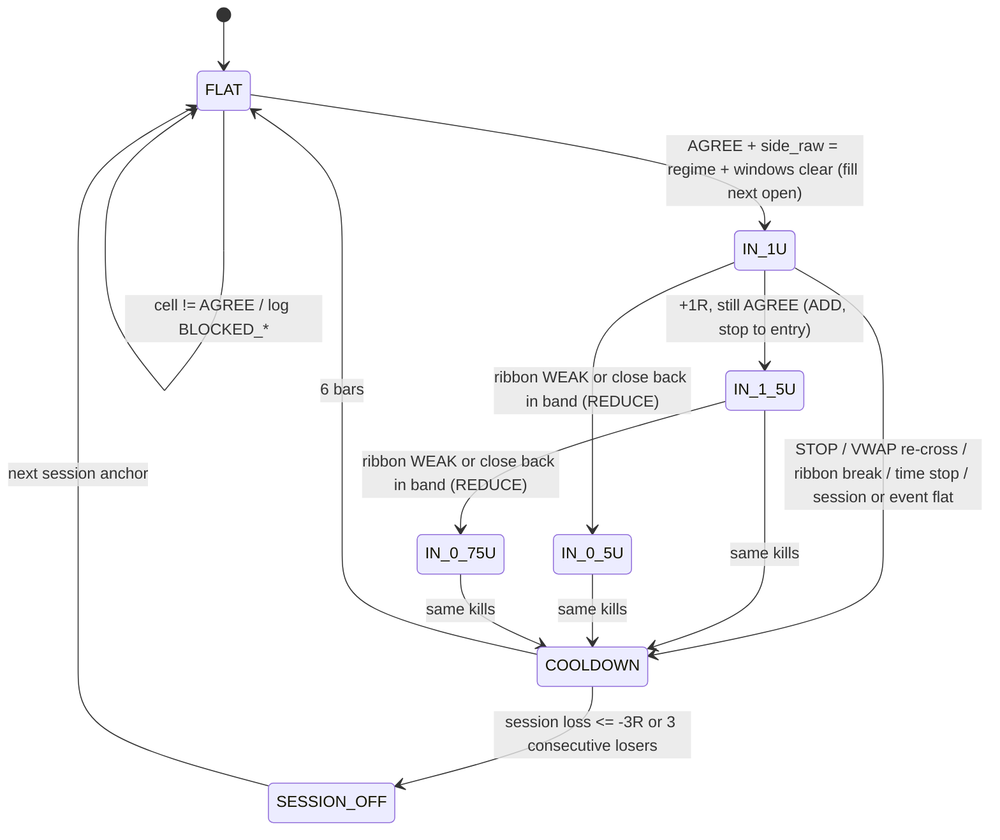

# Paper rule contract v0: VWAP regime-follow + EMA 21/50/100 ribbon (VRF-EMA v0)

**PAPER / RESEARCH ONLY.** No live trading, no exchange keys, no order placement. This contract describes
two **paper** books so that they can be replayed and measured. It does not authorise any trade.

| | |
|---|---|
| Date | Thu 1 Oct 2026 |
| Name | **VRF-EMA v0 (paper)**: VWAP Regime Flow with EMA ribbon gate |
| Books | **A**: inventory-skew paper book (market-maker-style lean). **B**: perp directional paper book |
| Reference engine | [`tools/vwap_regime_flow.py`](tools/vwap_regime_flow.py), checked by [`tools/test_vwap_regime_flow.py`](tools/test_vwap_regime_flow.py) |
| Companion | [`research_brief_20261001.md`](research_brief_20261001.md) (why, evidence, pitfalls) |
| Status | Rules only. **Every threshold is a placeholder.** Nothing has been run on real data. Phase 0 (§10) comes before any result. |

Where this document and the engine disagree, the engine is a bug or the document is stale: fix one, do
not interpret.

---

## 0. Scope and non-goals

- One venue, one instrument per study. Default: **Binance USD-M BTCUSDT perpetual**, with Binance spot
  BTCUSDT as the basis companion.
- Book A and Book B are evaluated **separately** and logged **jointly** (they trade the same instrument
  in the same direction in the AGREE cell).
- Not in scope: B-01 (frozen-session VWAP rejection), the SD-MR fade
  ([teardown](../vwap_sd_mr_teardown_20261001.md)), sizing beyond fixed units, multi-venue routing.

## 1. Inputs and clocks

| Item | v0 rule |
|---|---|
| Bars | **5-minute** OHLCV built from 1-minute bars of the traded instrument, UTC timestamps. Gaps are flagged, never forward-filled. |
| Session anchor | **00:00 UTC**, resetting every day. Variant (separate pre-registered study): 13:30 UTC (US cash open). No mid-study switching. |
| Decision clock | Close of each 5m bar `t`. |
| Fill clock | Market orders fill at the **open of bar t+1** plus slippage. Book A passive quotes are live for bar t+1 only. |
| Freeze | VWAP and residual sigma used at the close of `t` are computed through bar `t−1` of the current session. EMAs and ATR **include** bar `t` (its close is known at decision time). |
| Volume | Traded-instrument volume (perp volume for the perp). Never mix spot and perp volume in one VWAP. |
| Funding | Per-symbol funding timestamps and rates from the venue (Binance `GET /fapi/v1/fundingInfo` plus funding history). **Do not hardcode 8h**: Binance moves symbols between 8h, 4h and 1h intervals. |
| Calendar | Tier-1 US macro releases (CPI, NFP, FOMC statement and press conference, PCE, ISM) plus crypto placeholders (§7). |

## 2. Regime definition (VWAP side)

At the close of bar `t`, inside session `S`:

```
tp_i        = (high_i + low_i + close_i) / 3
VWAP_{t-1}  = Σ_{i∈S, i≤t-1} v_i·tp_i / Σ v_i
σ_{t-1}     = max( sqrt(Σ v_i·tp_i² / Σ v_i − VWAP_{t-1}²), 3 bps · VWAP_{t-1} )
band_t      = max( 0.25 · σ_{t-1}, 5 bps · VWAP_{t-1} )               # dead band
side_raw_t  = +1 if close_t > VWAP_{t-1} + band_t
              −1 if close_t < VWAP_{t-1} − band_t
               0 otherwise, or if minute_t < 60 (warm-up) or VWAP undefined
```

**Regime state machine** (`regime ∈ {ABOVE=+1, BELOW=−1, UNDEFINED=0}`), reset to UNDEFINED at every session
anchor:

1. During warm-up (first 60 minutes = 12 bars after the anchor) the regime is UNDEFINED. Nothing trades.
2. A regime is **established** (from UNDEFINED) or **cracked** (flipped) only after **2 consecutive closes**
   with `side_raw` equal to the new side. Any close inside the band or back on the old side resets the
   count.
3. Closes inside the band never change the regime.
4. `against_t` is true when the regime is set and `side_raw_t = −regime` but the flip is not yet
   confirmed. Book A uses it to de-risk early; Book B uses it to reduce.

Events: `REGIME_ESTABLISHED`, `CRACK_UP`, `CRACK_DOWN` (the engine logs these as `crack = ±1`).

## 3. Ribbon-intact gate (EMA 21 / 50 / 100)

On the same 5m closes. EMAs are **continuous across sessions** (not reset), and seeded at the first bar.

```
E21, E50, E100 = EMA(close, 21 / 50 / 100)
ATR            = Wilder ATR(14)
order_t        = +1 if E21 > E50 > E100;  −1 if E21 < E50 < E100;  0 otherwise
gap_t          = min(|E21 − E50|, |E50 − E100|) / ATR_t
slope_bull_t   = ΔE21 > 0 and ΔE50 > 0 and ΔE100 ≥ 0.05·ATR_t      (Δ over 6 bars = 30 min)
slope_bear_t   = mirror
crosses_t      = number of E21/E50 crosses in the last 48 bars (4 h)
qualify_t      = order_t if (matching slope) and gap_t ≥ 0.15 and crosses_t ≤ 2, else 0
```

| Test | What it rules out | v0 threshold |
|---|---|---|
| **Order** | Braided averages | Strict 21 > 50 > 100 (bull) or 21 < 50 < 100 (bear) |
| **Slope** | Ordered but flat ribbons after a range | All three EMAs moving the same way over 30 min; EMA100 by ≥ 0.05 ATR |
| **Separation** | Ordered by a hair | Both adjacent gaps ≥ 0.15 ATR to qualify; stays intact down to 0.05 ATR (hysteresis) |
| **Time in state** | One-bar flickers | 6 consecutive qualifying bars (30 min) before the ribbon is called INTACT |
| **Chop count** | Recently crossing ribbons | ≤ 2 EMA21/EMA50 crosses in the last 4 hours |
| **Warm-up** | Seed dependence | No state before 300 bars (3 × 100); the seed's weight is then below 0.3% |

**Ribbon state machine** (`BULL_INTACT=+2, BULL_WEAK=+1, TANGLED=0, BEAR_WEAK=−1, BEAR_INTACT=−2`):

- From any non-intact state: if `qualify` has held the same direction for ≥ 6 bars → `±2 INTACT`.
  Otherwise, if `order ≠ 0` and `crosses ≤ 2` → `±1 WEAK` (forming). Otherwise → `0 TANGLED`.
- From `±2 INTACT`:
  - stays INTACT while order is unchanged, gap ≥ 0.05 ATR and E50 still slopes the same way;
  - drops to `±1 WEAK` if order holds but separation or E50 slope fails (**reduce** signal);
  - drops to `0 TANGLED` or the opposite side the moment order breaks (**ribbon break** kill).

## 4. Decision matrix

`cell(t)` combines the regime with the ribbon state (see
[fig06](figures/fig06_decision_matrix.png)):

| Regime \ ribbon | BEAR_INTACT | BEAR_WEAK | TANGLED | BULL_WEAK | BULL_INTACT |
|---|---|---|---|---|---|
| **ABOVE** | CONFLICT | CONFLICT | TANGLED | WEAK | **AGREE** |
| **BELOW** | **AGREE** | WEAK | TANGLED | CONFLICT | CONFLICT |
| **UNDEFINED** | UNDEFINED | UNDEFINED | UNDEFINED | UNDEFINED | UNDEFINED |

| Cell | Book A target `q*` | Book B |
|---|---|---|
| AGREE | `regime × 0.6 · q_max` | may enter; hold; may add |
| WEAK | `regime × 0.3 · q_max` | no new entry; reduce if held |
| TANGLED | 0 (neutral two-sided quoting) | flat (ribbon-break kill) |
| CONFLICT | 0 (neutral two-sided quoting) | flat; **do not trade either side** |
| UNDEFINED | 0 | flat |

Overrides on every cell: `against_t` (one unconfirmed close beyond the band against the regime) sets Book A's
`q* = 0` at once ("de-risk fast, re-risk slow"). Kill switches (§7) override everything.

## 5. Book A: inventory-skew paper book

Units: inventory `q` in units of `q_max` (paper notional). **Perp:** `q ∈ [−q_max, +q_max]`, signed.
**Spot:** hold a neutral base inventory `q0 = q_max` and lean around it, so actual holding = `q0 + q ∈ [0, 2·q_max]`.
There is no borrowing and no naked spot short. "Below VWAP, accumulate sell-side inventory" means **hold less
than neutral**.

At the close of bar `t`, for quotes live during bar `t+1`:

| Rule | v0 |
|---|---|
| Target | `q*_t` from §4 (0 in warm-up, in blackouts, and in the last 30 minutes of the session) |
| Half-spread | `h = max(2 bps, 0.5 × sd of the last 48 five-minute log returns)` |
| Skew | `k = clip(1.5 × (q* − q) / q_max, −0.9, +0.9)`; `bid = mid − h + k·h`, `ask = mid + h + k·h` (both stay passive) |
| Size | 0.1 `q_max` per side per bar; a side is off if filling it would breach `±q_max` |
| **No absorbing against the lean** | If `q* < 0` and `q ≥ q*`: **no bid** (do not buy what sellers are dumping below VWAP). Mirror for `q* > 0`. Within the lean the book only sells rallies (below VWAP) or buys dips (above VWAP). |
| Add / reduce | Inventory changes only by moving `q*` (cell changes); there are no discretionary adds. |
| Fill model (paper) | A quote fills only if bar `t+1` trades **through** it by ≥ 0.5 bps. Fill at the quote price, maker fee charged. No queue position is modelled, and that is optimistic (§10 B7). |
| Drift unwind | If `|q − q*| > 0.5 q_max` for 24 bars (2 h), cross the spread for 0.1 `q_max` toward `q*` at the next open (taker). |
| Session flat | `q* = 0` from 30 minutes before the anchor; any residual is crossed out (taker) from 10 minutes before. |
| Event flat | At the first bar inside a blackout window: quotes pulled, inventory crossed out (taker). |

## 6. Book B: perp directional paper book

Units: 1 unit = fixed paper notional. Max 1.5 units. One position at a time.

### 6.1 Entry (all must hold at the close of `t`; fill at the open of `t+1`)

1. `cell_t = AGREE` and the ribbon is past warm-up.
2. `side_raw_t = regime_t` (the close is on the regime side, outside the band, so no entry from inside the band).
3. More than 60 minutes left in the session.
4. Not inside or entering an event blackout; **no funding stamp within 10 minutes after the fill**.
5. Cooldown: ≥ 6 bars since the last exit. ≤ 2 entries per regime episode (per crack).
6. Session not switched off by loss limits.

A refused entry is logged as `BLOCKED_CONFLICT`, `BLOCKED_TANGLED` or `BLOCKED_WINDOW`. Blocked signals are
kept for the counterfactual test (§11).

### 6.2 Stop and R

`stop = the further of (entry ∓ 2.0·ATR_t) and (VWAP_{t−1} ∓ (band_t + 0.5·ATR_t))`, i.e. beyond the far
edge of the VWAP dead band and at least 2 ATR away. **R = |entry − stop|.** The stop rests intrabar and
fills at the stop price, or at the open if the bar gaps through it. The thesis is invalidated by acceptance
back across VWAP, so the hard stop sits there; an ATR-only stop on 5m bars is noise-sized.

### 6.3 Add, reduce, flat (evaluated at each close while in a position; precedence top to bottom)

| # | Trigger | Action | Log |
|---|---|---|---|
| 1 | ≤ 15 minutes left in the session, or next bar is a new session | Flat | `SESSION_FLAT` |
| 2 | Next bar is inside an event blackout | Flat | `EVENT_FLAT` |
| 3 | Regime confirmed flipped against the position | Flat | `KILL_VWAP_RECROSS` |
| 4 | Ribbon TANGLED or opposite (`state × side ≤ 0`) | Flat | `KILL_RIBBON_BREAK` |
| 5 | Held ≥ 48 bars (4 h) and MFE < 0.5R | Flat | `TIME_STOP` |
| 6 | Ribbon drops to WEAK on the position's side (first time) | Reduce to 50% | `REDUCE_RIBBON_WEAK` |
| 7 | Close back inside the band or beyond it against (`side_raw ≠ side`), first time | Reduce to 50% | `REDUCE_VWAP_TOUCH` |
| 8 | Open P&L ≥ +1R, cell AGREE, `side_raw = side`, > 60 minutes left, not yet added or reduced | Add 0.5 unit; **stop for the whole position moves to the entry price** | `ADD` |

Every action fills at the next open with taker fee and slippage. After a reduce there is no add.

### 6.4 State machine



## 7. Kill switches (both books unless stated)

| Kill | Book A | Book B |
|---|---|---|
| **Ribbon break** (INTACT → TANGLED/opposite) | `q*` → 0 (neutral quoting), drift unwind applies | Flat at next open |
| **VWAP re-cross** (confirmed regime flip) | `q*` → 0 at the first unconfirmed close against; to the new side only after confirmation **and** ribbon agreement | Flat at next open |
| **Time stop** | Drift unwind after 2 h off-target | 4 h without 0.5R MFE → flat |
| **Session flat** | `q*` = 0 from T−30 min; taker flatten from T−10 min | Flat from T−15 min; no entries from T−60 min |
| **Event blackout** (placeholders) | Quotes pulled, flatten at the window start | No entries; flat at the window start |
| **Funding window** | none (logged) | No new entry within 10 min before a funding stamp |
| **Loss limits** | Paper drawdown on the session ≥ 50 bps of `q_max` notional → quoting off for the session *(not in the engine yet)* | Session realised ≤ −3R or 3 consecutive losers → off for the session |
| **Data quality** | Missing bar, zero-volume run ≥ 3 bars, or stale feed → pull quotes, flatten *(not in the engine yet)* | Same → flat, block entries *(not in the engine yet)* |
| **Combined exposure** | `|q_A| + |pos_B|` in common notional ≤ 2 units; B has priority, A's target is clipped *(not in the engine yet)* | |

**Event blackout windows (placeholders, fill in before Phase 1):** [−30 min, +30 min] around US CPI, NFP,
FOMC statement and press conference, PCE, ISM manufacturing. Crypto placeholders: announced venue
maintenance, large scheduled token unlocks (alts only), and the funding-interval change notices on the
traded symbol. In the engine this is `blackout=((start_bar, end_bar), ...)`.

## 8. Costs and funding (paper placeholders)

| Item | v0 placeholder | Replace with |
|---|---|---|
| Taker fee | 5 bps per side | Venue tier at the desk's volume |
| Slippage | 1 bp per side (Book B) | Measured arrival-price slippage for the size |
| Maker fee | 1 bp per side (Book A) | Venue tier; rebates if any |
| Funding | 1 bp per 8h stamp, longs pay when positive | **Printed** funding rate and interval per stamp |

Book B round trip ≈ 12 bps at these placeholders. That is the hurdle every conditional-drift estimate in
§10 must clear at the intended holding horizon.

## 9. Logging

- **Per bar:** `VWAP_{t−1}`, `σ_{t−1}`, `band`, `side_raw`, `regime`, `against`, E21/E50/E100, ATR, `order`,
  `gap`, `crosses`, `qualify`, ribbon state, cell, Book A `q*` and `q`, Book B units.
- **Per event:** regime established or cracked, ribbon break, every `BLOCKED_*`, `SIGNAL_*`, fills with
  reason codes as in §6.3, kills.
- **Per Book B episode:** side, signal and entry bar, entry price, R in bps, MFE/MAE in R, adds and reduces,
  exit reason, gross, fees, funding, net in bps and in R.
- **Per Book A fill:** side, price, maker or taker, regime, cell, `q*` at quote time, markouts at
  +5/+15/+30/+60 minutes.

## 10. Base-rate study checklist (Phase 0, before any backtest claim)

**No strategy P&L may be quoted until Phase 0 is written up.** Pre-register all of the following, with the
v0 thresholds frozen, before looking at held-out data.

**Data:** ≥ 6 months in-sample and ≥ 3 months held-out of 1m bars, resampled to 5m, for one venue and one
instrument (default BTCUSDT perp), with the spot companion, funding history and interval history, and the
event calendar. Report gaps.

| ID | Question | Measurement | Stop rule (falsifies VRF-EMA v0) |
|---|---|---|---|
| B1 | Does the VWAP side persist? | P(regime unchanged after 1/2/4/8 h \| crack), against placebo levels (previous session's VWAP, a VWAP anchored at a random time, a ±1 session shift) and against a block-bootstrap random walk | Held-out persistence not above the best placebo |
| B2 | Is there drift on the regime side? | `E[side_t · r(t→t+H)]` in bps, H ∈ {30 min, 1, 2, 4 h}, **by cell** (AGREE / WEAK / TANGLED / CONFLICT), hour-of-day bucket and volatility tercile, with block-bootstrap 95% CI | AGREE-cell lower CI ≤ round-trip cost (§8) at the intended hold |
| B3 | How noisy is a crack? | Whipsaw rate P(flip back within 15/30/60 min \| crack), cracks per session, with and without the band and acceptance rule | Not reported = no Phase 1 |
| B4 | How late is the ribbon? | Time from crack to INTACT; share of the B2 drift realised **before** the ribbon confirms | If > 50% of the drift is gone before confirmation, Book B as specified is structurally late; redesign (§12 Q3) before Phase 1 |
| B5 | Does VWAP add anything beyond the ribbon? | B2 for "ribbon INTACT, ignore VWAP" against "AGREE"; and B2 for "VWAP side, ignore ribbon" | If AGREE ≤ ribbon-only, drop VWAP from Book B (or the ribbon, in the mirror case) |
| B6 | Funding and basis | Funding sign and average funding per hold by cell; perp-vs-spot VWAP gap; regime agreement between perp and spot VWAP | Report; a gate on funding sign is an open question |
| B7 | Book A markouts | Needs trade prints and top of book. Passive fill probability and markouts at +1/+5/+15/+60 min for bids and asks, by regime side and cell, with-lean against neutral | With-lean markouts not better than neutral MM markouts by more than the maker fee → Book A dropped |
| B8 | Anchor sensitivity | B1/B2 at 00:00 UTC against 13:30 UTC anchors (separate pre-registered studies) | Report both; do not pick the better one after the fact |
| B9 | Concentration | Share of B2 drift from event days, from one month, from one hour bucket | > 50% from any one bucket → not a regime effect |
| B10 | Power | Independent cracks per month; minimum detectable effect at 80% power | Underpowered → extend data before Phase 1 |

## 11. Phase 1 (paper replay, walk-forward) and Phase 2 (forward shadow)

Phase 1 only if Phase 0 passes. Parameters are frozen before each out-of-sample block. VRF-EMA v0 Book B is
**falsified** if any of these holds:

- fewer than 200 out-of-sample episodes;
- the lower 95% bound on net expectancy per episode is ≤ 0;
- net expectancy turns negative under **any single** one-notch perturbation: +1 bar entry delay, +1 bp
  slippage per side, `accept_bars` ±1, dead band ±50%, `confirm_bars` ±50%, separation thresholds ±50%;
- more than 50% of net P&L comes from one calendar month or one hour-of-day bucket;
- replayed `BLOCKED_CONFLICT` / `BLOCKED_TANGLED` signals are **not** worse than AGREE entries (the ribbon gate
  then adds nothing and the result is a fitting artefact);
- worst session loss exceeds 4R.

Book A in Phase 1 is a markout study rather than a P&L claim, because a bar-based fill model cannot price queue
position (§5). Phase 2 is a forward shadow paper run. Realised fill and slippage diverging from Phase 1
assumptions by more than 50% invalidates Phase 1.

## 12. Open questions

1. **Bar size.** 5m is primary. Do 1m (faster crack, noisier) or 15m (slower ribbon) change B2 and B4 materially?
2. **Session anchor.** 00:00 UTC is a calendar convention, not an auction. Is a NY-open anchor or a
   volume-defined session (as in Shen, Urquhart & Wang 2022) better? Pre-register; do not shop.
3. **Lag.** Should Book B take a smaller starter position on the crack, before the ribbon confirms
   ([fig09](figures/fig09_lag_vwap_vs_ribbon.png))? That trades lag cost for whipsaw (B3 vs B4).
4. **CONFLICT as its own hypothesis.** Below VWAP with a bull ribbon is a classic "buy the pullback" setup.
   It is out of scope here; if anyone wants it, give it a separate contract and a separate book.
5. **Book A without L2 data.** Without trade prints and the book, A can only be checked mechanically. Is
   it worth building before B7 data exists?
6. **Combined exposure.** Which book has priority in AGREE, and should A's lean shrink while B is on?
7. **Funding as a gate.** Block longs when funding is above some percentile? Only after B6.
8. **Weekends.** Separate bucket, or exclude? Crypto weekend volume is structurally lower.
9. **Warm-up.** On synthetic paths, entries in the first two hours were stopped most often. Is 60 minutes
   enough, or 120?
10. **Regime labels.** Should `mm-regime-logger` labels (JOB-20260917-MM-001) gate eligibility, once validated?

---

## Appendix A. v0 defaults (engine field names)

| Group | Field | v0 |
|---|---|---|
| Regime | `warmup_minutes` | 60 |
| | `dead_band_sigma` / `dead_band_floor_bps` | 0.25 / 5.0 |
| | `accept_bars` | 2 |
| | `sigma_floor_bps` | 3.0 |
| Ribbon | `fast` / `mid` / `slow` | 21 / 50 / 100 |
| | `atr_len` / `slope_bars` / `slope_min_atr` | 14 / 6 / 0.05 |
| | `sep_min_atr` / `sep_hold_atr` | 0.15 / 0.05 |
| | `confirm_bars` / `cross_lookback` / `max_fast_crosses` | 6 / 48 / 2 |
| | `warmup_bars` | 300 |
| Book B | `stop_atr_min` / `stop_vwap_buffer_atr` | 2.0 / 0.5 |
| | `add_at_r` / `add_units` / `reduce_frac` | 1.0 / 0.5 / 0.5 |
| | `time_stop_bars` / `time_stop_min_r` / `max_hold_bars` | 48 / 0.5 / 0 (off) |
| | `cooldown_bars` / `max_entries_per_regime` | 6 / 2 |
| | `no_entry_last_minutes` / `flat_before_end_minutes` | 60 / 15 |
| | `funding_blackout_minutes` / `funding_bps` | 10 / 1.0 |
| | `daily_loss_r` / `max_consec_losses` | 3.0 / 3 |
| | `taker_bps` / `slippage_bps` | 5.0 / 1.0 |
| Book A | `lean` / `mult_agree` / `mult_weak` / `mult_tangled` / `mult_conflict` | 0.6 / 1.0 / 0.5 / 0 / 0 |
| | `clip` / `half_spread_bps_min` / `half_spread_vol` / `vol_len` | 0.1 / 2.0 / 0.5 / 48 |
| | `skew_k` / `skew_cap` / `tick_bps` | 1.5 / 0.9 / 0.5 |
| | `maker_bps` / `taker_bps` | 1.0 / 6.0 |
| | `drift_tol` / `drift_bars` / `unwind_clip` | 0.5 / 24 / 0.1 |
| | `flat_window_minutes` / `hard_flat_minutes` | 30 / 10 |

## Appendix B. Pine visual sketch (RESEARCH ONLY)

Written from scratch for this desk; no third-party Pine source is reused. It is an **indicator**: it draws
the regime shading, the frozen VWAP and the ribbon state, and places no orders. **It has not been compiled
in TradingView or checked against the Python reference.** The Python engine is the reference. For crypto
venues the exchange timezone on TradingView is normally UTC, so `timeframe.change("D")` is the 00:00 UTC
anchor. Check `syminfo.timezone` before relying on it.

```pine
//@version=5
// RESEARCH ONLY. Educational visual of VRF-EMA v0 regime and ribbon states.
// Not a strategy, places no orders, not compiled or verified against the Python reference.
indicator("VRF-EMA v0 regime + ribbon (research only)", overlay = true)

warmBars  = input.int(12, "Warm-up bars after session anchor")
deadK     = input.float(0.25, "Dead band (x residual sigma)")
deadBps   = input.float(5.0, "Dead band floor (bps)")
acceptN   = input.int(2, "Closes beyond band to crack")
sepMin    = input.float(0.15, "Min EMA gap to qualify (x ATR)")
sepHold   = input.float(0.05, "Min EMA gap to stay intact (x ATR)")
slopeBars = input.int(6, "Slope lookback (bars)")
slopeMin  = input.float(0.05, "Min EMA100 move over lookback (x ATR)")
confirmN  = input.int(6, "Qualifying bars to call intact")
crossLb   = input.int(48, "Chop lookback (bars)")
crossMax  = input.int(2, "Max EMA21/50 crosses in lookback")

// Session VWAP and residual sigma, frozen at t-1
newSess = timeframe.change("D")
var float sv   = 0.0
var float spv  = 0.0
var float sp2v = 0.0
var int barsIn = 0
float vwapPrev = na
float sigPrev  = na
if newSess
    sv := 0.0
    spv := 0.0
    sp2v := 0.0
    barsIn := 0
else
    barsIn += 1
    if sv > 0
        vwapPrev := spv / sv
        sigPrev := math.max(math.sqrt(math.max(sp2v / sv - vwapPrev * vwapPrev, 0.0)), 3e-4 * vwapPrev)
sv   += volume
spv  += hlc3 * volume
sp2v += hlc3 * hlc3 * volume

band    = na(vwapPrev) ? na : math.max(deadK * sigPrev, deadBps * 1e-4 * vwapPrev)
ready   = not na(vwapPrev) and barsIn >= warmBars
sideRaw = not ready ? 0 : close > vwapPrev + band ? 1 : close < vwapPrev - band ? -1 : 0

var int regime = 0
var int streak = 0
var int streakSide = 0
if newSess
    regime := 0
    streak := 0
    streakSide := 0
if ready
    if sideRaw != 0 and sideRaw != regime
        streak := sideRaw == streakSide ? streak + 1 : 1
        streakSide := sideRaw
        if streak >= acceptN
            regime := sideRaw
            streak := 0
            streakSide := 0
    else
        streak := 0
        streakSide := 0

// EMA 21/50/100 ribbon
e21  = ta.ema(close, 21)
e50  = ta.ema(close, 50)
e100 = ta.ema(close, 100)
atr  = ta.atr(14)
ord  = e21 > e50 and e50 > e100 ? 1 : e21 < e50 and e50 < e100 ? -1 : 0
gapAtr = math.min(math.abs(e21 - e50), math.abs(e50 - e100)) / atr
dF = e21 - e21[slopeBars]
dM = e50 - e50[slopeBars]
dS = e100 - e100[slopeBars]
slopeBull = dF > 0 and dM > 0 and dS >= slopeMin * atr
slopeBear = dF < 0 and dM < 0 and -dS >= slopeMin * atr
crosses = math.sum(ta.cross(e21, e50) ? 1 : 0, crossLb)
calm = crosses <= crossMax
qual = ord == 1 and slopeBull and gapAtr >= sepMin and calm ? 1 : ord == -1 and slopeBear and gapAtr >= sepMin and calm ? -1 : 0

var int qStreak = 0
var int qDir = 0
if qual != 0 and qual == qDir
    qStreak += 1
else if qual != 0
    qStreak := 1
    qDir := qual
else
    qStreak := 0
    qDir := 0

var int rib = 0
if bar_index >= 300
    if math.abs(rib) == 2
        d = rib > 0 ? 1 : -1
        holds = ord == d and gapAtr >= sepHold and math.sign(dM) == d
        if not holds
            rib := ord == d ? d : ord
    else if qStreak >= confirmN
        rib := 2 * qDir
    else if ord != 0 and calm
        rib := ord
    else
        rib := 0

agree    = regime != 0 and rib == 2 * regime
conflict = regime != 0 and rib * regime < 0

bgcolor(regime == 1 ? color.new(color.green, 88) : regime == -1 ? color.new(color.red, 88) : color.new(color.gray, 92))
plot(vwapPrev, "Session VWAP (t-1)", color.blue, 2, plot.style_linebr)
p21  = plot(e21, "EMA 21", color.orange)
plot(e50, "EMA 50", color.purple)
p100 = plot(e100, "EMA 100", color.teal)
ribCol = rib == 2 ? color.new(color.green, 70) : rib == 1 ? color.new(color.green, 88) : rib == -1 ? color.new(color.red, 88) : rib == -2 ? color.new(color.red, 70) : color.new(color.gray, 85)
fill(p21, p100, color = ribCol)
plotshape(agree and not agree[1] and regime == 1, "AGREE long starts", shape.triangleup, location.belowbar, color.green, size = size.small)
plotshape(agree and not agree[1] and regime == -1, "AGREE short starts", shape.triangledown, location.abovebar, color.red, size = size.small)
plotshape(conflict and not conflict[1], "CONFLICT starts", shape.xcross, location.abovebar, color.purple, size = size.tiny)
```

## Appendix C. Reproduce

```bash
pip install numpy matplotlib
python3 desk-briefs/hft-strategies/vwap-regime-ema-flow/tools/test_vwap_regime_flow.py
python3 desk-briefs/hft-strategies/vwap-regime-ema-flow/tools/make_figures.py
```

The tests check that:

- the frozen VWAP, regime, ribbon state and both books' decisions before bar `k` do not change when bars
  from `k` onward are perturbed;
- the VWAP resets each session and the regime is UNDEFINED in warm-up;
- one close beyond the band never cracks the regime and two do;
- the EMA seed decays exactly as `(1 − α)^k`, and the ribbon waits for warm-up;
- Book B enters only in the AGREE cell and kills fire on the next bar;
- both books are flat at every session end and Book A inventory never exceeds `q_max`.
