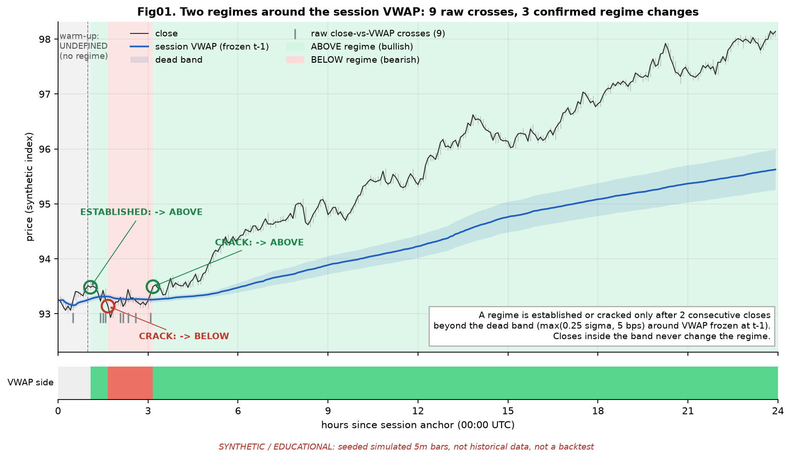
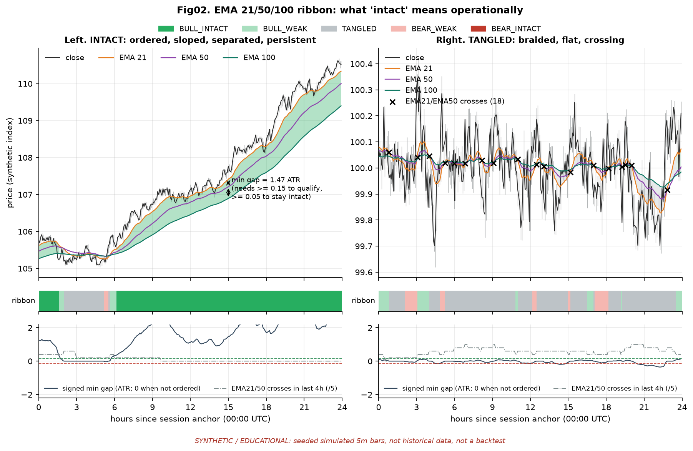
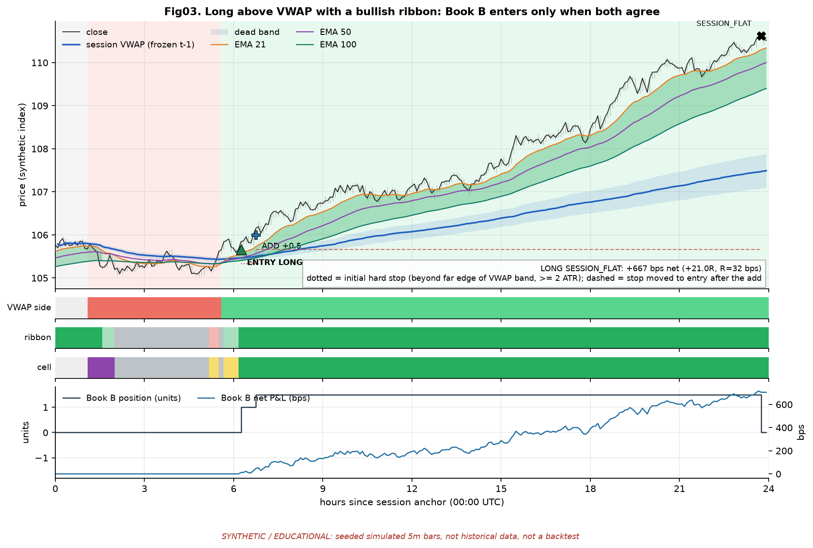
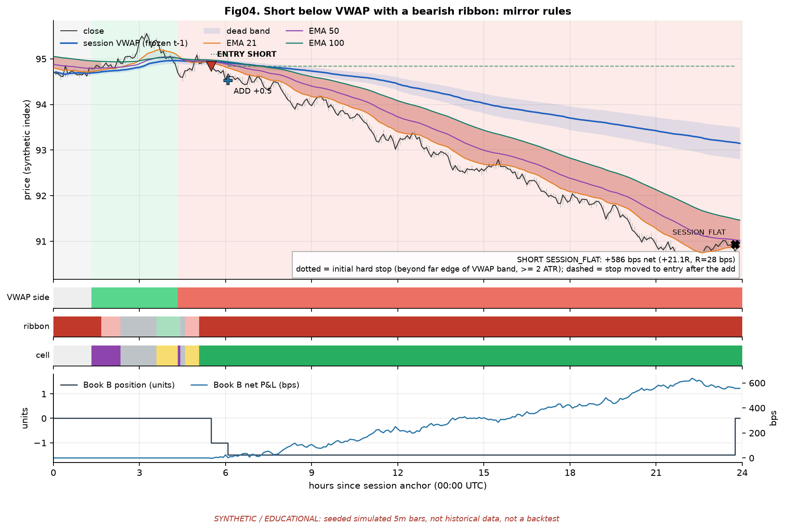
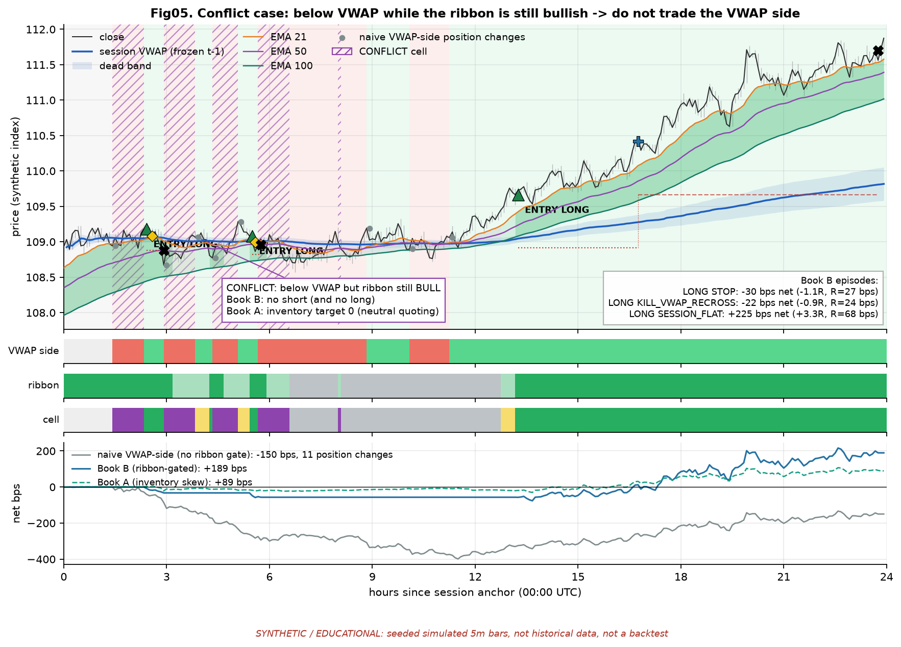
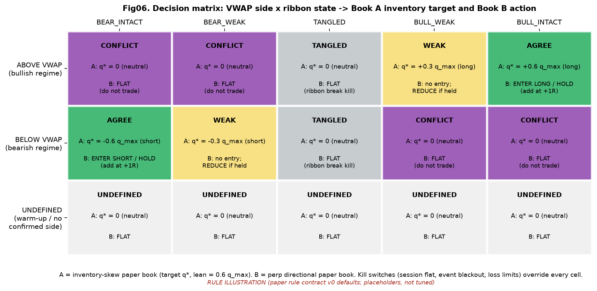
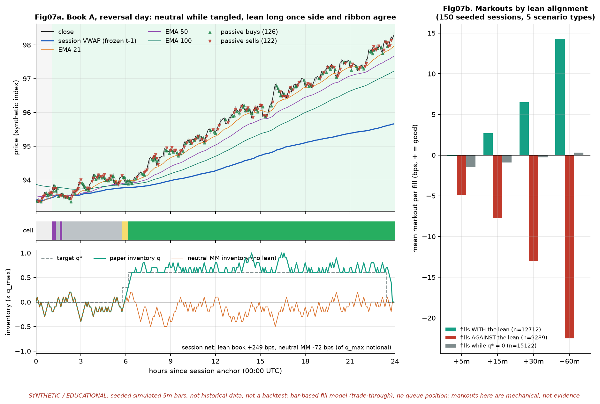
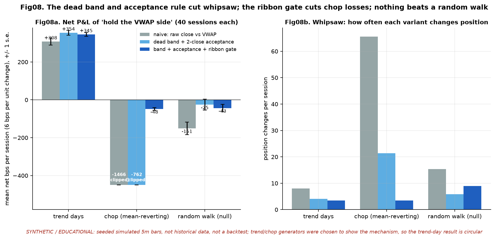
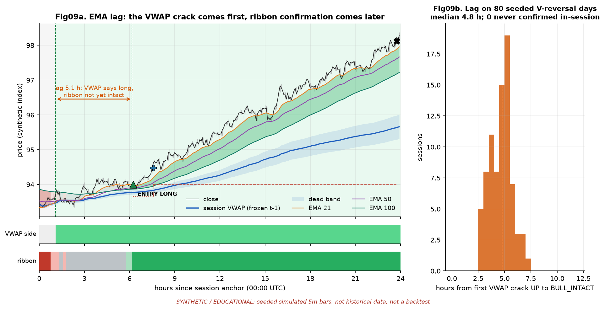

# VWAP regime-follow with an EMA 21/50/100 ribbon filter: market research brief

**PAPER / RESEARCH ONLY.** No live trading, no exchange keys, no order placement. Nothing here is a trade
instruction, and nothing here claims the idea is profitable.

| | |
|---|---|
| Date | Thu 1 Oct 2026 |
| Track | `HFT-strategies` paper track, packet `vwap-regime-ema-flow` |
| Operator thesis | Price above session VWAP is a bullish regime, below it a bearish one. Once the prior regime cracks, follow the flow: (1) lean inventory with the side of VWAP; (2) on perps, trade the VWAP side **only while** the 21/50/100 EMA ribbon is intact |
| Rules | [`paper_rule_contract_v0.md`](paper_rule_contract_v0.md) (VRF-EMA v0: regime, ribbon gate, Book A and Book B, kills, Phase 0 checklist) |
| Previous step | [`../vwap_sd_mr_teardown_20261001.md`](../vwap_sd_mr_teardown_20261001.md) (VWAP±SD mean-reversion teardown) |
| Figures | [`figures/`](figures/), regenerate with `python3 desk-briefs/hft-strategies/vwap-regime-ema-flow/tools/make_figures.py` |
| Status | Hypothesis only. **No real market data was run.** Every chart uses seeded synthetic 5-minute paths. |

---

## Desk takeaways

**Verdict.** The thesis **can be written as causal, checkable paper rules**, and
[contract v0](paper_rule_contract_v0.md) does that. **Whether it has edge is unknown.** Public evidence
that "the side of VWAP persists" exists only for US equity index ETFs. The best of it is concentrated around
the cash open, and none of it is peer-reviewed. Crypto intraday evidence shows both momentum and reversal.
Do not build a backtest until the Phase-0 base-rate study (contract §10) is written up.

1. **This is the opposite bet to the SD-MR fade.** The fade says a stretch away from VWAP comes back.
   Regime-follow says the side of VWAP persists. Both bets use the same reference level, so one base-rate
   dataset can test both. If touch-back probability is high, persistence is low, and vice versa.
2. **A raw VWAP cross is noise; a crack needs acceptance.** v0 requires 2 consecutive 5m closes beyond a dead
   band of `max(0.25σ, 5 bps)` around a VWAP frozen at t−1 (fig01). On synthetic chop, naive "hold the side
   of VWAP" changed position **66 times a session and lost about 1,466 bps** at 6 bps per change. The band
   and acceptance rule cut that to 21 changes and −762 bps, and the ribbon gate cut it to 3.5 changes and
   −48 bps (fig08).
3. **"Ribbon intact" has to be operational, not visual.** v0 requires five things: order (21 > 50 > 100),
   slope (all three rising, EMA100 by at least 0.05 ATR per 30 minutes), separation (both gaps at least
   0.15 ATR), time in state (6 bars) and no recent chop (at most 2 EMA21/50 crosses in 4 hours). Anything
   less is WEAK or TANGLED (fig02).
4. **Trade the AGREE cell only.** Book B (perp) trades long only when price is above VWAP *and* the ribbon
   is BULL_INTACT, and short only in the mirror case. Below VWAP with a bull ribbon is CONFLICT, and the
   book stays flat (fig05, fig06).
5. **The price of the ribbon gate is lag.** On synthetic V-reversal days, the ribbon confirmed a median
   **4.75 hours** after the VWAP crack (10th–90th percentile 3.2–5.8 h; fig09). Book B will mostly trade
   the second leg of a regime, not the crack itself. Phase 0 must measure how much of the move is gone by
   then (contract §10 B4).
6. **The inventory lean (Book A) and the perp overlay (Book B) are different products.** Below VWAP,
   sellers hit bids, so a passive market maker *naturally accumulates longs*. Leaning short means
   **refusing to absorb** (no bid while short of target) and selling rallies into VWAP. That is a deliberate
   give-up of spread capture, which pays only if the side persists. Its risk is adverse selection, and that
   can only be measured with markouts on real trade and book data (fig07, contract §10 B7).
7. **Perp specifics are not optional.** Binance sets funding intervals per symbol and moves them between 8h,
   4h and 1h, so read the schedule rather than hardcoding 00/08/16 UTC. Compute VWAP from the instrument
   you trade (perp volume for the perp), because perp and spot VWAPs differ by the basis.
8. **What must be measured first** (contract §10): side persistence against placebo levels, side-signed
   drift by cell net of a 12 bps round trip, crack whipsaw rate, ribbon lag, whether VWAP adds anything
   beyond the ribbon, funding by cell, passive-fill markouts, anchor sensitivity, concentration and power.

---

## 1. VWAP as a regime divider: practice and literature

### 1.1 Where VWAP comes from: an execution benchmark

VWAP became a standard because execution desks are measured against it. Berkowitz, Logue and Noser (1988)
used it as the benchmark for the cost of a trade: the price a passive participant could expect over the
day. Madhavan (2002) describes the main ways to achieve VWAP: guaranteed principal bids, forward VWAP crosses,
and automated participation that trades in proportion to the expected volume curve. He warns that the
benchmark is a poor fit for momentum-driven or size-sensitive orders. Kakade, Kearns, Mansour and Ortiz
(2004) treat it as an online algorithms problem.

**Why this matters for the thesis.** The popular story is that institutions "defend VWAP", buying below it
and selling above it. Madhavan's description cuts against that. Most VWAP-benchmarked flow is a
participation schedule that follows *volume*, not price relative to VWAP. Only the opportunistic "beat
VWAP" slice is price-sensitive at the level. The benchmark's real effect on behaviour is therefore
plausible but small and unmeasured. Treat "who's in control" arguments as narrative.

### 1.2 How practitioners use the side of VWAP

- **Day-trading desks and educators.** Aziz (*How to Day Trade for a Living*, 2016) and Shannon (*Maximum
  Trading Gains With Anchored VWAP*, Alphatrends, 2023; *Technical Analysis Using Multiple Timeframes*,
  2008) frame session VWAP, and VWAP anchored to an event, as the dividing line between buyers and sellers
  being in control. Above it, the average participant since the anchor is in profit; below it, they are
  underwater. Typical rules are: favour longs above, shorts below, and treat a reclaim or loss of VWAP as
  the regime change. This is the operator thesis almost word for word. It is a framework, not a tested
  result.
- **Auction-market practice.** Market Profile (Dalton, Jones and Dalton, *Mind Over Markets*) distinguishes
  **acceptance** (price spends time and volume beyond a level) from **rejection** (a probe that fails). The v0
  "2 closes beyond a dead band" rule is a crude, checkable version of acceptance.
- **Systematic intraday momentum.** The Concretum and Bear Bull Traders papers (§1.3) do not use VWAP side
  alone. They use it as **confirmation and as a trailing stop** next to a separate signal. That is the
  closest public analogue to "VWAP side + ribbon gate".

### 1.3 What the quantitative evidence says

| Source | What it tests | Finding | How much weight |
|---|---|---|---|
| Zarattini & Aziz (2023), *VWAP: The Holy Grail for Day Trading Systems*, SSRN 4631351 | QQQ/TQQQ, 1-minute bars, 2018–2023. Groups each minute by whether the **previous close** was above or below session VWAP; then long above / short below, with a stop on a close across VWAP | Most of QQQ's repricing happened on the side of VWAP the previous minute was on. Reported +671% net on QQQ, Sharpe 2.1 | **Thin.** Authors are affiliated with the education firms involved; it is not peer-reviewed; the paper says it assumed **no slippage**. Independent re-implementations (a QuantConnect write-up by S. Lingafeldt; a 2026 Medium replication extended to July 2026) found weaker, regime-dependent results with the edge concentrated in the first hours after the cash open. One example in the paper shows five quick whipsaw trades in a row before the trend leg. |
| Zarattini, Barbon & Aziz (2024), *Beat the Market*, SSRN 4824172 (SFI WP 24-97) | SPY: break of a "noise area" around the open **and** price on the right side of VWAP; VWAP as trailing stop | +1,985% net 2007–early 2024, Sharpe 1.33 | **Thin to moderate.** More careful, but the slippage assumption ($0.001/share) has been publicly criticised as far below SPY's spread. Supports "VWAP as a filter or stop beside another signal", not VWAP alone. |
| Gao, Han, Li & Zhou (2018), *Market intraday momentum*, JFE 129(2) | SPY: first half-hour return predicts last half-hour | Significant, out-of-sample | **Moderate**, but for US equities with a real open and close. Not a VWAP test. |
| Shen, Urquhart & Wang (2022), *Bitcoin intraday time-series momentum*, Financial Review 57(2) | BTC across several venues; trading time defined by **volume** because BTC has no close | First half-hour predicts last half-hour, strongest on high-volume or high-volatility days; attributed to liquidity provision | **Moderate** for crypto intraday persistence in general. Not a VWAP test. Its session definition is a hint for open question 2 in the contract. |
| Wen, Bouri, Xu & Zhao (2022), *Intraday return predictability in the cryptocurrency markets: momentum, reversal, or both*, NAJEF 62:101733 | BTC 2013–2020, plus ETH, LTC, XRP | **Both** momentum and reversal; the pattern changes with jumps, FOMC days, liquidity and COVID | **Moderate.** Says crypto intraday persistence is conditional. That is the case for a regime gate and the case against assuming the side always persists. |
| Moskowitz, Ooi & Pedersen (2012), JFE 104(2); Hurst, Ooi & Pedersen (2017), JPM 44(1); Liu & Tsyvinski (2021), RFS 34(6) | Time-series momentum across assets and in crypto, at **daily to monthly** horizons | Robust trend premia | **Strong** for slow trend following; **does not transfer** automatically to 5-minute EMAs. |
| Guppy, *Trend Trading* (2004) (the multiple-moving-average ribbon); Kaufman, *Trading Systems and Methods* | Ribbon compression or expansion as trend strength; moving-average lag and whipsaw | Practitioner framework | **None as evidence.** Useful for vocabulary and failure modes. |

**Bottom line on evidence.** The thesis is well motivated: intraday trends exist, and the side of VWAP is a
natural confirmation. But there is **no public, cost-honest test of "VWAP side + EMA 21/50/100 ribbon" on
crypto perps**. The closest results come from US index ETFs, where the effect clusters at the cash open, a
feature crypto's 24-hour session does not have. Treat every number above as motivation, not a prior.

---

## 2. How this differs from the VWAP±SD mean-reversion sketch

The [SD-MR teardown](../vwap_sd_mr_teardown_20261001.md) took apart a vault script that faded ±2σ stretches
back to a lifetime VWAP. This packet is the other side of the same coin.

| | Vault VWAP±SD fade (torn down) | VRF-EMA v0 (this packet) |
|---|---|---|
| Hypothesis | A stretch away from VWAP **reverts to** it | The side of VWAP **persists**; a confirmed cross starts a new regime |
| Where the trade happens | Away from VWAP, at the ±2σ pierce | On the regime side, after a confirmed crack, while the ribbon agrees |
| What VWAP is to the trade | The **target** | The **invalidation** (re-cross = kill; the hard stop sits beyond the band) |
| VWAP definition | Lifetime cumulative; the anchor is the data start (S1 defect D1) | Session-anchored at 00:00 UTC, frozen at t−1, typical price |
| Dispersion | `stdev(close, 20)` around an SMA (wrong object, D2) | Volume-weighted residual σ around session VWAP, used only for the dead band |
| Stops and kills | None (D5) | Structural stop beyond VWAP, VWAP re-cross, ribbon break, time stop, session flat, event blackout, loss limits |
| Costs | None (D6) | Taker + slippage + funding; 12 bps round-trip hurdle |
| Fails in | Trend days | Chop around VWAP (whipsaw), and V-reversals (ribbon lag) |

**How they relate.** SD-MR v1's eligibility filters, VWAP slope and side persistence (at least 75% of
closes on one side), are exactly the conditions under which this packet wants to trade. v1's
`BLOCKED_INELIGIBLE` events are candidate regime-follow bars. Run both Phase-0 studies on **one dataset**
with one session clock and one frozen-VWAP implementation. Keep the books, parameters and P&L separate,
and log them jointly, since they will hold opposite positions around the same level. B-01 (frozen-session
VWAP *rejection*) is a third, separate hypothesis: it trades the level holding, while this packet trades
the level being accepted through. It shares infrastructure only.

The progression is: **mean-reversion bands → regime-follow with a ribbon filter.** Both are hypotheses about
the same reference, and Phase 0 decides which, if either, survives.

---

## 3. VWAP side × EMA 21/50/100 ribbon

### 3.1 Why a second filter at all

The two signals move at different speeds:

- **VWAP side is fast and noisy.** It can flip on two closes, and around a flat VWAP it flips constantly
  (fig08: 21 changes per session in synthetic chop even with the band).
- **The ribbon is slow and structural.** On 5m bars, EMA 21/50/100 have effective lags (centre of mass,
  `(N−1)/2` bars) of about 50 minutes, 2 hours and 4.1 hours. It cannot flip on a single impulse.

The ribbon filters out VWAP-side signals that are not part of a broader move. The cost is lag: it will
always be late to a genuine regime change (§3.4).

### 3.2 What "intact" means operationally

| Property | Why it matters | v0 test (contract §3) |
|---|---|---|
| **Order** | A braided ribbon has no direction | 21 > 50 > 100 (bull) or 21 < 50 < 100 (bear), strictly |
| **Slope** | Ordered but flat ribbons appear after ranges and drift sideways | All three moving the same way over 30 minutes; EMA100 by at least 0.05 ATR |
| **Separation** | Ordered by a hair flips on the next bar | Both adjacent gaps at least 0.15 ATR to qualify, kept down to 0.05 ATR once intact (hysteresis) |
| **Time in state** | Single-bar flickers | 6 consecutive qualifying bars (30 minutes) before INTACT |
| **No recent chop** | A ribbon that just re-ordered after hours of crossing is not a trend yet | At most 2 EMA21/50 crosses in the last 4 hours |
| **Warm-up** | EMA seed dependence | No state before 3 × 100 bars; the seed then weighs less than 0.3%. Unlike lifetime VWAP, the EMA's memory decays, so the data start stops mattering. |

**States:** BULL_INTACT, BULL_WEAK (ordered, but separation or slope has failed: **reduce**), TANGLED (order
broken: **flat**), and the bear mirrors. Fig02 shows an intact day against a tangled day with the gap and
crossing counts plotted.

### 3.3 Confirmation against conflict

| VWAP side \ ribbon | Ribbon agrees and INTACT | Ribbon agrees but WEAK | TANGLED | Ribbon opposite |
|---|---|---|---|---|
| Above / Below | **AGREE**: both books may lean or trade | **WEAK**: A half lean; B no new entry, reduce | **TANGLED**: A neutral; B flat | **CONFLICT**: A neutral; B flat |

Fig06 is the full 3 × 5 grid. The most important cell is **CONFLICT**, for example below VWAP while the
ribbon is still bullish (fig05). That is a pullback inside an uptrend. A VWAP follower wants to be short; a
trend follower wants to buy the dip. With no evidence for either, v0 stands aside. "Buy the pullback in a
bull ribbon" is a legitimate *different* hypothesis (contract §12 Q4). It must not leak into this book.

### 3.4 The lag problem

Fig09 shows the structural issue. On a V-reversal day, the VWAP regime cracks up early, while the ribbon is
still bearish and has to unwind, re-order, separate and persist. On 80 synthetic reversal days, the median
time from crack to BULL_INTACT was 4.75 hours. If on real data most of the side-signed drift happens before
that, Book B is structurally late and needs a redesign before Phase 1, for example a starter position on
the crack with the add gated by the ribbon (contract §12 Q3).

---

## 4. Spot inventory lean against perp directional

### 4.1 What "accumulate sell-side inventory below VWAP" means mechanically

In market-making models the dealer quotes around a **reservation price** that is shifted by inventory and,
when there is one, by an alpha signal (Ho & Stoll 1981; Avellaneda & Stoikov 2008; Guéant, Lehalle &
Fernandez-Tapia 2013; Cartea, Jaimungal & Penalva 2015, which covers market making with a directional
signal). A VWAP-side lean is such a signal. Below VWAP, the reservation price is shifted down, so the
**target inventory `q*` is short** and both quotes shift down: asks become more aggressive and bids are pulled
back.

- **Perp:** `q*` is signed (v0: `±0.6·q_max` in AGREE, `±0.3` in WEAK, 0 otherwise).
- **Spot:** there is no naked short. The book holds a neutral base `q0` and leans around it. "Sell-side
  inventory" below VWAP means **holding less than neutral**, down to zero.

### 4.2 The trap: passive flow fills you the wrong way

Below VWAP, aggressive sellers dominate, and a neutral market maker's bids get hit. It **accumulates longs**,
which is the opposite of the lean, and it is adversely selected if the move continues (Glosten & Milgrom
1985; Easley, López de Prado & O'Hara 2012 on flow toxicity). Leaning short therefore requires an explicit
rule: **while short of target, do not bid** ("no absorbing against the lean", contract §5). The book then
only sells into upticks toward VWAP. That costs spread capture and fill rate, and it pays only if the side
persists.

Fig07 shows the mechanism on synthetic paths. The markouts are mechanical, because the bar-based fill model has
no queue. Fills **with** the lean averaged −0.1 / +2.7 / +6.5 / +14.3 bps at +5 / +15 / +30 / +60 minutes. Fills
**against** the lean averaged −4.9 / −7.8 / −13.0 / −22.5 bps. Fills while neutral averaged roughly zero. On the
reversal day shown, the lean book made +249 bps of `q_max` notional and a neutral market maker lost −72 bps.
**This is what the mechanism looks like when the side persists by construction. It is not evidence that it
does.**

### 4.3 When A and B agree, and when they conflict

| Situation | Book A (inventory) | Book B (perp) | Note |
|---|---|---|---|
| AGREE (for example above VWAP, bull ribbon intact) | Lean long (0.6 `q_max`) | Long 1 unit, add at +1R | **Same direction, so exposure stacks.** Cap combined exposure (contract §7) |
| WEAK | Half lean | No new entry; reduce if held | |
| TANGLED | Neutral two-sided quoting | Flat | The plain market-making regime; A behaves like a normal market maker |
| CONFLICT (for example below VWAP, bull ribbon) | **Neutral, not short** | Flat | The two signals disagree and neither has evidence; stand aside |
| Unconfirmed close against the regime | `q*` → 0 at once | Reduce to 50% | **De-risk fast, re-risk slow.** A re-leans only after the crack is confirmed *and* the ribbon agrees |

The asymmetry is deliberate. A's lean is cheap to cut (stop quoting one side), so it reacts on a single
close. B's position costs taker fees to flip, so it waits for confirmation.

---

## 5. Named pitfalls

| Pitfall | What goes wrong | v0 guard | Measure in Phase 0 |
|---|---|---|---|
| **VWAP definition** | *Lifetime cumulative* VWAP depends on where the data starts (SD-MR D1). *Rolling-N* VWAP has no anchor and drifts with the window. *Anchored* VWAPs invite anchor shopping after the fact. | Session-anchored at 00:00 UTC, one pre-registered variant (13:30 UTC). Lifetime VWAP is **never** the primary reference. | B8 anchor sensitivity |
| **Look-ahead** | Using VWAP *including* the bar being judged; using the day's final VWAP; filling at the same close that produced the signal; ordering intrabar highs and lows optimistically | VWAP frozen at t−1; decisions at the close, fills at the next open; stop beats target within a bar; causality tests in `tools/` | Re-run the causality tests on the real-data pipeline |
| **Chop around VWAP** | A flat VWAP produces a flip every few bars; costs eat everything (fig08: naive −1,466 bps a session in synthetic chop) | Dead band + 2-close acceptance; ribbon gate; cooldown; at most 2 entries per regime | B3 whipsaw rate, flips per session |
| **Regime-flip whipsaw** | A genuine crack that reverses within the hour | Acceptance rule; VWAP re-cross kill; structural stop beyond the band | B3 |
| **EMA lag** | The ribbon confirms hours after the crack (fig09); the trade catches the tail | Explicit; measured, not hidden | B4: share of drift before confirmation |
| **Funding** | Holding a perp through funding stamps; funding sign correlates with crowded direction | No entries within 10 minutes before a stamp; funding charged per stamp; schedule read per symbol (8h / 4h / 1h on Binance) | B6 funding by cell |
| **Basis** | Signal on spot VWAP, execution on perp, or the reverse; the regime differs by the basis | VWAP from the traded instrument; spot companion logged | B6 perp-against-spot regime agreement |
| **Volume quality** | Wash trading inflates some venues' volume and distorts VWAP (Cong, Li, Tang & Yang 2023, *Crypto Wash Trading*, Management Science) | Single, major, regulated-ish venue; one instrument | Compare against a second venue's VWAP |
| **Session boundary** | 00:00 UTC is a calendar convention, not an auction; there is no opening print | Warm-up of 60 minutes; regime UNDEFINED until established | B8; open question on volume-defined sessions |
| **Early-session instability** | VWAP built on a few bars swings easily; in the seed scans behind these figures, entries in the first two hours were stopped most often | 60-minute warm-up (open question: 120) | B2 by hour-of-day bucket |
| **Crowding at an obvious level** | Everyone watches VWAP, so stops cluster just beyond it | Stop placed beyond the band plus 0.5 ATR, not at the line | Stop-hit clustering against distance |
| **Multiple testing** | 30+ thresholds, 2 books, 2 anchors and 3 bar sizes give a large search space (Bailey, Borwein, López de Prado & Zhu 2014; Harvey & Liu 2015) | Frozen v0 defaults; one-notch perturbation test; blocked-signal counterfactual | Pre-registration before held-out data |
| **Synthetic circularity** | The figures in this packet use generators built to show each mechanism | Every figure is labelled; no figure is quoted as evidence | n/a |

---

## 6. What the figures show

Every price path is **synthetic, seeded and educational**: an Ornstein–Uhlenbeck process around a drifting
anchor on 5-minute bars, with two prior sessions to warm the EMAs. None of it is calibrated to BTC, and none
of it is a backtest.

| Figure | Shows |
|---|---|
|  | **Fig01. Two regimes.** Session VWAP frozen at t−1, dead band, green/red regime shading, and the warm-up. 9 raw close-vs-VWAP crosses produce only 3 regime changes (one establishment and two cracks). |
|  | **Fig02. Ribbon intact against tangled.** Left: ordered, sloped and separated (minimum gap 1.47 ATR at hour 15), and persistent. Right: 18 EMA21/50 crosses in one session, with a gap that rarely clears the 0.15 ATR threshold and a chop count that keeps it from qualifying when it does. |
|  | **Fig03. Long above VWAP with a bull ribbon.** Book B enters only once the regime is ABOVE and the ribbon is BULL_INTACT, adds at +1R with the stop moved to entry, and exits on the session flat (+667 bps net, +21R; a synthetic trend day is generous by construction). |
|  | **Fig04. Short below VWAP with a bear ribbon.** The mirror case (+586 bps net, +21R, same caveat). |
|  | **Fig05. Conflict.** A pullback below VWAP while the ribbon stays bullish. Naive VWAP-side trading lost −150 bps over 11 position changes. Book B never entered on a conflict bar: its two early longs in brief AGREE windows lost −30 and −22 bps, and it then caught the resumed trend (+225 bps), +189 bps on the session. Book A stayed neutral in conflict (+89 bps). |
|  | **Fig06. Decision matrix.** VWAP side × ribbon state → Book A target and Book B action. |
|  | **Fig07. Inventory book.** `q*` against paper inventory against a neutral market maker on a reversal day; markouts by lean alignment over 150 synthetic sessions (§4.2). |
|  | **Fig08. Whipsaw and the null.** "Hold the VWAP side" in three variants across 40 sessions each. Trend days: all variants win (circular). Chop: naive −1,466 bps / 66 changes; band and acceptance −762 / 21; plus the ribbon gate −48 / 3.5. **Random walk: every variant loses (−151, −25, −43 bps).** Gates reduce losses; they do not create edge. |
|  | **Fig09. EMA lag.** The VWAP crack comes first; BULL_INTACT arrives a median 4.75 hours later on 80 synthetic V-reversal days. |

---

## 7. Answer to the desk's question

**Is the operator thesis tradeable as paper rules?** Yes. Contract v0 specifies a causal regime (session
VWAP frozen at t−1, dead band, 2-close acceptance), an operational ribbon gate (order, slope, separation, time
in state, chop count), two separate paper books with entry, add, reduce and flat rules, and kills for ribbon
break, VWAP re-cross, time stop, session flat, event blackout, funding window and loss limits. The reference
engine implements these rules, and the tests check causality and the core invariants.

**Under what gates?** Book B only in the AGREE cell, outside warm-up, the last hour, event and funding
windows, with at most 2 entries per regime, a cooldown and session loss limits. Book A leans in AGREE (full)
and WEAK (half), is neutral otherwise, de-risks on a single close against the regime, and never absorbs
against its lean.

**What must be measured first?** The Phase-0 checklist (contract §10). The four items most likely to kill
the idea are:

1. B2: is the side-signed drift in the AGREE cell above a 12 bps round trip at the holding horizon?
2. B4: how much of that drift is gone by the time the ribbon confirms?
3. B5: does VWAP add anything beyond the ribbon alone?
4. B7: are with-lean passive fills better than neutral fills by more than the maker fee? This needs trade and
   book data.

## 8. Limits of this brief

- No real market data was run. The figures prove that the rules do what they say, not that the market
  rewards them. The trend and chop generators were chosen to make the gates visible, so any "win" on them is
  circular.
- The Book A fill model is bar-based trade-through with no queue position. It is optimistic for passive fills,
  and its markouts are mechanical.
- Combined A+B exposure caps, Book A loss limits and data-quality kills are specified in the contract but
  not implemented in the reference engine.
- The Pine sketch in the contract appendix has not been compiled in TradingView.
- Citations are to public papers and books. The independent replications of the Zarattini & Aziz result
  are blog posts, cited as such.

---

## Sources

**VWAP as benchmark and practice**

- Berkowitz, S., Logue, D., & Noser, E. (1988). The total cost of transactions on the NYSE. *Journal of
  Finance*, 43(1), 97–112.
- Madhavan, A. (2002). VWAP strategies. *Institutional Investor Investment Guides: Trading* / *Journal of
  Trading*, Spring 2002, 32–39.
- Kakade, S., Kearns, M., Mansour, Y., & Ortiz, L. (2004). Competitive algorithms for VWAP and limit order
  trading. *ACM EC '04*.
- Shannon, B. (2023). *Maximum Trading Gains With Anchored VWAP*. Alphatrends Publishing. Also *Technical
  Analysis Using Multiple Timeframes* (2008).
- Aziz, A. (2016). *How to Day Trade for a Living*.
- Dalton, J., Jones, E., & Dalton, R. *Mind Over Markets* (orig. 1990; updated ed. Wiley 2013).

**VWAP-side and intraday momentum evidence**

- Zarattini, C., & Aziz, A. (2023). Volume Weighted Average Price (VWAP): The Holy Grail for Day Trading
  Systems. [SSRN 4631351](https://papers.ssrn.com/sol3/papers.cfm?abstract_id=4631351).
- Zarattini, C., Barbon, A., & Aziz, A. (2024). Beat the Market: An Effective Intraday Momentum Strategy for
  S&P500 ETF (SPY). [SSRN 4824172](https://papers.ssrn.com/sol3/papers.cfm?abstract_id=4824172); Swiss
  Finance Institute WP 24-97.
- Independent replications (blogs, not peer-reviewed): S. Lingafeldt, ["Bear Bull Traders' paper on 'The Holy
  Grail' – not so fast"](https://www.linkedin.com/pulse/bear-bull-traders-paper-holy-grail-so-fast-seth-lingafeldt-2o3cf)
  (LinkedIn); ["I tested the Holy Grail VWAP strategy on 8 years of data"](https://medium.com/@techacademies/i-tested-the-holy-grail-vwap-strategy-on-8-years-of-data-it-worked-for-three-of-them-601d1d61b535)
  (Medium, 2026).
- Gao, L., Han, Y., Li, S. Z., & Zhou, G. (2018). Market intraday momentum. *Journal of Financial
  Economics*, 129(2), 394–414.
- Elaut, G., Frömmel, M., & Lampaert, K. (2018). Intraday momentum in FX markets: disentangling informed
  trading from liquidity provision. *Journal of Financial Markets*, 37.
- Shen, D., Urquhart, A., & Wang, P. (2022). Bitcoin intraday time series momentum. *Financial Review*,
  57(2), 319–344. [doi:10.1111/fire.12290](https://doi.org/10.1111/fire.12290).
- Wen, Z., Bouri, E., Xu, Y., & Zhao, Y. (2022). Intraday return predictability in the cryptocurrency
  markets: Momentum, reversal, or both. *North American Journal of Economics and Finance*, 62, 101733.
  [SSRN 4080253](https://papers.ssrn.com/sol3/papers.cfm?abstract_id=4080253).

**Trend following and moving averages**

- Moskowitz, T., Ooi, Y. H., & Pedersen, L. H. (2012). Time series momentum. *Journal of Financial
  Economics*, 104(2), 228–250.
- Hurst, B., Ooi, Y. H., & Pedersen, L. H. (2017). A century of evidence on trend-following investing.
  *Journal of Portfolio Management*, 44(1).
- Liu, Y., & Tsyvinski, A. (2021). Risks and returns of cryptocurrency. *Review of Financial Studies*,
  34(6), 2689–2727.
- Guppy, D. (2004). *Trend Trading*. Wiley.
- Kaufman, P. *Trading Systems and Methods* (6th ed., Wiley).

**Market making, inventory and flow**

- Ho, T., & Stoll, H. (1981). Optimal dealer pricing under transactions and return uncertainty. *Journal of
  Financial Economics*, 9(1), 47–73.
- Glosten, L., & Milgrom, P. (1985). Bid, ask and transaction prices in a specialist market with
  heterogeneously informed traders. *Journal of Financial Economics*, 14(1), 71–100.
- Avellaneda, M., & Stoikov, S. (2008). High-frequency trading in a limit order book. *Quantitative
  Finance*, 8(3), 217–224.
- Guéant, O., Lehalle, C.-A., & Fernandez-Tapia, J. (2013). Dealing with the inventory risk: a solution to
  the market making problem. *Mathematics and Financial Economics*, 7(4), 477–507.
- Cartea, Á., Jaimungal, S., & Penalva, J. (2015). *Algorithmic and High-Frequency Trading*. Cambridge
  University Press.
- Easley, D., López de Prado, M., & O'Hara, M. (2012). Flow toxicity and liquidity in a high-frequency
  world. *Review of Financial Studies*, 25(5), 1457–1493.

**Perps, venue data and research hygiene**

- He, S., Manela, A., Ross, O., & von Wachter, V. Fundamentals of perpetual futures.
  [arXiv:2212.06888](https://arxiv.org/abs/2212.06888).
- Binance, [Important Updates on Funding Rate Settlement Frequency of USDⓈ-M Perpetual Contracts
  (2025-05-02)](https://www.binance.info/en/support/announcement/detail/3243c81a35bd4f0c86a37315c3dc96cc) and
  [(2026-01-02)](https://www.binance.info/en/support/announcement/detail/e4445d0389ce4defa6009021fcf6ee46):
  per-symbol 8h / 4h / 1h intervals; `GET /fapi/v1/fundingInfo`.
- Cong, L. W., Li, X., Tang, K., & Yang, Y. (2023). Crypto wash trading. *Management Science*, 69(11).
- Bailey, D., Borwein, J., López de Prado, M., & Zhu, Q. (2014). Pseudo-mathematics and financial
  charlatanism. *Notices of the AMS*, 61(5).
- Harvey, C., & Liu, Y. (2015). Backtesting. *Journal of Portfolio Management*, 42(1).
