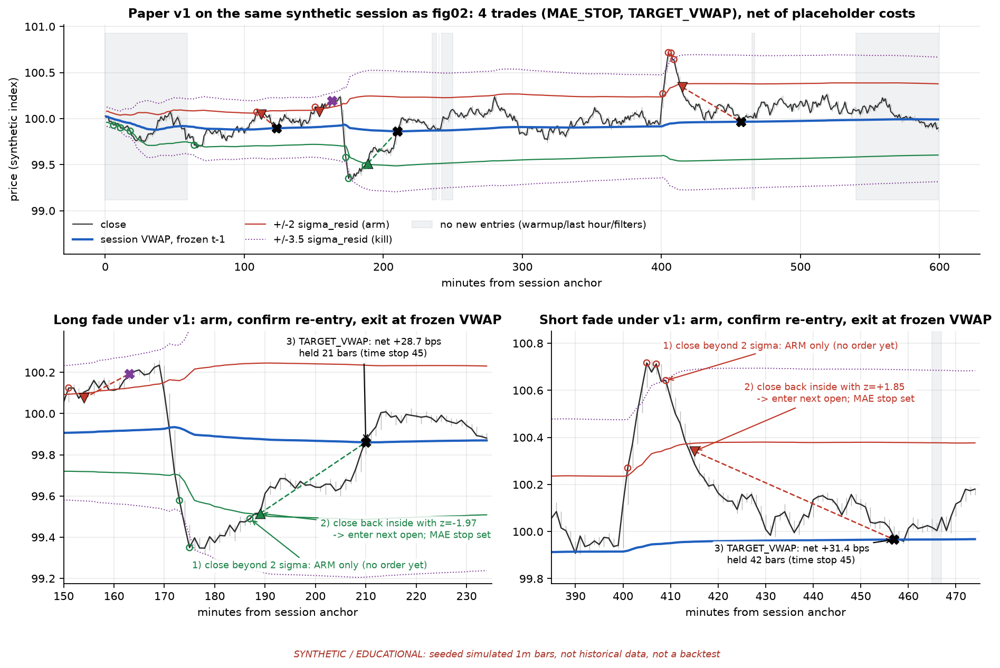

# VSD-MR v1: improved paper sketch

**PAPER / RESEARCH ONLY. NOT FOR LIVE FIRE.** This is a research specification. It is not exchange code,
and it has no keys, no order routing and no sizing for real capital. It claims nothing about profitability.

Read the [teardown](vwap_sd_mr_teardown_20261001.md) first. It explains why each item here exists. This
document is the "how": formulas, defaults, pseudocode, the research-only Pine snippet, and the open design
questions.

---

## 0. Phase gate

Do the Phase-0 base-rate study (teardown §8.7) before any of this is run as a strategy. If the probability
of touching VWAP before the stop, measured after a confirmed stretch, does not clear the cost hurdle (fig06)
on held-out data, **stop the track**. Do not move on to filters or parameter tuning.

---

## 1. What changes versus the vault file

| Concern | Vault | v1 |
|---|---|---|
| Reference | Lifetime `cum(close·v)/cum(v)` | Session-anchored VWAP of typical price, **frozen at t−1** |
| Dispersion | `stdev(close, 20)` | Volume-weighted residual σ about session VWAP, frozen at t−1, with a bps floor |
| Entry | Pierce of the band | **Arm** beyond ±k_arm, then **confirm** on a close back inside, with room left |
| Eligibility | None | Warmup, end-of-session cut-off, blackout, ER, VWAP slope, side persistence, data quality |
| Exit | VWAP touch only | Maker target at frozen VWAP, MAE stop, z kill, time stop, session flat, blackout flat |
| Position policy | Reversals allowed | One position, flat between trades, cooldown |
| Costs | None | Taker/maker per side, slippage in ticks, funding |

---

## 2. Definitions

For bar *t* in session *s* (bars `s₀ … t`):

```text
tp_i        = (high_i + low_i + close_i) / 3
VWAP_t      = Σ_{i=s₀..t} v_i·tp_i / Σ v_i
Var_t       = Σ v_i·tp_i² / Σ v_i − VWAP_t²            # volume-weighted residual variance about VWAP
VWAP*_t     = VWAP_{t−1}                                 # frozen: what bar t is judged against
σ*_t        = max( sqrt(Var_{t−1}), floor_bps·1e−4·VWAP*_t )
z_t         = (close_t − VWAP*_t) / σ*_t
ER_t        = |close_t − close_{t−60}| / Σ_{i=t−59..t} |close_i − close_{i−1}|
slope_t     = (VWAP*_t − VWAP*_{t−60}) / σ*_t            # in sigma units
above_t     = share of session closes in (t−119..t) with close > VWAP*      # needs ≥ 30 bars
```

**Why residual σ and not `stdev(close)`.** The trade is "price is far from VWAP and will come back", so the
band should be scaled by how far price normally sits from VWAP in this session. That is exactly what the
volume-weighted residual variance measures. The same object underlies the standard "VWAP ± k·stdev" bands
in most charting packages. Here it is computed *before* bar t so the bar cannot inflate its own band
(teardown D2, fig05).

**Known weakness.** The session-cumulative σ gets sluggish late in the session and keeps the memory of early
impulses. An EWMA alternative is `σ²_t = (1−α)σ²_{t−1} + α(tp_t − VWAP*_t)²`, with a half-life of 30–60
bars. Pre-register **one** of the two, not both. See §6, Q2.

---

## 3. Default parameters (placeholders)

| Param | Default | Role |
|---|---|---|
| `anchor` | 00:00 UTC | Session reset. The NY 09:30 ET variant is a separate study. |
| `k_arm` | 2.0 | Stretch that arms a fade |
| `k_min_left` | 1.0 | Minimum \|z\| still left at confirmation |
| `k_kill` | 3.5 | Adverse-close kill, while armed or in position |
| `mae_sigma` | 1.25 | Hard stop distance in units of σ at entry. Defines **R**. |
| `arm_window` | 10 bars | How long an arm stays live |
| `time_stop` | 45 bars | Maximum hold |
| `cooldown` | 10 bars | After any exit |
| `warmup` | 60 bars | After the anchor |
| `no_entry_last` | 60 min | Before session end |
| `flat_before_end` | 15 min | Forced flat |
| `sigma_floor_bps` | 3.0 | Lower bound on σ |
| `er_len`, `er_max` | 60, 0.35 | Choppiness gate |
| `slope_len`, `slope_max_sigma` | 60, 0.5 | VWAP drift tolerated against the fade |
| `persist_len`, `persist_max` | 120, 0.75 | One-sided-session gate |
| `taker_bps`, `maker_bps` | 5.0, 1.0 | **Placeholders.** Replace them with the venue's fee schedule for the assumed tier, plus measured slippage. |

Once Phase 0 has data, replace the fixed `k_*` values with **in-sample empirical quantiles** of |z| (for
example, the 97.5th percentile for arm and the 99.5th for kill). The v1 z is fat-tailed (fig05), so "2.0"
is a starting point, not a probability statement.

---

## 4. State machine (pseudocode)

```text
state ∈ {FLAT, ARMED(side, t_arm), IN_POS(trade), COOLDOWN(until)}

on close of bar t:
  compute VWAP*_t, σ*_t, z_t, eligibility_long_t, eligibility_short_t   # all from bars < t, plus close_t

  IN_POS:
    # intrabar checks on bar t, pessimistic ordering
    if adverse extreme of bar t crosses stop      -> exit MAE_STOP at stop (or at open if gapped); COOLDOWN
    elif favourable extreme trades through VWAP*_t -> exit TARGET_VWAP at VWAP*_t (maker); COOLDOWN
    # bar-close checks, filled at next open
    elif bars_held >= time_stop                   -> exit TIME_STOP
    elif side·z_t <= −k_kill                      -> exit Z_KILL
    elif near session end / session change        -> exit SESSION_FLAT
    elif blackout begins within 2 min             -> exit BLACKOUT_FLAT

  COOLDOWN: wait until t >= until, then FLAT

  FLAT:
    if z_t <= −k_arm -> ARMED(long,  t)
    if z_t >= +k_arm -> ARMED(short, t)

  ARMED(side, t_arm):
    sz = side·z_t
    if session changed or sz <= −k_kill or t − t_arm > arm_window -> FLAT (log DISARM_*)
    elif sz > −k_arm:                                   # closed back inside the arm band
        if sz <= −k_min_left and eligible(side, t)  -> SIGNAL; enter at next open; stop = open ∓ mae_sigma·σ*_t
        elif sz <= −k_min_left                      -> log BLOCKED_INELIGIBLE; FLAT
        else                                        -> log DISARM_NO_ROOM; FLAT
```

The reference implementation is `run_v1()` in [`tools/vwap_sd_mr_research.py`](tools/vwap_sd_mr_research.py).
[`tools/test_vwap_sd_mr_research.py`](tools/test_vwap_sd_mr_research.py) checks that perturbing bars from k
onward changes neither the frozen reference nor any event before k.

---

## 5. What the v1 geometry looks like



*Fig07: the same **synthetic** session as fig02, run under v1, with frozen session VWAP, ±2σ arm bands,
±3.5σ kill bands, grey no-entry zones, arms (open circles), entries (triangles) and exits (X).*

- **Long fade:** the arm fires during the down-impulse, but no order goes in. The entry comes at t=189,
  after a close back inside the band at z = −1.97, so it buys after the impulse rather than into it. It exits
  at the frozen VWAP limit, net +28.7 bps after placeholder costs, 21 bars later.
- **Short fade:** it arms on the impulse high and confirms on the way back down. It exits at VWAP, net
  +31.4 bps, after 42 bars.
- **Whole session:** 4 trades instead of the vault's 13, one of them an `MAE_STOP` at −21.8 bps. Unlike the
  vault, v1 shows a real loss when it is wrong.

On a different synthetic seed the numbers differ, and **none of them are evidence**. The figure shows when
the contract acts, not whether acting pays.

---

## 6. Open design questions (to resolve in pre-registration, not after results)

1. **Re-arm after disarm.** Right now a disarmed setup can re-arm on the very next bar if price is still beyond
   k_arm, and that includes a disarm caused by the kill level. The fig07 long shows it: armed at t=173, killed
   at 174 when the close went past 3.5σ, re-armed at 175, expired at 186, re-armed at 187, signalled at 188.
   That makes the kill on arms weak. A stricter alternative: after `DISARM_KILL`, block re-arming until z
   has come back inside k_arm, or for the rest of a cooldown. The stricter rule gives fewer, cleaner signals
   but misses slow bottoms.
2. **σ object.** Session-cumulative σ, which is simple, reproducible and slow, against EWMA residual σ,
   which is more responsive but adds a half-life parameter. Pick one.
3. **Anchor.** 00:00 UTC against NY 09:30 ET. Crypto trades 24/7, but desk flow concentrates around the US
   open. These are separate studies with separate holdouts.
4. **Exit type.** A maker exit at VWAP is cheap but adversely selected: it fills when price reaches VWAP and
   keeps going through. A taker exit on a close beyond VWAP is costlier but certain. Model both. The
   falsification grid already requires v1 to survive the taker exit.
5. **Trend gate.** ER and slope alone passed the slow grind in fig03; side persistence did most of the
   blocking. Test each gate's counterfactual value separately (teardown §8.7).
6. **Interaction with the B-01-style geometry.** Shared infrastructure only (§5 of the teardown). If both
   are paper-traded on the same instrument, log their joint exposure around VWAP.

---

## 7. Illustrative Pine snippet: RESEARCH ONLY, NOT FOR LIVE FIRE

> **RESEARCH ONLY / NOT FOR LIVE FIRE.** This is for chart-side visual inspection of the v1 geometry on a
> TradingView paper chart. It has **not been compiled or validated** in TradingView. It does not replicate the
> Python engine bar-for-bar: side persistence spans session boundaries here, and the stop/target ordering
> inside a bar follows Pine's broker emulator, not the pessimistic rule. Costs are placeholders. It is
> written from scratch and reuses no text from the MPL-2.0 vault source. **Do not attach it to alerts,
> webhooks, bots or any live account.**

```pine
//@version=5
// RESEARCH ONLY - NOT FOR LIVE FIRE. Paper/visual study of a session-anchored, frozen-VWAP fade (VSD-MR v1).
// No alerts, no webhooks, no live accounts. Thresholds are placeholders pending pre-registered research.
strategy("RESEARCH ONLY - VSD-MR v1 paper sketch", overlay=true, pyramiding=0,
     commission_type=strategy.commission.percent, commission_value=0.05, slippage=2)

kArm     = input.float(2.0,  "Arm |z|")
kRoom    = input.float(1.0,  "Min |z| left at entry")
kKill    = input.float(3.5,  "Kill |z|")
maeSig   = input.float(1.25, "MAE stop, x sigma at entry")
armWin   = input.int(10,     "Arm window (bars)")
tStop    = input.int(45,     "Time stop (bars)")
coolBars = input.int(10,     "Cooldown (bars)")
warm     = input.int(60,     "Warmup bars after anchor")
noEntMin = input.int(60,     "No new entries in last N minutes")
flatMin  = input.int(15,     "Flat in last N minutes")
floorBps = input.float(3.0,  "Sigma floor (bps)")
erMax    = input.float(0.35, "Efficiency ratio max")
slopeMax = input.float(0.5,  "VWAP slope max (sigma units)")
persMax  = input.float(0.75, "Side persistence max")
anchorTF = input.timeframe("D", "Session anchor")

newSess = timeframe.change(anchorTF)

var float sv   = 0.0
var float spv  = 0.0
var float sp2v = 0.0
var int   nIn  = 0
if newSess
    sv   := 0.0
    spv  := 0.0
    sp2v := 0.0
    nIn  := 0

// Frozen reference: read accumulators BEFORE adding this bar.
float vwPrev = sv > 0 ? spv / sv : na
float sgRaw  = sv > 0 ? math.sqrt(math.max(sp2v / sv - vwPrev * vwPrev, 0.0)) : na
float sigma  = na(vwPrev) ? na : math.max(sgRaw, floorBps * 1e-4 * vwPrev)
float z      = na(sigma) ? na : (close - vwPrev) / sigma

sv   += volume
spv  += hlc3 * volume
sp2v += hlc3 * hlc3 * volume
nIn  += 1
float vwNow = spv / sv          // becomes next bar's frozen reference; used as the resting target

float er        = math.sum(math.abs(ta.change(close)), 60)
er             := er > 0 ? math.abs(close - close[60]) / er : 0.0
float slope     = nIn > 60 and not na(sigma) ? (vwPrev - vwPrev[60]) / sigma : 0.0
float fracAbove = math.sum(close > nz(vwPrev, close) ? 1.0 : 0.0, 120) / 120.0

int   msLeft   = time_close(anchorTF) - time_close
bool  baseOk   = nIn > warm and msLeft > noEntMin * 60000 and not na(z)
bool  okLong   = baseOk and er < erMax and slope > -slopeMax and fracAbove > 1.0 - persMax
bool  okShort  = baseOk and er < erMax and slope <  slopeMax and fracAbove < persMax

var int   armSide   = 0
var int   armBar    = na
var int   coolUntil = na
var float sigEntry  = na
bool flat = strategy.position_size == 0

if flat and not na(z) and (na(coolUntil) or bar_index >= coolUntil)
    if armSide == 0
        if z <= -kArm
            armSide := 1
            armBar  := bar_index
        else if z >= kArm
            armSide := -1
            armBar  := bar_index
    else
        float sz = armSide * z
        if newSess or sz <= -kKill or bar_index - armBar > armWin
            armSide := 0
        else if sz > -kArm
            if sz <= -kRoom and (armSide == 1 ? okLong : okShort)
                sigEntry := sigma
                strategy.entry(armSide == 1 ? "L" : "S", armSide == 1 ? strategy.long : strategy.short)
            armSide := 0

if strategy.position_size > 0
    strategy.exit("xL", "L", limit=vwNow, stop=strategy.position_avg_price - maeSig * sigEntry)
if strategy.position_size < 0
    strategy.exit("xS", "S", limit=vwNow, stop=strategy.position_avg_price + maeSig * sigEntry)

if strategy.position_size != 0
    int held = bar_index - strategy.opentrades.entry_bar_index(0) + 1
    bool zKill = (strategy.position_size > 0 and z <= -kKill) or (strategy.position_size < 0 and z >= kKill)
    if held >= tStop or zKill or msLeft <= flatMin * 60000
        strategy.close_all(comment=held >= tStop ? "TIME" : zKill ? "ZKILL" : "SESSION")
        coolUntil := bar_index + coolBars

plot(vwPrev, "Session VWAP (frozen t-1)", color=color.blue, linewidth=2)
plot(vwPrev + kArm * sigma,  "Arm +", color=color.red)
plot(vwPrev - kArm * sigma,  "Arm -", color=color.green)
plot(vwPrev + kKill * sigma, "Kill +", color=color.purple, style=plot.style_circles)
plot(vwPrev - kKill * sigma, "Kill -", color=color.purple, style=plot.style_circles)
```

The known gaps against the Python engine are listed in the note above. In addition, the cooldown is applied
only after kill exits, not after target or stop fills, and there is no event blackout or data-quality kill.
Use the Python engine for any numbers.

---

## 8. Next steps (paper)

1. **Phase 0.** Pull ≥ 9 months of 1m Binance USD-M BTCUSDT bars into the desk data store (read-only public
   data, no keys). Run the base-rate test with a frozen split. Report the touch probability against p* and
   against the placebo control.
2. **Only if Phase 0 passes:** pre-register the v1 parameters, the σ object and the anchor. Run a
   walk-forward paper replay through the Python engine with a cost grid.
3. **Only if Phase 1 passes:** run a forward shadow paper log. Measure the realised gap between the maker
   fill assumption and observed trade-through.

None of these steps involve keys, orders or live accounts.
