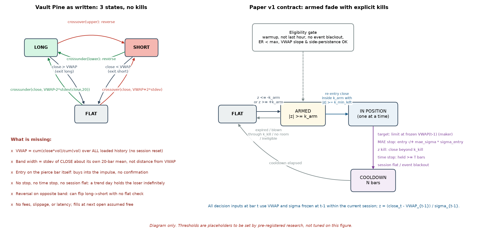
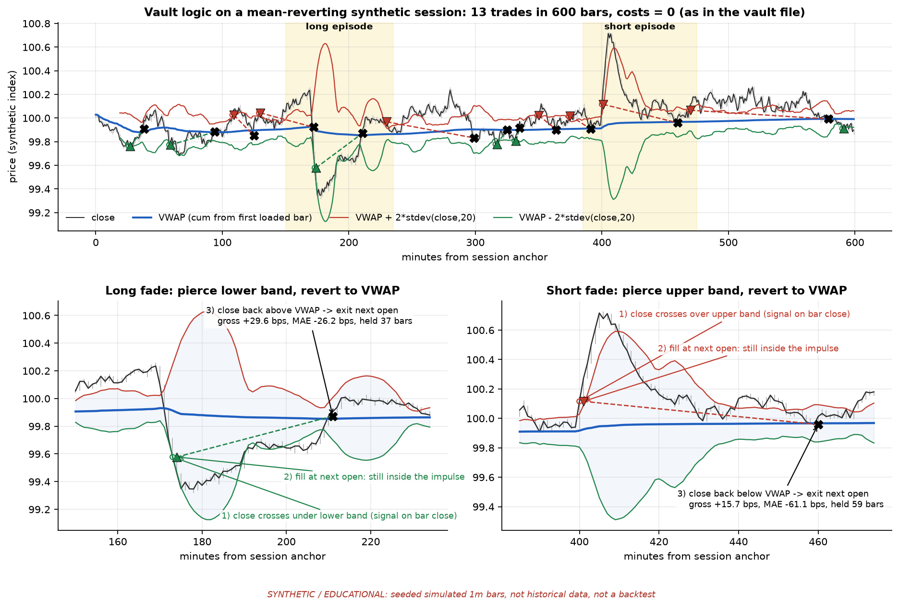
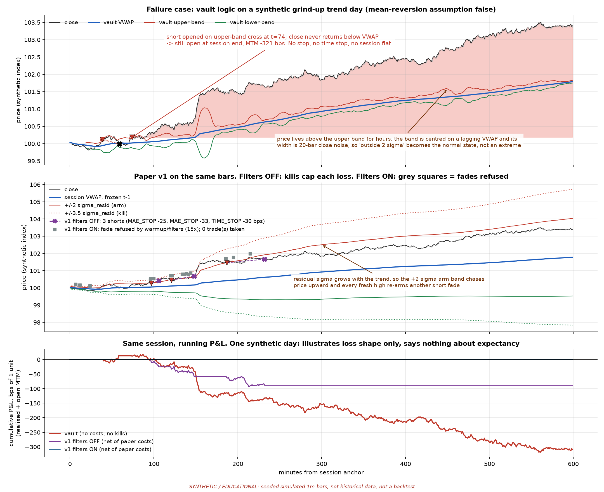
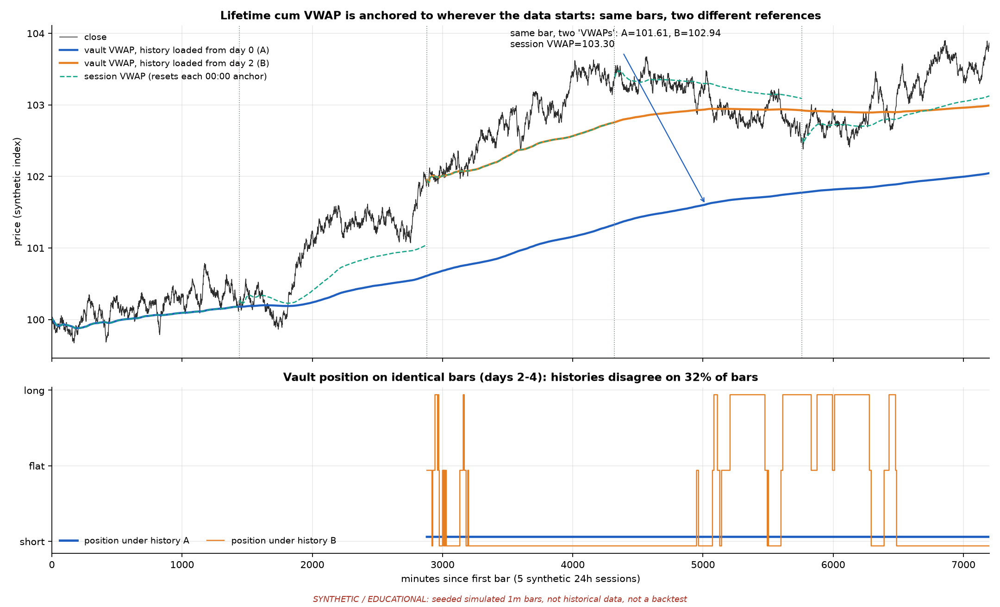
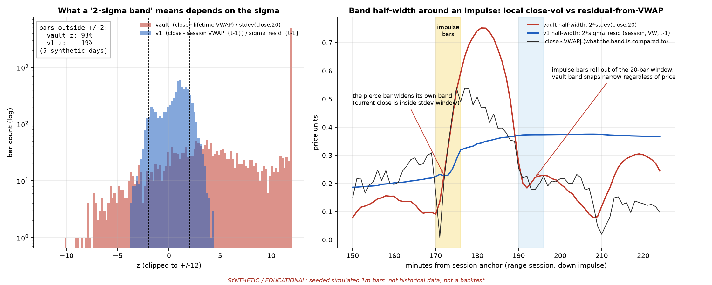
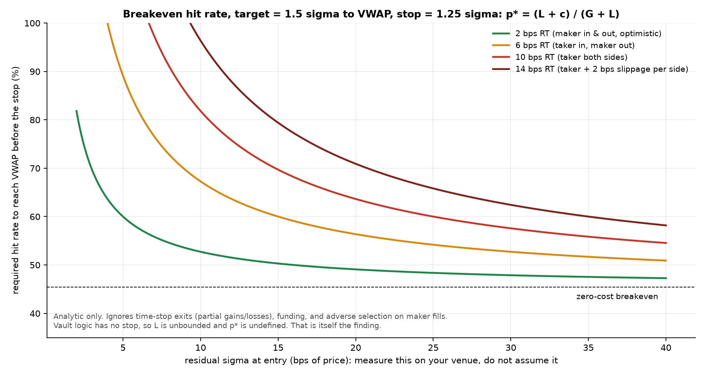

# VWAP Standard-Deviation Mean Reversion: teardown

**PAPER / RESEARCH ONLY.** No live trading, no exchange keys, no order placement. Nothing here is a trade
instruction, and nothing here claims the strategy is profitable.

| | |
|---|---|
| Date | Thu 1 Oct 2026 |
| Track | `HFT-strategies` (separate paper track; not part of B-01 or the inventory-accumulation work) |
| Source (pinned) | [The-Quant-Trading-Vault @ `c9d6fa4` / `strategies/VWAP-Standard-Deviation-Mean-Reversion-Trading-Strategy.md`](https://github.com/brainbrick-trades/The-Quant-Trading-Vault/blob/c9d6fa49486855899a92fea65004f440533049aa/strategies/VWAP-Standard-Deviation-Mean-Reversion-Trading-Strategy.md) (FMZ page 474675, last modified 2024-12-11) |
| Companion | [`vwap_sd_mr_improved_sketch.md`](vwap_sd_mr_improved_sketch.md): improved paper sketch and a Pine snippet marked RESEARCH ONLY |
| Figures | [`figures/`](figures/), regenerate with `python3 desk-briefs/hft-strategies/tools/make_figures.py` |
| Status | Hypothesis only. I have not run it on any real data. Every chart below uses **synthetic, seeded** 1-minute paths. |

---

## TL;DR

The vault file is a **three-state fade with no kills**. It uses an **unanchored lifetime VWAP**, and its band
width comes from **20-bar close noise**, which is not the same thing as distance from VWAP. It enters on the
bar that pierces the band and exits only when price touches VWAP again. It has no stop, no time stop, no
session flat and no costs.

On synthetic data this structure does the following:

- **Every closed trade is a winner.** The only exit is a VWAP touch. On the range session in fig02, all 12
  closed trades are gross-positive. The one losing trade simply never closes. The FMZ-style smooth equity
  curve is a property of the exit rule, not evidence of edge.
- **A trend day leaves a short open indefinitely.** In fig03 the short is −321 bps mark-to-market at session
  end and nothing in the code would ever close it.
- **The reference depends on the data start.** In fig04 the same bars give two different "VWAPs" depending on
  where history begins, and the two resulting position series disagree on 32% of bars.
- **"2σ" stops meaning an extreme.** In fig05, 93% of bars sit outside the vault's ±2 band on a 5-day path.

**What is worth keeping** is the hypothesis itself: intraday price that stretches away from a volume-weighted
fair value tends to come back. That claim is testable. The rest should be rebuilt as a session-anchored
reference frozen at the prior bar, with residual-based dispersion, a confirmation entry, explicit kills and a
pre-registered falsification test. The [paper v1 contract](#8-proposed-paper-v1-contract) below does that.
Before building v1 at all, run the Phase-0 base-rate study (§8.7). If the base rate does not clear the cost
hurdle in fig06, stop there.

---

## 1. Source, provenance, and naming / licence notes

Everything in this section comes from the pinned vault file; I checked each point against it.

| Item | What the file says | Note |
|---|---|---|
| Strategy title in code | `strategy("ETHUSD VWAP Fade Strategy", overlay=true)` | **Naming mismatch.** The backtest header runs `Futures_Binance` `BTC_USDT`. The vault filename and FMZ description say "VWAP Standard Deviation Mean Reversion". It is one script with three names and two instruments. Treat any ETH/BTC performance claim as unattributed. |
| Backtest header | `start: 2024-12-03`, `end: 2024-12-10`, `period: 1m` | One week, one instrument, one timeframe, no out-of-sample period, no costs. **Marketing, not evidence.** |
| Author fields | FMZ page "Author: ChaoZhang"; Pine header `© jklonoskitrader` | FMZ republished it; the Pine author is a different person. Attribute to the Pine author. |
| Licence | `Mozilla Public License 2.0` notice in the Pine source | MPL-2.0 is file-level copyleft. If we copy or modify that Pine file, the modified file has to stay MPL-2.0 and keep the notice. The snippet in the companion sketch is **written from scratch** and reuses none of the source text. Keep it that way, or carry the notice. |
| Description claims | "market-neutral", "robust risk control", "reliable mean reversion statistical principles" | **All false as coded.** It is a directional single-instrument strategy, it has no risk control beyond waiting for VWAP, and it makes no statistical test. The file's own "Risks / Optimization" list (trend filter, max holding time, stops) describes features the code does not have. |
| Chart | FMZ screenshot (`fmz.com/upload/asset/1ac8ab640a7eb6ad5fa.png`) | Not reproducible: no data, no fill model, no costs. Replaced here by figs 01–07. |

---

## 2. Mechanism map

### 2.1 Pine as written (verbatim logic, comments trimmed)

```pine
std_multiplier = input.float(2.0)
cumulative_pv  = ta.cum(close * volume)
cumulative_vol = ta.cum(volume)
vwap           = cumulative_pv / cumulative_vol          // never resets

length     = input.int(20)
std_dev    = ta.stdev(close, length)                      // stdev of CLOSE about its 20-bar SMA
upper_band = vwap + std_multiplier * std_dev
lower_band = vwap - std_multiplier * std_dev

go_long  = ta.crossunder(close, lower_band)
go_short = ta.crossover(close, upper_band)
if (go_long)
    strategy.entry("Long", strategy.long)
if (go_short)
    strategy.entry("Short", strategy.short)
if (strategy.position_size > 0 and close > vwap)
    strategy.close("Long")
if (strategy.position_size < 0 and close < vwap)
    strategy.close("Short")
```

### 2.2 Components

| Layer | Construction | Implication |
|---|---|---|
| **Reference** | `ta.cum(close*volume)/ta.cum(volume)`, starting at the **first bar the engine loads** and never resetting. Uses close, not typical price or trade prints. | This is an anchored VWAP whose anchor is the data start. Bar *t* gets weight `v_t / Σv`, which shrinks toward 0 as history grows, so after weeks of 1m bars the "VWAP" is almost frozen. It becomes a long-run average price, not an intraday fair value. |
| **Dispersion** | `ta.stdev(close, 20)`: population stdev of the last 20 closes about **their own 20-bar mean**, current bar included | It measures local close-to-close noise, not how far price usually sits from VWAP. The centre (VWAP) and the width (deviation around an SMA) refer to different things. |
| **Bands** | `VWAP ± 2 × stdev(close,20)` | The "z" implied by these bands, `(close − VWAP)/stdev(close,20)`, is not a stable statistic (fig05). |
| **Entry** | `crossunder(close, lower)` (long) and `crossover(close, upper)` (short), on bar close, filled at next bar's open (Pine default) | It fires on the **pierce bar**, which is inside the impulse, with no confirmation. |
| **Exit** | Long closes when `close > vwap`; short closes when `close < vwap`; filled at next open | That is the **only** exit. |
| **Reversal** | `strategy.entry` in the opposite direction reverses the position (pyramiding = 0) | A long can flip straight to short. When a reversal and a `strategy.close` fire on the same bar, how Pine nets them is not specified by the file. My research engine models it as "reversal wins". |
| **Costs** | None | — |

### 2.3 State machine



*Fig01. On the left, the vault's three states: entries, VWAP-touch exits and band-to-band reversals, with no
kill path. On the right, the proposed paper v1 contract (§8).*

---

## 3. What the figures show

All price paths are **synthetic and educational**. They are seeded Ornstein–Uhlenbeck (OU) and drift processes
with injected impulses, on a 100-index price scale. They were **built to show mechanisms**. They are not
calibrated to BTC or ETH, and nothing below is a backtest.

### 3.1 How the fade is supposed to work (vault geometry)



*Fig02. The vault logic on a mean-reverting synthetic session, with VWAP, ±2·stdev(close,20) bands, entries
(triangles), signal bars (open circles) and exits (X).*

- **Long fade (minutes 150–235):** close crosses under the lower band at t=173 and fills at the next open, which
  is still inside the down-impulse. Adverse excursion (MAE) is −26 bps before the close-above-VWAP exit at
  +29.6 bps gross.
- **Short fade (minutes 385–475):** the short fires on the first bar of an up-impulse. MAE is −61 bps
  before a +15.7 bps exit, 59 bars later. A trader holding this would have sat through four times the
  eventual profit in drawdown, with no rule to cut it.
- **Whole session:** 13 trades in 600 bars. All 12 closed trades are gross winners; the 13th is still open at
  session end. This is the **negative-skew signature**: closed-trade win rate is close to 100% by
  construction, and the losses wait in trades that never close.

### 3.2 Failure case: trend day



*Fig03. A synthetic grind-up day (+340 bps open to close).*

- **Top panel (vault):** the second short (t=74) never sees a close below VWAP. It is **−321 bps
  mark-to-market at session end** and still open. Price spends hours above the upper band, because the band is
  centred on a lagging VWAP and its width is 20-bar noise, so being "outside 2σ" becomes the normal state.
- **Middle panel (paper v1):** with filters **off**, v1 still loses, taking three shorts that exit
  `MAE_STOP −25`, `MAE_STOP −33` and `TIME_STOP −30` bps net. The residual sigma grows with the trend, so the
  +2σ arm band chases price up and each new high re-arms another fade. The kills cap the damage; they do not
  create edge. With filters **on**, all 15 armed fades are refused (warmup, side persistence, VWAP slope)
  and no trade is taken.
- **Bottom panel:** running P&L for all three. **One synthetic day shows the shape of the loss, not the
  expectancy.** The filters were also designed alongside this path, so their success here is circular. It
  proves the mechanism works, not that the filter is well calibrated.

### 3.3 Lifetime VWAP depends on where the data starts



*Fig04. Five synthetic 24h sessions, comparing the vault VWAP with history loaded from day 0 (A), the vault
VWAP with history loaded from day 2 (B), and a session VWAP that resets each day.*

On the same bar (day 3, minute 700), A = 101.61, B = 102.94, and session VWAP = 103.30. The vault's
position series under the two histories **disagree on 32% of bars** over days 2–4. Under history A, a short
opened at minute 1830 (day 1) is still open on the final bar, more than 3.5 days later. Days are 0-indexed,
as in the figure.

### 3.4 The dispersion object



*Fig05.*

- **Left:** distribution of the vault's implied z, `(close − lifetime VWAP)/stdev(close,20)`, against the v1
  z, `(close − session VWAP_{t−1})/σ_resid_{t−1}`, over the 5-day path. **93%** of bars are outside ±2 on
  the vault z and 19% on the v1 z. The v1 z is not a calibrated Gaussian either; it is fat-tailed and
  non-stationary, and its thresholds still need empirical quantiles (§8). But it is at least on the right
  scale.
- **Right:** band half-width around an impulse. The vault band (a) widens on the pierce bar itself, because
  the current close sits inside the stdev window, and (b) **snaps narrow 20 bars later** when the impulse bars
  roll out of the window, whatever price is doing. That can create crossings driven by the window, not by
  price.

### 3.5 Cost hurdle (analytic)



*Fig06. Breakeven probability of reaching VWAP before the stop, `p* = (L + c)/(G + L)`, for a v1-like
geometry (target 1.5σ, stop 1.25σ), against residual σ in bps and round-trip cost c.*

When σ is small, as in quiet 1m crypto hours, any taker-taker cost pushes p* far above the zero-cost
breakeven of 45%. **The vault has no stop, so L is unbounded and p* is undefined**, which is itself the
finding. Measure σ and c on the venue; do not read them off this chart.

---

## 4. Defects and research risks

Severity: **S1** means it invalidates any result; **S2** means it materially biases results; **S3** means it
is a hygiene issue.

| # | Defect | Sev | Detail |
|---|---|---|---|
| D1 | **Lifetime cumulative VWAP (anchor = data start)** | S1 | Strictly speaking, the formula has no look-ahead: `ta.cum` only sums past bars. The problem is that the reference is a function of an **arbitrary, researcher-chosen data start**. In the FMZ run the anchor is the backtest start, picked after the fact. On TradingView it is however much history the chart loads, which varies with plan and timeframe. Backtest, replay and live will each see a different "VWAP" on identical bars (fig04). It is "non-causal" in the sense that matters for research: the reference depends on information (where the data window begins) that does not exist at decision time in any stable way. As history grows, the VWAP also stops being intraday fair value. |
| D2 | **Wrong variance object** | S1 | `stdev(close,20)` is dispersion around a 20-bar SMA, but the band is centred on VWAP. That mismatch means "±2σ" carries no probabilistic meaning (93% of bars outside, fig05). There is also no volume weighting, the current bar is in its own window (self-inflation), and window roll-off creates artefacts. |
| D3 | **Pierce-bar entry with no confirmation** | S2 | `crossunder` fires while the impulse is still running, and the next-open fill sits inside the move (fig02 MAE −26 / −61 bps). This is buying while price is still falling hard. |
| D4 | **Flip-flop and reversal behaviour** | S2 | An opposite-band cross reverses with no flat check. In chop, the strategy can churn long → flat → long on repeated crosses with no cooldown. Netting when a reversal and a close land on the same bar is unspecified. |
| D5 | **No stop, no time stop, no session flat** | S1 | The only exit is a VWAP touch, so the loss tail is unbounded (fig03: −321 bps, still open). The closed-trade win rate is structurally inflated (§3.1). The file lists these as "mitigation measures" but does not implement them. |
| D6 | **No fees, slippage, funding or latency** | S1 | On 1m bars with band half-widths in the low tens of bps, costs are first order (fig06). Perp funding (every 8h on Binance USD-M) is ignored. Despite the "HFT" framing, 1m bar-close signals with next-open fills are not high-frequency; queue position and latency are not modelled at all. |
| D7 | **Trend and regime failure** | S1 | No trend, volatility, session or event filter. Mean reversion is assumed in every regime, so trend days produce the largest losses (fig03). |
| D8 | **Warmup** | S2 | VWAP is defined from bar 1 and stdev from bar 20, so signals fire on nearly empty history (in fig03 the first short is at minute 39). |
| D9 | **Evidence quality** | S1 | One week of 1m BTC, no out-of-sample period, no parameter justification (2.0 and 20 are defaults), no costs, a mislabelled instrument, and a screenshot with no data. Zero evidential weight. |
| D10 | **Volume and price semantics** | S3 | Uses `close*volume` rather than typical price or trade-level VWAP. Perp volume differs from spot and by venue; contract versus coin volume units should be checked per venue. |
| D11 | **Realtime-bar behaviour** | S3 | In realtime, the forming bar's close and volume move the plotted VWAP and bands. Signals settle at bar close with default settings, but the chart repaints intrabar, which misleads anyone reading it live. |
| D12 | **Naming and licence** | S3 | ETHUSD title versus BTC backtest; FMZ author versus Pine author; MPL-2.0 obligations on derived files (§1). |

---

## 5. Comparison: session-anchored, frozen pre-bar VWAP rejection geometry (B-01 style)

**Conceptual only.** This section does not restate, modify or replace B-01's rules. The B-01 spec is not in
this repo; I used only the geometry named in the desk context: a session-anchored VWAP, frozen before the
decision bar, traded as a rejection level.

| Dimension | Vault fade (this file) | Frozen session VWAP rejection (B-01 style geometry) |
|---|---|---|
| Reference anchor | Data start (lifetime cumulative) | Explicit session anchor; resets each session |
| Freeze | None: the current bar's close and volume are in the reference it is judged against | Reference fixed from bars strictly before the decision bar, so a bar cannot move the level it is tested against |
| Where the trade happens | **Away from** VWAP, at a ±kσ stretch | **At** the VWAP level: a probe into or through the level, then a rejection |
| Hypothesis | Over-extension reverts **to** fair value | The fair-value level acts as **support or resistance**, and price is rejected **from** it |
| Trigger | Pierce of a band (no confirmation) | Rejection or reclaim confirmation at the level |
| Natural invalidation | None coded | Acceptance through the level (a close on the far side, holding) |
| Target | VWAP | Away from VWAP (next level or structure) |
| Main failure regime | Trend (price never returns) | Clean acceptance through VWAP or fake-outs (a level that does not hold) |

**How they relate.** The two geometries are close to mirror images. The vault's *take-profit* is exactly
where a B-01-style setup makes its *decision*. If the rejection hypothesis is true, a fade from −2σ that
reaches VWAP should stall there, which is consistent with the fade exiting at the touch. If price accepts
through VWAP instead, the fade has already exited, and the rejection setup is the one that is wrong. They are
complementary hypotheses about the same reference, so they should share **infrastructure** (the session
clock, frozen-VWAP computation and event calendar) but **not** parameters, signals or P&L.

**What this track borrows from the geometry:** a session anchor, the t−1 freeze, confirmation before entry,
and explicit invalidation.

**What it does not borrow:** any B-01 threshold, filter or sizing. Keep the books separate so neither
track's results contaminate the other's evaluation. Running both on the same instrument creates correlated
exposure around VWAP, so if they are ever run side by side in paper, log them jointly.

---

## 6. What NOT to inherit from the vault file

1. `ta.cum`-based lifetime VWAP, or any reference whose value depends on how much history was loaded.
2. `ta.stdev(close, n)` as the band width for a VWAP-centred band.
3. Entry on the pierce bar (`crossunder` / `crossover` of the band).
4. VWAP touch as the **only** exit. No position may exist without a stop, a time stop and a session flat.
5. Opposite-band reversals. v1 is one position at a time, goes flat between trades, and has a cooldown.
6. Zero-cost assumptions, and any reading of the FMZ equity curve or win rate.
7. Default parameters (2.0, 20) as if they had been justified. They have not.
8. The "market-neutral" and "robust risk control" labels, and the ETHUSD/BTC naming.
9. Pine source text, unless the MPL-2.0 notice comes with it.

---

## 7. Ranked improvement backlog

### Must (without these, no result is interpretable)

| # | Change | Why |
|---|---|---|
| M1 | Session-anchored VWAP with an explicit anchor (default 00:00 UTC; NY 09:30 ET as a variant), **frozen at t−1** | Fixes D1. The reference becomes reproducible across backtest, replay and live, and a bar can no longer move its own reference. |
| M2 | Dispersion = volume-weighted residual σ around the session VWAP, frozen at t−1, with a bps floor | Fixes D2. The band then measures distance from VWAP, which is what the fade trades. The floor stops near-zero σ early in the session from producing huge z values. |
| M3 | Hard kills on every position: MAE stop (in units of σ at entry), z kill, time stop, session flat | Fixes D5. Bounds the tail and makes the breakeven hit rate p* defined (fig06). |
| M4 | Cost model: taker/maker per side from the venue's fee schedule, slippage in ticks, perp funding | Fixes D6. Without it, any expectancy number is meaningless at this scale. |
| M5 | Pre-registered falsification and a Phase-0 base-rate study **before** building v1 | Fixes D9. Decides whether the hypothesis is worth a strategy at all. |
| M6 | One position at a time; no reversal; cooldown after exits | Fixes D4. |

### Should (likely to matter; test each one in isolation)

| # | Change | Why |
|---|---|---|
| S1 | Arm-then-confirm entry: arm at \|z\| ≥ k_arm, enter on a close back inside with \|z\| ≥ k_min_left | Addresses D3. Avoids filling inside the impulse and requires some room left to the target. |
| S2 | Regime eligibility: efficiency ratio, VWAP slope in σ units, side persistence (share of recent closes on one side of VWAP) | Addresses D7. Fig03 shows ER and slope alone pass slow grinds; side persistence did most of the blocking. |
| S3 | Warmup (≥ 60 bars after the anchor) and no new entries in the last hour of the session | Addresses D8, and avoids entering trades that the session flat would cut short. |
| S4 | Event blackout around tier-1 macro releases (CPI, NFP, FOMC, ISM) and perp funding timestamps | Scheduled jumps are not mean-reverting noise. |
| S5 | Limit (maker) exit at the frozen VWAP instead of a market exit on the next open | Cuts the exit cost. Needs a fill-realism model, because maker fills are adversely selected. |
| S6 | Empirical z quantiles in place of fixed 2.0 / 3.5 | The v1 z is still fat-tailed (fig05). Thresholds should be set as quantiles, using in-sample data only. |

### Later (only after the Must items survive Phase 0 and Phase 1)

| # | Change | Why |
|---|---|---|
| L1 | Trade-level VWAP from prints instead of bar typical price | Better fidelity; matters at sub-minute horizons. |
| L2 | Order-book and flow conditioning (spread, depth, CVD divergence at the stretch) | Possible gain in signal quality, at the risk of overfitting. |
| L3 | Regime labels from `mm-regime-logger` (JOB-20260917-MM-001) as an eligibility input | Reuses desk infrastructure. Only after its own validation. |
| L4 | Sizing by σ_entry or by R | Pointless until expectancy is established. |
| L5 | Multi-venue or multi-asset (ETH, SOL) | Only after a single-venue result exists. |

---

## 8. Proposed paper v1 contract

The name is **VSD-MR v1 (paper)**. Full formulas, pseudocode and the snippet are in the
[companion sketch](vwap_sd_mr_improved_sketch.md). Every threshold is a **placeholder**, to be fixed by
pre-registration and in-sample quantiles, not tuned on these figures.

### 8.1 Inputs

- 1m OHLCV bars from **one venue and one instrument** (default: Binance USD-M BTCUSDT perp), UTC timestamps,
  with gaps flagged rather than forward-filled.
- A venue fee schedule for the assumed tier, a tick size, and the funding timestamps.
- An economic calendar (tier-1 US releases) for blackouts.
- Optional, later: trade prints for a true VWAP, and top-of-book for spread checks.

### 8.2 Clocks

- **Session anchor:** 00:00 UTC (default) or 09:30 America/New_York (variant). Each variant is a separately
  pre-registered study; no switching between them after seeing results.
- **Decision clock:** the close of each 1m bar.
- **Fill clock:** the next bar's open for market orders. A limit at the frozen VWAP fills only if the bar
  trades **through** the level by at least one tick.
- **Freeze:** at the close of bar t, VWAP and σ are the values computed through bar t−1 of the current
  session. Only close_t is new information.

### 8.3 Reference, dispersion and z

- `VWAP_{t−1} = Σ v·tp / Σ v` over session bars ≤ t−1, where `tp = (h+l+c)/3`.
- `σ_{t−1} = max( sqrt(Σ v·tp² / Σ v − VWAP²), floor_bps · VWAP_{t−1} )`.
- `z_t = (close_t − VWAP_{t−1}) / σ_{t−1}`.

### 8.4 Eligibility (all must hold for a new entry)

1. Session minute ≥ warmup (60) and < session_len − no_entry_last (60).
2. Not inside an event or funding blackout window.
3. Efficiency ratio over 60 bars < 0.35.
4. VWAP drift over 60 bars, in σ units, is not against the fade by more than 0.5. A short is refused if
   VWAP is rising by 0.5σ or more; a long is refused in the mirror case.
5. Side persistence: a short is refused if ≥ 75% of the last 120 closes in the session were above VWAP; a
   long is refused in the mirror case.
6. Data quality: no missing bars or zero-volume bars in the last 30; the feed is not stale.

### 8.5 Entry

`FLAT → ARMED` when z ≤ −k_arm (2.0) for a long or z ≥ +k_arm for a short. `ARMED → signal` when a later
close comes back inside the band (|z| < k_arm), **with |z| ≥ k_min_left (1.0)** remaining, within
arm_window (10) bars, while eligible. The fill is at the next open. An arm is cancelled if it expires, if
the close goes beyond the kill level (|z| ≥ k_kill = 3.5), if there is no room left, or if the session
changes. A refused signal is logged as `BLOCKED_INELIGIBLE`. One position at a time.

### 8.6 Exits and kills

| Exit | Rule | Order type assumed |
|---|---|---|
| Target | Touch of the frozen VWAP (trade-through by one tick) | Maker limit |
| MAE stop | Entry ∓ mae_sigma (1.25) × σ at entry. **R** = this distance | Stop (gap-aware: fills at the open if the bar gaps through) |
| z kill | Close beyond k_kill on the adverse side | Market at next open |
| Time stop | Held ≥ 45 bars | Market at next open |
| Session flat | Within 15 minutes of the session end, or the session changes | Market at next open |
| Blackout flat | 2 minutes before a tier-1 event | Market |

If a stop and the target are both touched in the same bar, assume the **stop** (pessimistic). After any exit,
wait out the cooldown (10 bars).

**Strategy-level kills (paper):** a daily loss of 3R turns the strategy off for the session; 4 consecutive
losses turn it off for the session; a realised 15-minute vol above the trailing 30-day 99th percentile
blocks new entries; any data-quality failure goes flat and blocks entries.

### 8.7 What would falsify it (pre-registered)

**Phase 0, base rate (no strategy):** use ≥ 6 months of in-sample bars and ≥ 3 months held out. For every
v1 confirmation event, measure P(touch VWAP_{t−1} before the MAE stop or z kill, within 45 bars).

- **Falsified** if the held-out touch probability does not beat p* (fig06) at the **measured** σ and
  taker-in/maker-out cost, with the 95% confidence interval's lower bound above p*.
- **Falsified** if it does not beat a matched control (same hour-of-week, same distance to a placebo level
  such as a VWAP shifted by ±1 session).

**Phase 1, v1 paper replay (walk-forward, parameters frozen before each out-of-sample block).** v1 is
falsified if any of these holds:

- Fewer than 300 out-of-sample trades.
- The lower 95% bound on net expectancy per trade is ≤ 0.
- Net expectancy turns negative under **any single** one-notch perturbation: +1 bar entry delay, +1 tick
  slippage per side, taker exit instead of maker, or ±25% on any one threshold.
- More than 50% of net P&L comes from one calendar month, or from one hour-of-day bucket.
- Blocked signals, replayed counterfactually, are **not** worse than the trades taken. In that case the
  filters add nothing and the result is a fitting artefact.
- Worst session loss exceeds 6R, or the average loss in the worst 5% of trades exceeds 3× the average win.

**Phase 2, forward shadow paper:** realised fill and slippage assumptions diverging from Phase 1 by more than
50% invalidates the Phase-1 result.

### 8.8 Logging

Per bar: VWAP_{t−1}, σ_{t−1}, z, ER, slope, side-persistence fraction and both eligibility flags. Per event:
ARM, SIGNAL, BLOCKED_INELIGIBLE, DISARM_* and the exit reason. Per trade: entry and exit times and prices,
σ at entry, R, MAE, MFE (maximum favourable excursion), bars held, gross and net bps, and costs broken down.
The research engine (`tools/vwap_sd_mr_research.py`) already emits the event vocabulary.

---

## 9. Limits of this teardown

- No real market data was run. Every figure is synthetic, and the synthetic generators were built to make the
  mechanisms visible, so fig03's filter success especially is circular.
- The vault logic is reproduced in Python (`run_vault`) with Pine's default semantics: bar-close signals,
  next-open fills, pyramiding 0, and reversal-wins netting. This was **not** checked against TradingView or
  FMZ output.
- The v1 thresholds are placeholders. The Pine snippet in the sketch has not been compiled in TradingView.

## 10. Reproduce

```bash
pip install numpy matplotlib
python3 desk-briefs/hft-strategies/tools/make_figures.py          # writes figures/*.png
python3 desk-briefs/hft-strategies/tools/test_vwap_sd_mr_research.py   # causality / semantics checks
```

The checks confirm that v1's frozen reference and decisions before bar k do not change when bars from k
onward are perturbed, that the session VWAP resets, that the vault VWAP changes with the history start, and
that Pine `crossunder` semantics hold.
