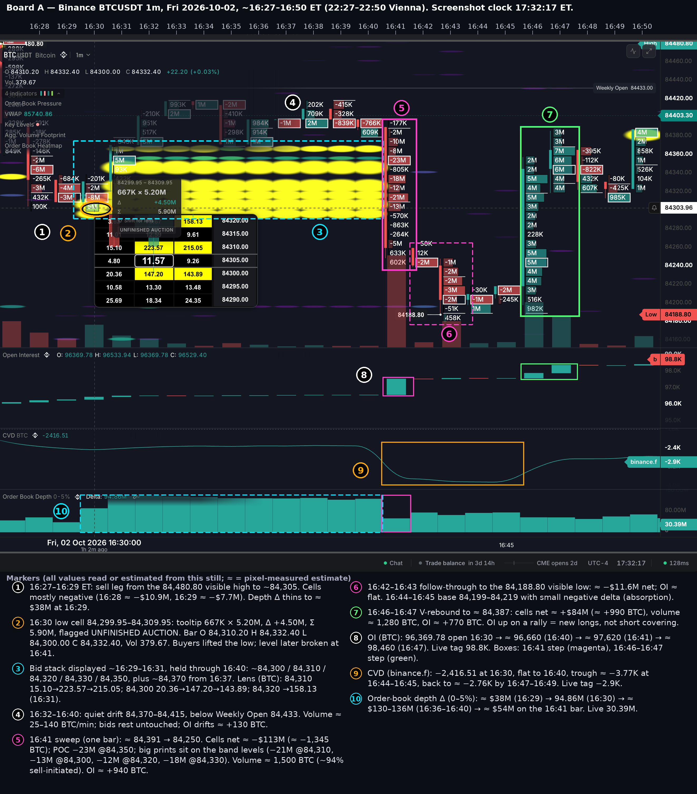
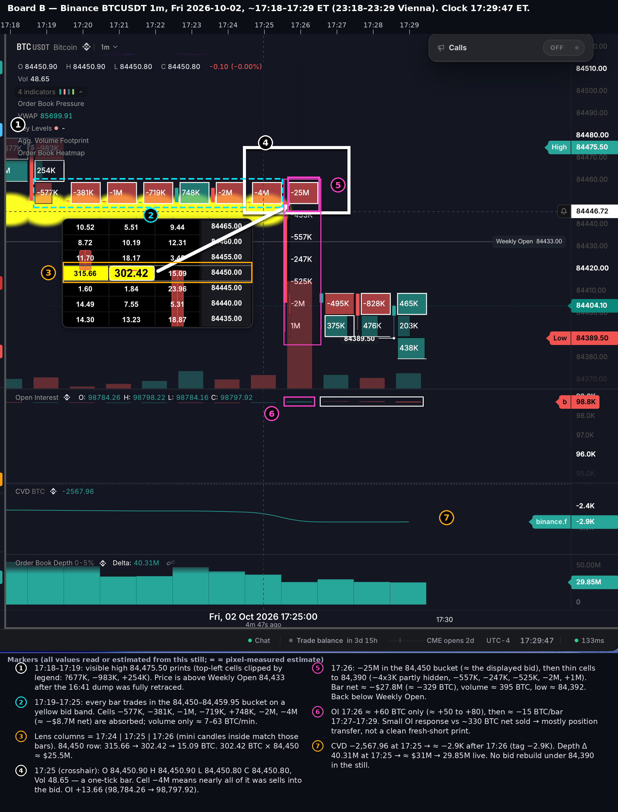
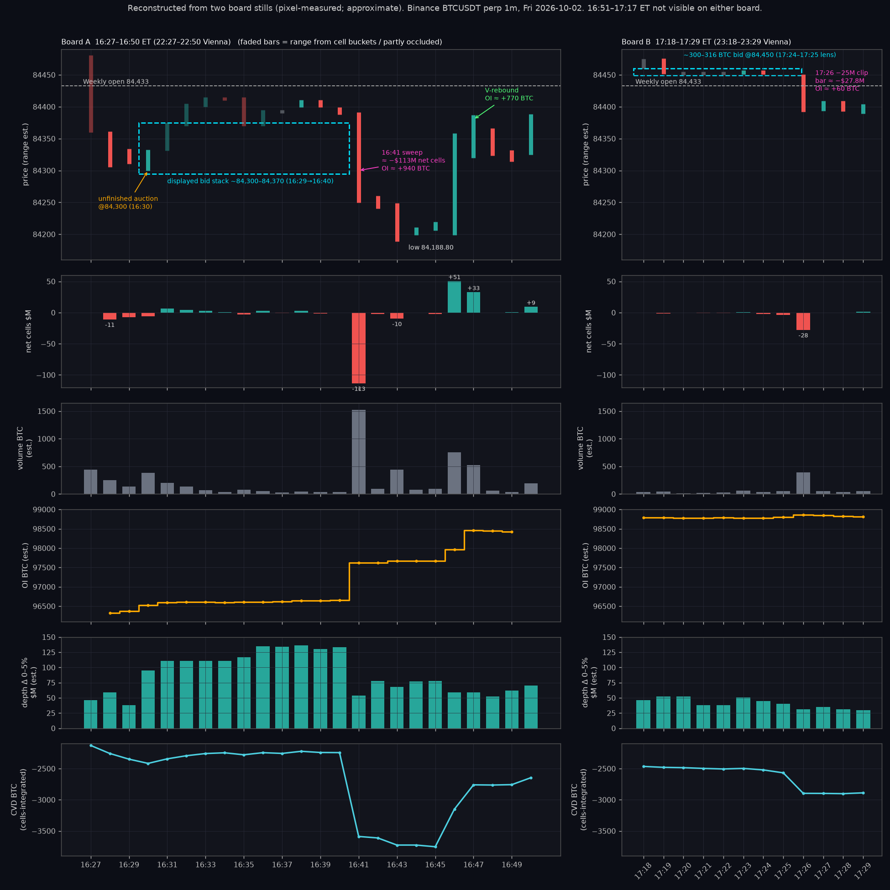

# BTC perp — post-US-close short initiation into displayed bids

**Fri 2026-10-02 · ~16:27–17:29 ET (22:27–23:29 Vienna) · Binance BTCUSDT perpetual · 1m**

| | |
|---|---|
| Status | **PAPER / observational only.** No live trade advice, no sizing. |
| Requested by | Richard (desk operator) |
| Read | Independent. Not coordinated with any sibling agent. Conclusions differ from the operator hypothesis in places (flagged). |
| Inputs | Two board stills: order-book heatmap, aggregated volume footprint, OI, CVD and order-book depth. No tape, no L2 history, no liquidation feed. |
| Packet | [`20261002-post-us-close-btc-shorts-opus55/`](20261002-post-us-close-btc-shorts-opus55/): raw boards, annotated boards, reconstructed phase panel, per-minute CSV |

Evidence tags used throughout:

- **[R]** read directly off a still (legend, tooltip, cell label, axis tag).
- **[M]** measured from pixels against axis and legend anchors. Approximate; error bars are in §9.
- **[C]** computed from [R] and [M] values.
- **[I]** interpretation.

---

## Bottom line

1. **There are two separate events, not one.** Board A is scrolled back: its clock reads 17:32:17, but the bars on screen are 16:27–16:50 ET. Board B shows 17:18–17:29 ET. The main sweep is at **16:41 ET**. The highlighted **−25M clip is at 17:26 ET**, about 45 minutes later. Nothing between 16:51 and 17:17 is visible on either board.
2. **16:41 is a clean fresh-short print.**
   - Bids were displayed at ~84,300 / 84,310 / 84,320 / 84,330 / 84,350 starting 16:29–16:31, plus ~84,370 from 16:37. They added roughly $95M of net bid depth.
   - The bids rested for ~10 minutes. Then one bar swept them all: net cells ≈ **−$113M** (≈ −1,345 BTC), volume ≈ **1,500 BTC** (~94% sell-initiated), OI ≈ **+940 to +960 BTC**.
   - Volume and ΔOI together put a floor under it: **at least about half to two-thirds of the aggressive selling had to be new shorts**, roughly ≥ $62–80M notional (§4.3).
3. **The bids were real and they were filled, not pulled.**
   - Prints match displayed size where the lens shows numbers: −13M vs ≈ $12.9M at 84,300, −21M vs ≈ $19.0M at 84,310, −12M vs ≈ $13.3M at 84,320.
   - Price levels with no displayed bid printed small (−805K at 84,340).
   - The heatmap bands vanish in the same bar, and depth Δ drops ≈ $80M.
4. **17:26 (the −25M) is a different animal.**
   - A ~300–316 BTC bid at 84,450 (≈ $25.5–26.7M) pinned price above the weekly open for 7+ minutes. Sellers nibbled at it (≈ −$8.7M net) without breaking it, then one bar took the whole shelf: **−25M ≈ 302.42 BTC × 84,450**.
   - OI rose only ≈ **+60 BTC** against ~330 BTC net sold. The aggressive sellers could have been anywhere from ~8% to ~100% new shorts. **It is mostly position transfer and can't be called fresh shorts from these stills.**
5. **The rebound was not short covering.**
   - 16:46–16:47: price +$190, CVD ≈ +990 BTC, **OI ≈ +770 BTC**. At least ~55% of that aggressive buying had to be new longs.
   - No bar on either board shows a meaningful OI drop. There is no OI evidence of long liquidations or a short squeeze.
6. **The +2.4K BTC of OI over the hour is not all shorts.**
   - OI went 96,369.78 (16:30 open) → ≈ 98,814 (17:29). Only ≈ +960 of that came on the sweep bar.
   - About +800 came with price rising (16:46–16:47), ≈ +290 came while the bids were being built (16:30–16:40), and ≈ +370 came in the unseen gap.
   - Net CVD over the same hour was only ≈ −470 BTC. That is a two-sided position build, not a one-way short campaign.
7. **On an intraday horizon the passive buyer won.**
   - The 16:41 sellers' VWAP is ≈ 84,334. Price was back above it by 16:47 and at 84,475 by 17:18–17:19. The sweep's permanent impact inside 6 minutes was about zero, which is the signature of a liquidity-driven trade, not an informed one.
   - The shorts did not cover into the V (OI kept rising). They behave like hedges or patient risk, not fast money.

### Verdict on the operator hypothesis

| Operator claim | Verdict | Why |
|---|---|---|
| Bid liquidity quoted ~16:30 ET | **Confirmed** | The lens jumps between 16:29 and 16:30: 84,310 goes 15.10 → 223.57 BTC, 84,300 goes 20.36 → 147.20, and 84,320 shows 158.13 by 16:31 [R]. Depth Δ goes ≈ $38M → 94.86M → ≈ $111M [R/M]. |
| …"shortly before fills" | **Not quite** | The ladder rested **10–11 minutes** (16:30 → 16:41). Price first *bounced* off it (16:30–16:31) and parked above it. Pattern: quote → bounce → park → sweep. |
| Intentional showing of size, then consumed | **Consumed: confirmed. Intent: unknowable** | Filled at about displayed size and not pulled (§3.1). Whether it was "shown" on purpose can't be read from a still. The bidder was also *buying* at 84,310 during 16:30 (−8M cell there) while still showing ~224 BTC, which looks like a real buyer rather than a display. |
| Prints = aggressive shorts hitting those bids, not chop | **16:41: confirmed. 17:26: ambiguous** | 16:41 is one-sided (~94%), with OI ≈ +960 and a floor of ≥ ~50–70% new shorts. 17:26 is one-sided (~92%), but OI is only ≈ +60, so the opening share is undetermined. |
| Price↓ + CVD↓ + OI↑ ≈ fresh shorts | **Confirmed for 16:41** | Textbook triad on that bar. |
| Later bars may mix liquidations | **Not supported** | No OI-down bar of size on either board; the largest dips are ≈ −15 to −20 BTC per bar. The later move that matters (16:46–16:47) is price↑ CVD↑ OI↑ = new longs. |
| OI ~96.5k → ~98.8k "in the initiation window" | **Numbers right, attribution too generous** | Only ~40% of the rise came on the short-initiation bar (see bottom line, item 6). |
| Yellow bands filled ~mid-84.3k / ~84.45k | **Confirmed** | 84,300–84,370 ladder filled at 16:41 (Board A); 84,450 shelf filled at 17:26 (Board B). |
| ~−25M highlighted clip | **Confirmed, but not the biggest event** | Largest single cell on either board. The 16:41 bar (POC −23M, net ≈ −$113M) is ~4× the 17:26 bar (net ≈ −$28M). |

---

## 1. Scene-set

### 1.1 Venue, product, timeframe

| Item | Reading | Tag |
|---|---|---|
| Venue | Binance: logo in symbol header; CVD source tag `binance.f`; OI tag `b` | R |
| Product | **BTCUSDT USDⓈ-M perpetual** (inferred, high confidence). The header just says "BTC USDT Bitcoin". Perp is inferred from three things: (a) there is an OI pane, and spot has no OI; (b) CVD is sourced from `binance.f`; (c) every printed price sits on a 0.10 grid, e.g. the 84,450.80 / 84,450.90 one-tick bar (perp tick is 0.10; spot is 0.01). | R + I |
| Timeframe | 1m | R |
| Board clock | UTC−4 (footer) = EDT | R |
| Units | OI and CVD in BTC; footprint cells in USD notional; lens values in BTC; depth Δ in USD | I, cross-checked in Appendix B |
| Indicators on chart | "4 indicators": Order Book Pressure (no value shown), VWAP, Key Levels (● –, no value shown), Agg. Volume Footprint, Order Book Heatmap. Separate panes: Open Interest, CVD BTC, Order Book Depth 0–5%. | R |

### 1.2 Clocks (ET · UTC · Vienna CEST = UTC+2)

| Stamp | ET | UTC | Vienna |
|---|---|---|---|
| US cash equity close | 16:00 | 20:00 | 22:00 |
| **Board A visible bars** | **~16:27–16:50** | 20:27–20:50 | 22:27–22:50 |
| Board A crosshair ("1h 2m ago") | 16:30:00 | 20:30 | 22:30 |
| Bid ladder appears | 16:29–16:31 | 20:29–20:31 | 22:29–22:31 |
| **Sweep bar** | **16:41** | 20:41 | 22:41 |
| Visible low 84,188.80 | 16:43 | 20:43 | 22:43 |
| V-rebound | 16:46–16:47 | 20:46–20:47 | 22:46–22:47 |
| CME BTC futures weekend close | 17:00 | 21:00 | 23:00 |
| **Board B visible bars** | **~17:18–17:29** | 21:18–21:29 | 23:18–23:29 |
| Board B crosshair ("4m 47s ago") | 17:25:00 | 21:25 | 23:25 |
| **−25M clip bar** | **17:26** | 21:26 | 23:26 |
| Board B screenshot clock | 17:29:47 | 21:29:47 | 23:29:47 |
| Board A screenshot clock | 17:32:17 | 21:32:17 | 23:32:17 |
| CME reopen (footer: "CME opens 2d") | Sun 18:00 | Sun 22:00 | Mon 00:00 |

**How bar times were pinned [M]:**

- Crosshair labels: 16:30:00 sits at x≈138 on Board A; 17:25:00 sits at x≈437 on Board B (display px).
- Axis time labels (16:45, 17:30) and candle spacing (40.25 px/min on A, 60.1 px/min on B) fix every other bar.
- The bar under each crosshair matches its header OHLC. For 16:30 the header shows L 84,300.00 / H 84,332.40; the candle measures 84,300.1–84,332.3.
- On Board B, the mini-candles inside the lens match the 17:24/17:25/17:26 bars.

**Clock context [I]:**

- The 16:41 sweep is 41 minutes after the US cash close and **19 minutes before the CME weekend close**.
- The 17:26 clip is **26 minutes after the CME close**. From then until Sunday 18:00 ET, CME-hedged books can only hedge on 24/7 venues.
- Liquidity thins into the weekend.

### 1.3 Levels

| Level | Value | Source |
|---|---|---|
| Weekly open | **84,433.00** | R (both boards) |
| Session VWAP | 85,740.86 at 16:30 → 85,699.91 at 17:25 | R (legend); anchor not shown |
| Board A visible high | 84,480.80 (left edge, ~16:27) | R (axis tag + marker) |
| Board A visible low | **84,188.80** (16:43) | R (axis tag + marker) |
| Board B visible high | 84,475.50 (17:18–17:19 area) | R (axis tag) |
| Board B visible low | 84,389.50 (17:29, live bar) | R (axis tag + marker) |
| Last | 84,404.10 at 17:29:47 · 84,403.30 at 17:32:17 | R |
| Displayed bid ladder (A) | ~84,300 / 84,310 / 84,320 / 84,330 / 84,350, + ~84,370 from 16:37 | R (lens) + M (heatmap) |
| Displayed bid shelf (B) | 84,450 (≈ 300–316 BTC) | R (lens) |

**Location matters [I]:**

- Price is ~1.5% (~$1,300) below session VWAP on both boards. Both events happen late in a down session, not at a rally high.
- The weekly open is the pivot for both events:
  - Event 1 follows a failed approach: 16:33–16:35 highs were ~84,410–84,415, about $20 shy of 84,433.
  - Event 2 knocks price back below 84,433 after 7+ minutes above it.

### 1.4 How I read the panes (tool semantics relied on)

- **Footprint cells:** net delta (aggressive buys − aggressive sells) per $10 bucket per minute, in USD notional.
  - The tooltip on the 16:30 low cell reads `84299.95 – 84309.95`, `667K × 5.20M`, `Δ +4.50M`, `Σ 5.90M` [R]. So left = sold into the bid, right = bought at the ask, Δ = right − left, Σ = total.
  - Arithmetic: 5.20 − 0.667 = 4.53 ≈ 4.5 and 5.20 + 0.667 = 5.87 ≈ 5.9. The tool rounds to 0.1M.
- **White-outlined cell in each bar:** most likely the bar's POC (highest-volume bucket). It isn't labeled, so treat it as "likely".
- **Orange or lime cell fills are a rendering artifact, not a signal.** The boxes are semi-transparent. Orange is a red cell drawn over a yellow heatmap band; lime is a teal cell over yellow. Every orange box on Board B sits on the 84,450 band; the lime "5M" (16:30) and "4M" (16:50) on Board A sit on yellow blobs.
- **Lens grid ("Shift for lens"):**
  - Three columns = three consecutive minutes. The mini-candles drawn inside the lens match 16:29/16:30/16:31 on A and 17:24/17:25/17:26 on B.
  - Rows = $5 price levels. Values = resting size in BTC.
  - Side isn't labeled. It's whatever rests at that price: a bid if it's below the market, an ask if above.
- **Order Book Depth 0–5% "Delta":** read as bid depth minus ask depth within 5% of mid, in USD. It rises when bids appear under price and falls when they're consumed [I].
- **Dimmed cells:** cells for 16:32–16:37 on Board A are rendered dimmed (cause unknown). They are still legible.

---

## 2. Chronology

Cells are listed top → bottom as `bucket lower bound: printed value` [R]. "Net" is the sum of printed cells [C]; it inherits the rounding of the labels. Ranges, volume, OI and depth are [M] unless marked [R]. The full table is in `per-minute-readings.csv`.

### 2.1 Board A — minute by minute (16:27–16:50 ET)

| ET (Vienna) | Range ≈ | Footprint cells (top → bottom) | Net cells | Vol ≈ BTC | OI ≈ (Δ) | Book / notes |
|---|---|---|---|---|---|---|
| 16:27 (22:27) | ~84,480.8 → ~84,360, red; left edge, partly behind legend | Mostly hidden. Readable: −289K, −598K, −137K, −272K, −1M, 849K, 285K; top cell truncated ("−1?M") | n/a | ≈440 | n/a | Small yellow bid at ~84,335–84,340 at the far-left edge, gone by 16:28 (16:28's −6M at 84,340 hits it). Visible-range high 84,480.80 marker here [R]. |
| 16:28 (22:28) | 84,306–84,361, red | 84,360 −146K · 84,350 −2M · **84,340 −6M** (POC) · 84,330 −265K · 84,320 −3M · 84,310 +432K · 84,300 +100K | **−$10.9M** (≈ −129 BTC) | ≈250 | ≈96,320 (+95) | — |
| 16:29 (22:29) | 84,310–84,334, red | 84,330 −684K · 84,320 −4M · 84,310 −3M (POC) | **−$7.7M** (≈ −91) | ≈133 | ≈96,370 (+50) | Depth Δ ≈ $38M, the window low. Lens (16:29 col): 84,310 = 15.10, 84,300 = 20.36 BTC. First yellow at 84,300–84,310 at the right edge of the slot. |
| **16:30** (22:30) | **O 84,310.20 H 84,332.40 L 84,300.00 C 84,332.40** (+22.20) [R] | 84,330 −201K · 84,320 −2M · **84,310 −8M** (POC) · **84,300 +5M** (tooltip: 667K × 5.20M, Δ +4.50M, Σ 5.90M, **UNFINISHED AUCTION**) | −$5.7M (≈ −68) | **379.67** [R] | **O 96,369.78 → C 96,529.40 (+159.62)** [R] | Lens (16:30 col): **84,310 = 223.57, 84,300 = 147.20 BTC**. Depth Δ **94.86M** [R]. CVD **−2,416.51** [R]. |
| 16:31 (22:31) | ~84,331–84,375, green | 84,370 −345K · 84,360 +1M · **84,350 +5M** (POC) · 84,340 +93K · 84,330 422K (sign unclear; lower cells under the tooltip) | ≥ +$6.2M (visible) | ≈200 | ≈96,590 (+60) | Lens (16:31 col): **84,320 = 158.13, 84,310 = 215.05, 84,300 = 143.89 BTC**. Depth Δ ≈ $111M. |
| 16:32 | ~84,370–84,405 | 84,400 −210K · 84,390 +951K · 84,380 +517K · 84,370 +3M | +$4.3M | ≈137 | flat | Ladder visible (lower bands hidden under the tooltip 16:31–16:33). |
| 16:33 | ~84,400–84,415 | 84,410 +993K · 84,400 +2M | +$3.0M | ≈72 | flat | Full ladder visible: block ~84,295–84,332 + band ~84,340–84,354. |
| 16:34 | ~84,410–84,415 | 84,410 +1M | +$1.0M | ≈33 | flat | — |
| 16:35 | ~84,370–84,415 | 84,410 −2M · 84,400 −410K · 84,390 −1M · 84,380 −298K · 84,370 +1M | −$2.7M | ≈77 | flat | Depth Δ ≈ $117M |
| 16:36 | ~84,370–84,395 | 84,390 +984K · 84,380 +914K · 84,370 +1M | +$2.9M | ≈51 | flat | Depth Δ ≈ $135M |
| 16:37 | ~84,390 | 84,390 −1M | −$1.0M | ≈25 | flat | New yellow band ~84,365–84,370; moderate (green) ~84,355–84,359. |
| 16:38 | 84,399–84,411, green | 84,410 +202K · 84,400 +709K · 84,390 +2M | +$2.9M | ≈46 | flat | — |
| 16:39 | 84,399–84,411, red | 84,410 −415K · 84,400 −328K · 84,390 −839K | −$1.6M | ≈33 | flat | — |
| 16:40 | 84,388–84,399, red | 84,390 −766K · 84,380 +609K | −$0.2M | ≈33 | ≈96,660 | Ladder intact through this slot. Depth Δ ≈ $133M. |
| **16:41** (22:41) | **~84,391 → ~84,250, red (−$140)** | 84,390 −177K · 84,380 −2M · **84,370 −10M** · **84,360 −8M** · **84,350 −23M** (POC) · 84,340 −805K · **84,330 −18M** · **84,320 −12M** · **84,310 −21M** · **84,300 −13M** · 84,290 −570K · 84,280 −863K · 84,270 −264K · 84,260 −5M · 84,250 +633K · 84,240 +602K | **−$113.4M** (≈ −1,345 BTC) | **≈1,520** | **≈97,620 (≈ +940 to +960)** | **Every yellow band gone from this slot on.** Depth Δ ≈ $54M. |
| 16:42 | 84,240–84,261, red | 84,260 −50K · 84,250 +12K · 84,240 −2M | −$2.0M | ≈94 | flat | Faint residual liquidity ~84,342. |
| **16:43** (22:43) | **84,188.80**–84,249, red | 84,240 −1M · 84,230 −2M · 84,220 −2M · 84,210 −3M · 84,200 −2M (POC) · 84,190 −51K · 84,180 +458K | −$9.6M | ≈440 | +~30 | Visible low **84,188.80** [R]. |
| 16:44 | 84,199–84,211, green | 84,210 −30K · 84,200 −1M · 84,190 +1M | ≈0 | ≈77 | flat | — |
| 16:45 | 84,206–84,219, green | 84,210 −2M · 84,200 −245K | −$2.2M | ≈94 | flat | Green bar on negative delta = passive buying absorbs. |
| **16:46** (22:46) | **~84,199 → ~84,358, green (+$160)** | 84,350 +2M · 84,340 +2M · 84,330 +5M · 84,320 +4M · 84,310 +5M · 84,300 +3M · 84,290 +2M · 84,280 +2M · 84,270 +228K · 84,260 +3M · 84,250 +5M · **84,240 +5M** (POC) · 84,230 +4M · 84,220 +4M · 84,210 +3M · 84,200 +516K · 84,190 +982K | **+$50.7M** (≈ +600) | ≈750 | ≈97,970 (≈ +290) | No bid rebuild. |
| **16:47** | 84,320–84,387, green | 84,380 +3M · 84,370 +3M · 84,360 +7M · 84,350 +6M · **84,340 +6M** (POC) · 84,330 +4M · 84,320 +4M | **+$33.0M** (≈ +390) | ≈530 | **≈98,460 (≈ +480)** | — |
| 16:48 | 84,324–84,366, red | 84,360 −395K · 84,350 −112K · 84,340 −822K (POC) · 84,330 +432K · 84,320 +607K | −$0.3M | ≈64 | ≈flat | — |
| 16:49 | 84,314–84,332, red | 84,330 −80K · 84,320 −425K · 84,310 +985K (POC) | +$0.5M | ≈38 | ≈flat | New yellow blob ~84,378–84,384 (side ambiguous). |
| 16:50 | 84,325–84,389, green | 84,380 +4M (POC; lime = over yellow blob) · 84,370 +2M · 84,360 +858K · 84,350 +1M · 84,340 +526K · 84,330 +104K · 84,320 +1M | +$9.5M | ≈193 | hidden by live OI tag | — |

### 2.2 Board A — what happened, phase by phase

**P0 · 16:27–16:29 — sell leg into a thin bid.**

- *Read:* red bars from the 84,480.80 visible high down to ~84,305. Cells mostly negative (16:28 ≈ −$10.9M, 16:29 ≈ −$7.7M). A small pre-existing bid near 84,340 is hit at 16:28 (−6M).
- *Measured:* depth Δ falls to ≈ $38M at 16:29; OI ≈ +145.
- *Inferred:* aggressive selling with light net opening. A mini version of what comes later: a bid shows, and a seller uses it.

**P1 · 16:30–16:31 — the ladder lands and price lifts off it.**

- *Read:*
  - The lens jumps at 84,310 (15.10 → 223.57 → 215.05) and 84,300 (20.36 → 147.20 → 143.89), and 84,320 shows 158.13 by 16:31.
  - Depth Δ is 94.86M at 16:30.
  - The 16:30 bar closes on its high (84,332.40); the 16:31 bar lifts +5M at 84,350.
- *Inferred:* about 370 BTC (~$31M) arrived at 84,300/84,310 inside the 16:30 minute. The buyer was also getting filled at 84,310 that minute (−8M cell = ~95 BTC sold into bids there) and still showed ~224 BTC at the snapshot, which looks like a real buyer.

**P2 · 16:32–16:40 — parked above the ladder.**

- *Read:* small, mixed cells.
- *Measured:* 25–140 BTC/min; depth Δ ≈ $111M → ≈ $135M.
- *Inferred:*
  - Nobody leans on the ladder.
  - With ~$135M of net bid depth under it, price still can't tag the weekly open (84,433). Offers above were heavier than anyone's willingness to lift. That quiet failure is the setup for the sweep.

**P3 · 16:41 — the sweep.** One bar, sized like the ladder (§3.1). OI ≈ +940 to +960.

**P4 · 16:42–16:45 — follow-through, then base.**

- −$2.0M and −$9.6M take price to the 84,188.80 low.
- Then a base at 84,199–84,219 with small negative delta and green bars: passive buyers absorbing.
- OI ≈ flat (+~50): a mix of opening and closing.

**P5 · 16:46–16:47 — V-rebound.**

- Positive cells wall to wall: ≈ +$84M over two bars, ≈ +990 BTC.
- OI ≈ +770. New longs lifting offers, not shorts covering.
- *Inferred:* the counterparty on the offer side was opening too (OI up). That would fit the 16:41 seller re-offering into the bounce, but the stills can't show who.

**P6 · 16:48–16:50 — digestion near 84,312–84,389.**

- A new yellow blob appears at ~84,380 at the 16:50 high.
- *Side unclear [I]:* it sits at the bar's high, so it could be an offer the bar ran into. I can't call it.

### 2.3 The gap 16:51–17:17 — not on either board

Only the endpoints are visible, so this is inference only, and I claim no prints from this window:

- Price goes from ~84,386 (16:50) to 84,450–84,475 (17:18–17:19), which means **the weekly open was reclaimed** somewhere in the gap.
- OI goes from ≈ 98,430 (16:49) to ≈ 98,785 (17:18), roughly +350; part of that is the hidden 16:50 bar.
- Cells-integrated CVD goes from ≈ −2,646 (end 16:50) to ≈ −2,521 (end 17:24, back-solved from the 17:25 legend). That's roughly +125 BTC of net buying.

### 2.4 Board B — minute by minute (17:18–17:29 ET)

| ET (Vienna) | Range ≈ | Footprint cells | Net cells | Vol ≈ BTC | OI ≈ (Δ) | Book / notes |
|---|---|---|---|---|---|---|
| 17:18 (23:18) | ~84,460–84,475 (left edge) | 84,470 ?677K (sign clipped) · 84,460 teal "…M" (value clipped) | n/a | ≈35 | ≈98,790 | Yellow bid band at ~84,450 already present. |
| 17:19 | ~84,451–84,475.50, red | 84,470 −983K · 84,460 +254K (POC) · 84,450 −577K | −$1.3M | ≈40 | flat | Visible high **84,475.50** prints in the 17:18–17:19 area [R]. |
| 17:20 | 84,450 bucket | 84,450 −381K | −$0.4M | ≈7 | flat | — |
| 17:21 | 84,450 bucket | 84,450 −1M | −$1.0M | ≈16 | flat | Depth Δ ≈ $38M |
| 17:22 | 84,450 bucket | 84,450 −719K | −$0.7M | ≈27 | flat | — |
| 17:23 | 84,450.5–84,457, green | 84,450 +748K | +$0.7M | ≈63 | flat | Depth Δ ≈ $51M |
| 17:24 | 84,450.5–84,457, red | 84,450 −2M | −$2.0M | ≈33 | flat | Lens (17:24 col): **84,450 = 315.66 BTC** |
| **17:25** (23:25) | **O 84,450.90 H 84,450.90 L 84,450.80 C 84,450.80** (−0.10) [R] | 84,450 **−4M** | −$4.0M (~98% sells) | **48.65** [R] | **O 98,784.26 → C 98,797.92 (+13.66)** [R] | Lens (17:25 col): **84,450 = 302.42 BTC** (cursor cell). Depth Δ **40.31M** [R]. CVD **−2,567.96** [R]. |
| **17:26** (23:26) | **84,450 → ~84,392, red (−$59)** | **84,450 −25M** · 84,440 −4x3K (partly under the operator's box; −433K or −453K) · 84,430 −557K · 84,420 −247K · 84,410 −525K · 84,400 −2M · 84,390 +1M | **−$27.8M** (≈ −329 BTC) | **≈395** (~92% sells) | **≈98,860 (≈ +60)** | Lens (17:26 col): **84,450 = 15.09 BTC**, so the bid is gone. The band ends at this candle. Depth Δ ≈ $31M. |
| 17:27 | 84,393–84,409, green | 84,400 −495K · 84,390 +375K (POC) | −$0.1M | ≈50 | −~16 | — |
| 17:28 | 84,393–84,409, red | 84,400 −828K · 84,390 +476K | −$0.4M | ≈38 | −~16 | — |
| 17:29 (live at 17:29:47) | **84,389.50**–84,404, green | 84,400 +465K (POC) · 84,390 +203K · 84,380 +438K | +$1.1M | ≈55 (partial) | −~16 | Last 84,404.10; depth Δ 29.85M [R]. |

### 2.5 Board B — phases

**P7 · 17:19–17:25 — pinned on the 84,450 shelf, above the weekly open.**

- Sellers hit the shelf every minute, ≈ −$8.7M net over 7 bars, and it held.
- 17:25 is a **one-tick bar**: the whole minute traded at 84,450.80 / 84,450.90, ~98% of it sells.
- The lens shows the shelf dropping only 315.66 → 302.42 BTC (−13) while ~47 BTC was sold into it in 17:25. The level was being refilled [I]: iceberg-like, or other bids joining at the same price (Binance public depth is aggregated per price, so you can't tell which).
- OI flat (±16 BTC per bar).

**P8 · 17:26 — the clip.**

- −25M in the 84,450 bucket matches the displayed shelf (302.42 × 84,450 ≈ $25.5M). The next lens column shows 15.09 BTC.
- Below the shelf the book was thin: every cell ≤ $0.6M per bucket until 84,400. Price falls $59 on ~$2.8M of extra net selling.
- OI ≈ +60.

**P9 · 17:27–17:29 — flat at 84,389.50–84,409.** Small mixed cells. OI drifts ≈ −45. No bid rebuild visible. Depth Δ ≈ $30M.

---

## 3. Liquidity story

### 3.1 Board A: quote → bounce → park → sweep

**The quote.** Lens readings [R], BTC:

| Row | 16:29 | 16:30 | 16:31 |
|---|---|---|---|
| 84,320 | ~3.6 (overlaid) | hidden ("…67", not highlighted) | **158.13** |
| 84,315 | 11.01 | 12.59 | 9.61 |
| 84,310 | 15.10 | **223.57** | **215.05** |
| 84,305 | 4.80 | 11.57 (cursor) | 9.26 |
| 84,300 | 20.36 | **147.20** | **143.89** |
| 84,295 | 10.58 | 13.30 | 13.48 |
| 84,290 | 25.69 | 18.34 | 24.35 |

- The heatmap adds bands at ~84,330 and ~84,345–84,350 (from 16:30–16:31) and ~84,365–84,370 (from 16:37). Their sizes aren't in the lens; yellow is the top of the colour scale.
- Depth Δ goes ≈ $38M → 94.86M → ≈ $111M → ≈ $130–136M. That is roughly **+$95M of net bid depth**, consistent with a ~$90–100M ladder.
- The ladder sits on a clean $10 grid of round handles (84,300 / 310 / 320 / 330 / 350, later 84,450 on Board B). That looks like a person or a simple ladder algo. A market maker's skewed, refreshing quotes would look different.

**The bounce and the park.**

- Price lifted off the ladder within two minutes (16:30–16:31), then sat $20–$115 above it for ~10 minutes.
- Volume collapsed to 25–140 BTC/min (~$2–12M/min). Nobody tested the ladder, and price could not reach the weekly open.

**The fill.** Displayed size vs. what printed at 16:41:

| Bucket | Displayed (lens, BTC) | ≈ $ | 16:41 cell | Read |
|---|---|---|---|---|
| 84,300–84,309.95 | 143.89 + 9.26 ≈ 153 | ≈ $12.9M | **−13M** | ≈ 1:1 |
| 84,310–84,319.95 | 215.05 + 9.61 ≈ 225 | ≈ $19.0M | **−21M** | ≈ 1:1 (a bit more: refilled or added) |
| 84,320–84,329.95 | 158.13 + (84,325 not in lens) | ≥ $13.3M | **−12M** | ≈ 1:1 (a bit less: trimmed, or partly hit earlier) |
| 84,330 | yellow band | n/a | −18M | big print on a band |
| 84,350 | yellow band | n/a | **−23M** (POC) | big print on a band |
| 84,360 / 84,370 | moderate / yellow (from 16:37) | n/a | −8M / −10M | prints on bands |
| 84,340 | **no band (gap)** | — | **−805K** | small print in a gap |
| 84,270–84,290 | no band | — | −264K … −863K | small prints in gaps |
| 84,260 | — | — | −5M | last chunk |
| 84,240–84,250 | — | — | +633K / +602K | buyers lift the bottom; seller stops |

The sum on band levels is ≈ −$105M; on the gaps it is ≈ −$8.4M.

**Conclusion: the bids were real, and they were filled, not pulled.**

- Prints are sized like the displayed book at the levels where the book was displayed, and small in the gaps.
- The bands disappear in the same bar, and depth Δ drops ≈ $80M.
- A spoof gets pulled as price approaches. This one stayed and traded.

### 3.2 Who was passive, who was aggressive (Board A)

| Window | Aggressive | Passive | Evidence |
|---|---|---|---|
| 16:28–16:29 | sellers | thin bids (incl. a small one at ~84,340) | negative cells; depth Δ ≈ $38M |
| 16:30 | sellers at 84,310–84,330; buyers at the 84,300 low | new bids at 84,300 / 84,310 | tooltip, lens |
| 16:31–16:40 | small, two-way | ladder resting | tiny volume |
| **16:41** | **sellers (~94%)** | **the ladder** | cells, volume, OI |
| 16:42–16:45 | sellers, fading | bids at 84,190–84,220 | 16:45 green on negative delta |
| **16:46–16:47** | **buyers (~89%)** | offers 84,190–84,390 | cells, OI |

### 3.3 The unfinished auction at 84,300 (16:30)

- **What it says [R]:** the low bucket of the 16:30 bar traded on both sides: 667K sold at the bid and 5.20M bought at the ask. The tool flags it "UNFINISHED AUCTION".
- **Why it matters [I]:** in auction terms, a *finished* low prints ~zero selling at the extreme, meaning sellers are exhausted. Here sellers were still active at the low; buyers just out-lifted them. Unfinished extremes tend to get revisited.
- **What happened:** 84,300 was revisited and broken at 16:41 (−13M in that bucket).
- **Caveat:** this is one instance. Use it as context, not proof.

### 3.4 Board B: the 84,450 shelf

- **The shelf [R]:** lens at 84,450 reads 315.66 (17:24) → 302.42 (17:25) → 15.09 (17:26) BTC.
  - It's a bid: aggressive sells consumed it, price held while it was there and fell when it went.
  - The $5 row 84,450.00–84,454.99 holds both the best bid (84,450.80) and the best ask (84,450.90). The sell-side consumption is what identifies it as bid size.
- **Absorption:** seven bars of sells into it (≈ −$8.7M), and it barely moved. The 17:25 one-tick bar is the extreme case.
- **The clip:** −25M ≈ 302 BTC at 84,450, i.e. the whole shelf in one minute. The cell can't say whether that was one order or a burst of many; it is a 1-minute, $10-bucket aggregate.
- **Underneath:** thin. Price drops $59 on ~$2.8M more net selling.
- **Depth Δ:** ≈ $40M → ≈ $31M. That is a smaller drop than the shelf's $25.5M, so either new bids were added deeper or asks were pulled. Stills can't separate the two.

### 3.5 Execution math — how the sellers fared

| Event | Net sold (cells) | Sellers' VWAP ≈ [C] | Arrival ≈ | Slippage | Afterwards |
|---|---|---|---|---|---|
| 16:41 | ≈ $113M (≈ 1,345 BTC) | **≈ 84,334** | ≈ 84,386–84,390 | ≈ $52–56 ≈ **6–7 bp** | bar low ≈ 84,250; 16:43 low 84,188.80 |
| 17:26 | ≈ $28M (≈ 329 BTC) | **≈ 84,445–84,450** | 84,450.8 | ≈ **0–1 bp** on the −25M | low ≈ 84,392 |

VWAP is computed from bucket midpoints weighted by |net cell|.

**Desk translation:**

- Selling $113M of BTC perp in one minute, after hours, for ~6–7 bp of impact is cheap. It was only cheap because the ladder was there.
- Selling $25M at the touch with zero slippage is about as good as lit-venue execution gets.
- In both cases the displayed bid *was* the block.

---

## 4. Positioning triad (OI × CVD × price)

### 4.1 One identity to keep straight

Every trade has two sides, and each side is either opening or closing:

- If both sides open, OI rises by the trade size.
- If both close, OI falls.
- If one opens and one closes, OI is unchanged.

Over a bar, that gives:

> **opening sides = volume + ΔOI** (out of 2 × volume)

With volume, ΔOI, and the aggressive buy/sell split, you can put a *floor* under how much of the dominant aggressor must have been opening. That turns "looks like fresh shorts" into a bound.

### 4.2 Phase table

CVD here is cells-integrated, anchored on the legends.

| Phase (ET) | Price | CVD (BTC) | OI (BTC) | Depth Δ | Read | Confidence |
|---|---|---|---|---|---|---|
| P0 16:27–16:29 | ↓ 84,480 → 84,305 | ↓ ≈ −220 (16:28–29) | ↑ small (≈ +145) | ↓ to ≈ $38M | aggressive selling, small net opening; light new shorts | Med-low |
| P1 16:30–16:31 | ↑ 84,300 → ~84,375 | ≈ flat (−68, +73) | ↑ (≈ +220) | ↑↑ $38M → $111M | ladder arrives; two-sided opening; floor | Med |
| P2 16:32–16:40 | → 84,370–84,415 | ↑ small (≈ +170) | ↑ drift (≈ +70) | ↑ ≈ $135M | inert; nobody leaning | Med |
| **P3 16:41** | **↓↓ −$140** | **↓↓ ≈ −1,345** | **↑↑ ≈ +940 to +960** | **↓↓ ≈ $54M** | **fresh shorts into new longs (the ladder); ≥ ~50–70% of aggressive selling was opening** | **High (direction) · Med (size)** |
| P4 16:42–16:45 | ↓ then base (low 84,188.80) | ↓ ≈ −165 | ≈ flat (+~50) | ≈ $68–78M | continuation absorbed; mixed open/close | Med |
| **P5 16:46–16:47** | **↑↑ +$190** | **↑↑ ≈ +990** | **↑ ≈ +770** | ≈ $59M | **new longs lifting offers, not short covering; ≥ ~55% of aggressive buying was opening** | **High (not covering) · Med (size)** |
| P6 16:48–16:50 | → / ↑ to ~84,389 | ↑ small (≈ +115) | ≈ flat (16:50 hidden) | ≈ $52–70M | digestion | Med-low |
| Gap 16:51–17:17 | ↑ to 84,450–84,475 (inferred) | ≈ +125 (inferred) | ≈ +350 (inferred) | n/a | weekly open reclaimed | **Low** |
| P7 17:19–17:25 | → pinned in 84,450 bucket | ↓ slow (≈ −100) | flat (±16/bar) | ≈ $38–52M | absorption on a displayed bid; transfer, not initiation | Med-high |
| **P8 17:26** | **↓ −$59** | **↓ ≈ −329** | **↑ small ≈ +60** | ↓ ≈ $31M | **mostly transfer; the aggressive sellers could be ~8% to ~100% new shorts** | **High that it's ambiguous** |
| P9 17:27–17:29 | → 84,389.5–84,409 | ≈ flat | ↓ small (≈ −45) | ≈ $30–35M | mild de-risking; no rebuild | Med-low |

### 4.3 Floors from the identity

| Bar | Volume ≈ | ΔOI ≈ | Opening share of all sides | Dominant aggressor ≈ | Floor: dominant aggressor that was opening |
|---|---|---|---|---|---|
| **16:41** | 1,520 (±15%) | +940 | ≈ 81% | sellers ≈ 1,430 BTC | **≥ ≈ 855 BTC (60%)**; 48–70% across the volume band, i.e. **≥ ~$62–80M of new shorts** |
| **16:46–16:47** | 1,280 | +770 | ≈ 80% | buyers ≈ 1,140 BTC | **≥ ≈ 625 BTC (55%) new longs**; covering ≤ ~45% |
| **17:26** | 395 | +60 | ≈ 58% | sellers ≈ 360 BTC | ≥ ≈ 30 BTC (8%); the upper bound is 100%, so **undetermined** |
| 16:30 | 379.67 [R] | +159.62 [R] | ≈ 71% | sellers ≈ 224 BTC | ≈ 0, undetermined |

The same arithmetic applies to the passive side at 16:41: **at least ~60% of the bids that got hit were opening longs**. The ladder was mostly not shorts covering.

### 4.4 Liquidations? Squeeze?

| Flow | Price | CVD | OI | Seen on these boards? |
|---|---|---|---|---|
| Fresh shorts (aggressive) | ↓ | ↓ | ↑ | **16:41** (strong); 16:28–16:29 (light) |
| Long liquidation / stop-out | ↓ | ↓ | ↓ | **No.** No OI-down bar of size. |
| Short covering / squeeze | ↑ | ↑ | ↓ | **No.** The rebound came with OI up. |
| Fresh longs (aggressive) | ↑ | ↑ | ↑ | **16:46–16:47** |
| Absorption / transfer | → | ± | → | **17:19–17:25**; **17:26** mostly |

The largest OI-down readings anywhere are ≈ −15 to −20 BTC per bar (16:42, 16:48, 17:27–17:29). If there were liquidations, they were netted inside bigger opening flow. The liquidation feed is needed to rule them in or out (§7).

### 4.5 Where the +2.4K BTC of OI came from

Close-to-close, from the 16:30 open:

| Window | ΔOI ≈ | Price | Read |
|---|---|---|---|
| 16:30 open → 16:40 | +290 | ↑ then flat | ladder built; two-sided |
| **16:41** | **+960** | ↓↓ | fresh shorts vs ladder longs |
| 16:42–16:45 | +50 | ↓ → | mixed |
| **16:46–16:47** | **+800** | ↑↑ | fresh longs vs passive offers |
| 16:48–16:49 | −35 | → | — |
| 16:50 → 17:25 (16:50 hidden, gap unseen) | +370 | ↑ through the weekly open | unseen |
| 17:26 | +60 | ↓ | transfer |
| 17:27–17:29 | −45 | → | mild de-risking |
| **Total (96,369.78 → ≈ 98,814)** | **≈ +2,440 (≈ $205M)** | | |

Net cells-integrated CVD over the same span is ≈ **−470 BTC** (−2,417 → −2,889). That is about $40M of net aggressive selling against ~$205M of new open interest. The hour built positions on both sides, and the aggressive shorts at 16:41 were matched by aggressive longs at 16:46–16:47.

---

## 5. Trading-firm / prop-desk perspective

How desks typically behave in this kind of spot, mapped onto what the boards show. Generic behaviour plus inference; **no firm identification is possible from these stills.**

### 5.1 Why wait for a bid pocket

- **The arithmetic of size after hours.** During the park (16:32–16:40) the tape ran ~25–140 BTC per minute, about $2–12M.
  - $113M worked as a 30-minute TWAP is ~$3.8M per minute, which is 30–190% of prevailing volume.
  - That isn't a TWAP, it's a billboard. Every short-horizon algo on the venue reads it, and the price walks away from you.
- **A displayed ladder is the cheapest block on a lit venue.** ~$100M within ~$70 of the touch, swept once, cost ~6–7 bp (§3.5). Without the ladder, the same size would have walked through gap-level liquidity (≤ $1M per $10) for hundreds of dollars.
- **Concentrated vs drawn-out leakage.** One big sweep leaks a lot of information, but for one minute. Slicing leaks a little every minute until you're done. Desks with size and some urgency take the one-shot when the liquidity is visible and looks like it'll stay long enough to hit.
- **Why it waited, if it did.** Two readings fit, and the stills can't separate them:
  - *(a) Opportunistic:* the seller wanted size on the bid and took it when it showed up and stayed.
  - *(b) Scheduled:* the seller had a deadline (for example, a hedge to place before the 17:00 ET CME close) and the ladder happened to be there.
  - The 10-minute gap between quote and sweep argues the seller wasn't simply *reacting* to the ladder appearing.
- **Board B is the other playbook.** Seven minutes of nibbling into the 84,450 shelf (POV/TWAP-like slices of −$0.4M to −$4M per minute), then one clip takes the remainder. "Work it, then take it" is what you do when the shelf is about the size you have left, or when you think it won't stay.

### 5.2 Inventory transfer — who got the BTC

- In the 16:41 minute the passive side bought ≈ 1,430 BTC (~$120M), most of it from the ladder.
- By the identity, ≥ ~60% of those passive buys were *opening* longs. The ladder was mostly not shorts taking profit.
- What kind of bidder shows ~$100M at fixed round prices for 10 minutes and doesn't pull when a sweep arrives?
  - **Directional accumulator.** Happy to buy a dip at round numbers, doesn't care about being run over by 0.2%. Fits.
  - **Hedger / arb who wants long perp.** For example long perp vs short spot/ETF/OTC inventory, or moving a CME position onto a 24/7 venue before the close. Fits, and timing-compatible with 16:41 (19 minutes before the CME close).
  - **Classic market maker.** Least likely in pure form. MMs quote thin, refresh fast, skew with inventory, and do not rest ~$100M flat at round handles for 10 minutes. If an MM did absorb it, it would hedge elsewhere right after (selling spot or other perps). That hedge doesn't reduce Binance perp OI, so the OI rise doesn't rule it out — but the quoting pattern argues against it.
- **What the bidder did next is the tell [I].**
  - No ladder rebuild after the sweep.
  - Five minutes later: aggressive buying with OI up (16:46–16:47).
  - That fits the same buyer, or the same cohort, switching from passive to aggressive once the passive bids were gone and price was cheaper. It doesn't prove it.

### 5.3 Adverse selection — who was "right"

| Mark | vs 16:41 VWAP ≈ 84,334 | Passive buyer (≈ 1,430 BTC) | Aggressive seller |
|---|---|---|---|
| 16:43 low 84,188.80 | −$145 / BTC | worst MTM ≈ −$0.2M | best |
| 16:47 ≈ 84,385 | +$51 | in profit | underwater |
| 17:18–17:19 ≈ 84,475 | +$141 | in profit | worst |
| 17:29–17:32 ≈ 84,404 | +$70 | in profit | underwater ≈ $70 |

- On a 5–45 minute horizon the passive buyer won and the aggressive seller lost.
- The permanent price impact of a $113M sweep was **~zero within six minutes**. In microstructure terms that's a liquidity-motivated trade (hedge, rebalance, mandate, deadline), not an informed one — unless the seller's horizon is days, which a still can't show.
- **For Richard's thesis:** "sizable shorts opening into the market" — yes. "Informed shorts" — the tape says no, at least intraday.

### 5.4 TWAP/VWAP vs hit-the-bid — what each looks like

| Style | 1m footprint signature | Seen? |
|---|---|---|
| TWAP / POV slicing | steady small negative cells every minute at or near the bid; stable share of volume | **17:19–17:25 yes**; 16:32–16:40 no |
| Liquidity-seeking sweep | quiet tape → one bar of very large one-sided cells sized to the displayed book, stopping where the book ends | **16:41 yes**; 17:26 yes (smaller) |
| Stop / liquidation cascade | one-sided and accelerating; prints through gaps as hard as through levels; **OI ↓** | **No** (OI ↑) |
| Discretionary market order | one large clip, not necessarily matched to displayed sizes | 17:26 is consistent |

The 16:41 seller **stopped where the displayed book stopped**: buyers lifted 84,240–84,250 (+633K / +602K). A cascade doesn't end neatly at the bottom of a ladder. A limit-priced sweep (an IOC with a floor, or a smart router with a price limit) does.

### 5.5 MM absorption vs directional buyer on the other side

- **16:41:** the evidence leans to a directional buyer or hedger rather than an MM. Reasons: long-lived displayed size, round handles, ≥ ~60% opening, and no rebuild after the fill. MM involvement in the hedge-it-elsewhere form can't be excluded.
- **17:19–17:26:** the 84,450 shelf got refilled while being hit (315.66 → 302.42 BTC while ~47 BTC traded into it in 17:25). That is absorbing behaviour, the kind of thing an iceberg or an MM leaning on a level does.
  - OI flat through those seven bars means the absorbed flow was transfer.
  - When the shelf finally went, OI rose only ~60. That fits a bidder who was *closing* (covering shorts, or flattening a hedge) and got filled all at once, as easily as a bidder opening longs against long-closers. **Can't separate these from stills.**

### 5.6 Why post–cash close matters

- **16:00 ET.** US equity desks are done and the spot-ETF NAV reference (typically 16:00 ET) is set. Equity-linked flow stops and liquidity thins.
- **17:00 ET Friday.** CME BTC futures close until Sunday 18:00 ET (footer: "CME opens 2d"). Books that hedge on CME and want weekend cover tend to move hedges onto 24/7 perps before the close.
  - 16:41 is 19 minutes before the CME close; 17:26 is 26 minutes after.
  - This *hypothesis* fits the timing and the price-insensitive, sticky behaviour. Nothing on the boards confirms it.
- **Thin hour = big impact per dollar.** A $25M shelf moved price $59 when it went; the ladder's removal took $140 in one bar plus $60 more in follow-through.
- **Next Binance funding stamp:** 00:00 UTC (20:00 ET Fri / 02:00 Vienna Sat). Worth checking whether funding leans negative (crowded shorts). It isn't on the boards.

### 5.7 Risk after the fill — "sticky shorts on bounce"

**16:41 shorts:** ≥ ~855 BTC, VWAP ≈ 84,334.

- Path: +$145 in the money at 16:43, flat by 16:46–16:47, −$140 at 17:18–17:19, −$70 at 17:29–17:32.
- **There is no OI bleed anywhere on that path.** Net, they didn't cover into a +$190 V or a weekly-open reclaim. Hedge-like or high-conviction behaviour, not fast money.
- If any of them are directional, their pain points are 84,433 (weekly open), the 84,450 former shelf, and 84,475.50 / 84,480.80 (visible highs).

**16:46–16:47 new longs:** ≥ ~625 BTC, buy-cell VWAP ≈ 84,309.

- In profit ≈ $95 at 84,404.
- **This is the inventory that could actually cascade.** If price loses 84,300 and then 84,188.80, these longs are the stop fuel. That is the bar to watch for price↓ CVD↓ **OI↓**.

**17:26 sellers:** VWAP ≈ 84,445–84,450; in profit ≈ $45 at 17:29–17:32.

**Squeeze risk** needs price up with OI down. It hasn't printed yet on either board.

### 5.8 Archetypes — what each would do next (for the live read, not a trade)

| Short-side archetype | Fits 16:41? | What you'd expect next |
|---|---|---|
| Basis / hedge (long spot/ETF/CME, short perp) | **Yes**: timing, size, sticky through the V | OI stays put; funding may lean negative; unwinds around CME reopen or as the spot leg is sold |
| OTC / block hedge | **Yes** | Sticky for hours; unwinds in slices, likely via offers |
| Patient directional | **Possible** | Holds through noise; re-offers into bounces. The OI-up offers at 16:46–16:47 would fit. |
| Fast-money directional | **Unlikely** | Would have covered into the V (OI ↓ on the bounce). Not seen. |
| Forced (liquidation / stop) | **No** | OI ↓; not seen |

---

## 6. What looks intentional vs mechanical

| Feature | Observed | Leans intentional / discretionary | Leans mechanical (stops / liqs / program) |
|---|---|---|---|
| Ladder on a $10 grid of round handles, resting 10 min | yes | real resting orders placed on purpose | a simple ladder algo is also "mechanical" |
| Ladder filled at ≈ displayed size, not pulled | yes | **real liquidity, not a spoof** | — |
| One-minute sweep, ~94% sell-initiated, after 10 quiet minutes | yes | urgent parent order or liquidity-seeking algo | cascades are one-sided too… |
| …but OI **↑ ≈ +950** | yes | **opening flow: not a liquidation cascade** | — |
| Sweep stops at the end of the displayed book | yes | **limit-priced sweep** | cascades rarely stop neatly |
| Follow-through 16:42–16:43 (≈ −$11.6M) on lower volume | yes | remainder of the parent, or followers | some stops below 84,250 possible |
| 17:19–17:25 small persistent sells into one bid | yes | slicing (POV/TWAP) | it is a program, but a chosen one |
| 17:25 one-tick bar, ~98% sells | yes | patient seller hitting a patient bidder | — |
| 17:26 single-bucket $25M | yes | a clip or IOC aimed at the displayed shelf | — |
| 17:26 OI only ≈ +60 | yes | position transfer | could include long exits / stops |
| V-rebound with OI ↑ | yes | new longs (discretionary or algo) | not a short-stop squeeze |

**Spoof check.** It fails for both events, meaning the bids were not spoofs. Spoofed bids get cancelled as price approaches; these traded at about displayed size. A same-party "show bids then sell into them" scheme would need self-trading, which exchange self-trade prevention blocks. Nothing on the boards suggests it.

**Cascade risk.**

- *In the window:* low. Every drop came with OI up or flat.
- *Now:* concentrated below 84,300 / 84,188.80, where the 16:46–16:47 longs sit (§5.7).

**Program vs discretionary.**

- 16:41: a liquidity-seeking execution, algorithmic or a large discretionary IOC. The precision (sized to the book, stopping at its end) argues for a router with a limit.
- 17:19–17:26: slicing plus a finishing clip. Could be one program changing urgency, or two different actors.

---

## 7. Falsifiers — what would overturn the "fresh short initiation at 16:41" read

1. **Liquidation feed (Binance forceOrder) for 16:41.** The floor is "≥ ~855 BTC of aggressive selling was opening". Liquidation sells are aggressive closes, so more than ~575 BTC (~$48M) of long liquidations in that minute would contradict the floor. That would mean my volume or OI reading is wrong and the read must be redone. Smaller liquidation totals are consistent with the read.
2. **Higher-resolution OI** (seconds-level snapshots, or the exchange's 5m OI statistics) disagreeing with a +940 to +960 step in the 16:41 minute. For example: the step is much smaller, or it belongs to a neighbouring minute.
3. **Cross-venue lead/lag.** If spot (Coinbase, Binance spot) or other perps led the drop by seconds and Binance perp followed, the sweep is transmission (arb/hedge), not a perp-native short initiation.
4. **Basis / funding.** Perp-specific short selling should push the perp to a wider discount to spot at 16:41. If basis didn't move, the whole complex sold together.
5. **Top-trader positioning** (Binance top-trader long/short positions). If the top-trader short share didn't rise over 16:41–16:45, the new shorts were small accounts. Still shorts, but not "a desk".
6. **OI bleed.** If ~1K BTC of OI unwinds over the next hours while price recovers above 84,433–84,480, the shorts were short-term and covered. "Initiation" becomes "round trip".
7. **"Agg." footprint turns out to be multi-venue.** Binance-only numbers would then be smaller. Current cross-checks argue against this: cells-integrated CVD reproduces the `binance.f` CVD pane, including the 16:29–16:30 dip, the ≈ −3.77K trough and the −2.9K tag, and volume-vs-delta is consistent bar by bar (Appendix B).
8. **Spoof / replace.** If the L2 diff stream shows the 84,300–84,350 bids cancelled in the seconds before the sweep, with fills against other orders, then "filled" becomes "pulled and replaced". Prints matching displayed size argue against this.
9. **For "intentional showing":** if L2 diffs show the ladder built from many small increments rather than a few large jumps, "one party showing size" weakens. Binance public data has no participant IDs, so this can only be suggestive.

**For 17:26:** the "fresh shorts" label is already weak on these stills (OI ≈ +60). It would be rehabilitated by higher-resolution OI showing a larger, offsetting two-way change inside the minute.

---

## 8. Live watchlist (what to look at next)

| Signal | Now (≈ 17:30 ET) | What it would mean |
|---|---|---|
| **OI** | ≈ 98.8K, drifting slightly lower | **Price↓ OI↑:** more shorts. **Price↑ OI↓:** covering, squeeze risk, especially through 84,433. **Price↓ OI↓:** long liquidation; the 16:46–16:47 longs (~84,309) are the fuel below 84,300 / 84,188.80. **Price↑ OI↑:** new longs (16:46 repeat). |
| **CVD** | ≈ −2.9K, flat since 17:26 | Price holds 84,389.50 while CVD makes new lows = absorption, bounce risk. CVD up with price flat = offers absorbing buyers, a cap. |
| **Bid rebuild** | Depth Δ ≈ $30M (vs ≈ $135M peak at 16:36–16:40); no yellow under price on Board B | A new ladder (yellow bands) at 84,380–84,390, ~84,300, or near 84,188.80 is the "shown liquidity" setup again. Track whether it gets **filled** (real) or **pulled** (bait). |
| **Weekly open 84,433 / 84,450 former shelf** | Price below both (84,404) | Reclaim and hold *with OI falling* = 16:41 shorts covering, squeeze toward 84,475.50 / 84,480.80. A third rejection = the pivot holds as resistance. |
| **Levels** | — | 84,480.80 · 84,475.50 (visible highs) · 84,450 (former shelf) · **84,433 (weekly open)** · 84,404 (last) · 84,389.50 (Board B low) · 84,300 (old ladder top; 16:30 unfinished auction, now resolved) · **84,188.80 (Board A low)** · VWAP ≈ 85.70K (far) |
| **Clocks** | — | Binance funding 20:00 ET (00:00 UTC). CME reopens Sun 18:00 ET (gap vs CME Friday close). |
| **Open questions** | — | Is the 16:43 low (84,180 bucket, +458K) a finished auction? There's no tooltip on the still. What printed 16:51–17:17? |

---

## 9. Confidence & limits

### 9.1 Confidence by claim

| Claim | Confidence |
|---|---|
| Two events (16:41 and 17:26), not one; boards don't overlap | **High** |
| Bids quoted 16:29–16:31 at ~84,300–84,350 (+84,370 from 16:37) | **High** |
| Ladder filled, not pulled | **High** |
| 16:41 = net new positioning with aggressive sellers; ≥ ~50–70% of the selling opened shorts | **High (direction) · Medium (magnitude)** |
| 16:46–16:47 rebound = new longs, not short covering | **High (not covering) · Medium (magnitude)** |
| 17:26 −25M ≈ the 84,450 shelf, taken in one minute | **High** |
| 17:26 = fresh shorts | **Cannot tell** (OI ≈ +60) |
| No liquidation signature in the window | **Medium**: OI-based only; no liquidation feed |
| Seller archetype (hedge / OTC / basis / directional) | **Low**: inference from timing and behaviour |
| Anything 16:51–17:17 | **Low**: endpoints only |

### 9.2 Measurement error bars

- **Prices from pixels:** ±$2–3 on A, ±$1 on B.
  - Anchor checks: 16:30 L/H 84,300.00 / 84,332.40 measure 84,300.1 / 84,332.3.
  - The Board B low 84,389.50 measures 84,389.9.
- **OI:** ±1 px ≈ ±41 BTC on A and ±31 BTC on B, anchored to the 16:30 and 17:25 legends. The 16:30 legend move (+159.62) measures +145.
- **Volume:** linear scale anchored to Vol 379.67 (A) and 48.65 (B); ±10–15%. Footprint boxes and heatmap bands over the histogram can bias single bars. I corrected an early read that overstated 16:46.
- **Depth Δ:** anchored to 94.86M and 40.31M; ±10%. A blurred legend smudge sits over the 16:32–16:35 depth bars on A.
- **Cells:** labels are rounded ("−2M" is anywhere from about −1.5M to −2.5M), so a 16-cell bar sum can be off by a few $M. The 16:31 sum covers visible cells only.
- **CVD:** each pane has only one labelled gridline, so intermediate values come from integrating cells from the legend anchors. The pane shape and endpoints match: trough ≈ −3.77K on the pane vs ≈ −3.75K integrated; tag −2.9K vs ≈ −2.89K.

### 9.3 Occlusions and ambiguities

- **Legend overlays:**
  - Over the 16:27 cells; the top cell reads "−1?M" and is truncated.
  - Over the 17:18 cells: "?677K" has its sign clipped, and the "…M" value is clipped.
- **Tooltip and lens:** cover the 16:31–16:33 lower cells and bands. The 16:31 cell "422K" has an uncertain sign. The 84,320 lens value in the 16:30 column is hidden ("…67").
- **Operator annotations:** cover the 17:26 second cell (−433K or −453K) and the area around the 17:25–17:26 tops.
- **Live OI tag:** covers the 16:50 OI bar.
- **16:32–16:37 cells:** rendered dimmed; values still legible.
- **16:49–16:50 yellow blob at ~84,380:** bid or offer can't be determined.
- **White-outlined cells:** read as POC, but it isn't labelled.
- **"Agg." in "Agg. Volume Footprint":** could mean multi-venue aggregation. The cross-checks say it matches Binance-perp flow on these boards.
- **Product label:** "perp" is inferred; the header doesn't say PERP.

### 9.4 Not knowable from stills

- **Who:** no firm ID. Binance public data has no account IDs.
- Whether the −25M was one order or many.
- Whether a level was one order or many.
- The liquidation share.
- Sub-minute sequencing.
- Spot, basis, funding, cross-venue context.
- Anything not on screen.

**PAPER ONLY.** Observational read of two screenshots. No live trade advice, no sizing, no recommendation to act.

---

## Appendix A — Reading inventory (everything legible on the boards)

**Board A**

- **Header:** BTC USDT · Bitcoin · Binance logo · 1m. O 84,310.20 · H 84,332.40 · L 84,300.00 · C 84,332.40 · +22.20 (+0.03%) · Vol 379.67. "4 indicators": Order Book Pressure; VWAP 85,740.86; Key Levels ● –; Agg. Volume Footprint; Order Book Heatmap.
- **Tooltip** (16:30, 84,300 cell): 84299.95 – 84309.95 · 667K × 5.20M · Δ +4.50M · Σ 5.90M · "Shift for lens" · UNFINISHED AUCTION.
- **Lens:** the table in §3.1. Price rows 84,320.00 … 84,290.00.
- **Price axis:** 84,160–84,480 in $20 steps. Tags: High 84,480.80 · last 84,403.30 · crosshair 84,303.96 · Low 84,188.80. Line: Weekly Open 84,433.00.
- **Markers:** "…480.80" at the left edge (high); "84188.80 →" at 16:43 (low).
- **OI pane:** Open Interest O 96,369.78 · H 96,533.94 · L 96,369.78 · C 96,529.40. Axis 95.0K–99.0K. Live tag "b 98.8K".
- **CVD pane:** CVD BTC −2,416.51. Axis −2.4K. Live tag "binance.f −2.9K".
- **Depth pane:** Order Book Depth 0–5% · Delta 94.86M. Axis 80.00M. Live tag 30.39M.
- **Time axis:** Fri, 02 Oct 2026 16:30:00 · "1h 2m ago" · 16:45.
- **Footer:** Chat · "Trade balance in 3d 14h" (macro calendar countdown, not used) · CME opens 2d · UTC−4 · 17:32:17 · 128ms.

**Board B**

- **Header:** BTC USDT · Bitcoin · 1m. O 84,450.90 · H 84,450.90 · L 84,450.80 · C 84,450.80 · −0.10 (−0.00%) · Vol 48.65. VWAP 85,699.91; same indicator list.
- **Lens:** columns 17:24 | 17:25 | 17:26, values in BTC.
  - 84,465: 10.52 | 5.51 | 9.44
  - 84,460: 8.72 | 10.19 | 12.31
  - 84,455: 11.70 | 18.17 | 3.4x (overlaid)
  - 84,450: **315.66 | 302.42 | 15.09**
  - 84,445: 1.60 | 1.84 | 23.96
  - 84,440: 14.49 | 7.55 | 5.31
  - 84,435: 14.30 | 13.23 | 18.87
- **Price axis:** 84,370–84,510 in $10 steps. Tags: High 84,475.50 · crosshair 84,446.72 · last 84,404.10 · Low 84,389.50. Line: Weekly Open 84,433.00. Marker "84389.50" at 17:29.
- **OI pane:** O 98,784.26 · H 98,798.22 · L 98,784.16 · C 98,797.92. Axis 95.0K–99.0K. Tag "b 98.8K".
- **CVD pane:** CVD BTC −2,567.96. Axis −2.4K. Tag "binance.f −2.9K".
- **Depth pane:** Order Book Depth 0–5% · Delta 40.31M. Axis 0, 50.00M. Tag 29.85M.
- **Time axis:** Fri, 02 Oct 2026 17:25:00 · "4m 47s ago" · 17:30.
- **Footer:** Chat · Trade balance in 3d 15h · CME opens 2d · UTC−4 · 17:29:47 · 133ms.
- **Top right:** "Calls OFF" toggle.
- **Operator annotations:** a white box around the 17:25–17:26 tops, and an arrow from the 302.42 lens cell to the −25M cell.

## Appendix B — Method (how the [M] numbers were produced)

**Resolution.** Native image sizes are 2646×2038 (A) and 2010×2010 (B). Measurements were taken at native resolution and expressed in 1024-wide display pixels.

**Time.**

- Crosshair label centres: A 16:30:00 at x≈138; B 17:25:00 at x≈437.
- Candle pitch from detected candle columns: 40.25 px/min on A, 60.1 px/min on B.
- Each crosshair bar's header OHLC matches its measured candle.

**Price.**

- Fit from the bold axis labels (A: 1.360 px/$; B: 3.668 px/$), corrected for label-text centring (~3.3 px).
- Validated against axis tags: crosshair 84,303.96, last 84,403.30 / 84,404.10, High 84,475.50.

**Footprint cell → bucket.** Detected cell-text rows were mapped to price. Bucket centres land on xx5, consistent with the tooltip bucket 84,299.95–84,309.95.

**OI.**

- A: 41.3 BTC/px from axis spacing, anchored on the 16:30 C = 96,529.40.
- B: 31.4 BTC/px, anchored on the 17:25 C = 98,797.92.
- Per-bar top and bottom edges were taken from the coloured bar bodies.

**Volume.** Exact-colour bar heights, linear, anchored on Vol 379.67 (A, 16:30) and 48.65 (B, 17:25). Overlay gaps (heatmap bands, text) were bridged.

**Depth Δ.** Bar heights anchored on the legend values (94.86M, 40.31M) and checked against the live tags (30.39M, 29.85M).

**Heatmap.** Yellow-pixel scans per minute column give band price ranges and start/end slots. The tooltip and lens were treated as occluders.

**Cross-checks:**

- **Footprint vs volume.** |net cells| never exceeds measured volume. Example: 17:25, −4M vs 48.65 BTC × 84,450.85 ≈ $4.11M.
- **Footprint vs CVD.**
  - Integrating cells from the legend anchors reproduces the CVD panes: the 16:29–16:30 dip, a trough ≈ −3.75K vs ≈ −3.77K on the pane, and ≈ −2.89K vs the −2.9K tag.
  - On Board B: −2,567.96 → ≈ −2,897 vs the −2.9K tag.
  - So the footprint behaves like Binance-perp flow on these boards.
- **Lens vs cells.** 302.42 BTC × 84,450 ≈ $25.5M ↔ −25M. 84,300 / 84,310 / 84,320 displayed ≈ $12.9M / $19.0M / ≥ $13.3M ↔ −13M / −21M / −12M.

## Appendix C — Packet files

| File | What |
|---|---|
| `20261002-post-us-close-btc-shorts-opus55/board-a-raw-1627-1650-et.png` | Board A as captured (clock 17:32:17; bars 16:27–16:50) |
| `20261002-post-us-close-btc-shorts-opus55/board-b-raw-1718-1729-et.png` | Board B as captured (clock 17:29:47; bars 17:18–17:29) |
| `20261002-post-us-close-btc-shorts-opus55/board-a-annotated.png` | Board A with minute ticks, ladder/sweep/rebound boxes, numbered callouts |
| `20261002-post-us-close-btc-shorts-opus55/board-b-annotated.png` | Board B with minute ticks, shelf/clip boxes, numbered callouts |
| `20261002-post-us-close-btc-shorts-opus55/phase-panel-reconstructed.png` | Per-minute reconstruction (range, net cells, volume, OI, depth Δ, cells-integrated CVD) for both windows |
| `20261002-post-us-close-btc-shorts-opus55/per-minute-readings.csv` | Every minute: cells, net, volume, OI, depth Δ, CVD, heatmap and notes, with ET / Vienna / UTC stamps |
