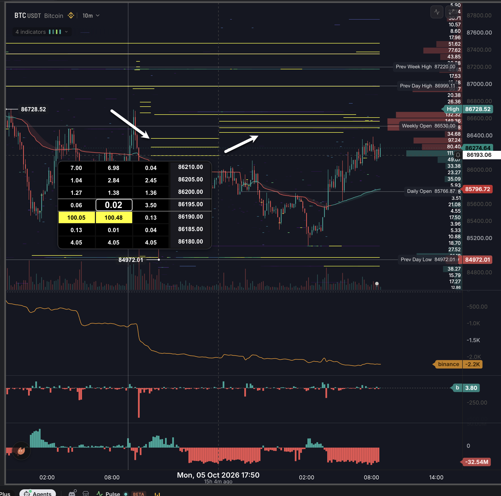

# Tape read: BTCUSDT "3 stepped asks tracking VWAP?" (paper only)

- Date: 2026-10-06 (revision 2: re-measured in code on the actual PNG)
- Author: Opus 5.5 cloud agent (produced independently; no GPT-model output was consulted)
- Scope: paper research only. **No live orders.** Nothing here is a trade instruction.
- Source: Richard's Binance BTCUSDT 10m chart, committed alongside as
  [`20261006-vwap-tracking-asks.png`](./20261006-vwap-tracking-asks.png) (2016 x 1996 px, RGBA).

- Reproduce: `python3 desk-briefs/tape-reads/tools/measure_20261006.py` (needs `numpy` and `pillow`).
- The script prints:
  - the axis fits
  - every yellow horizontal segment, with its price and time span
  - samples of the tracked line
  - the per-step table in section 2

## Labels used

| Label | Meaning |
|---|---|
| **READ** | Printed on the chart (axis label, price tag, ladder cell, date label). Copied as shown. |
| **AXIS-ESTIMATED** | Computed in code from pixel rows or columns of the PNG using the fits in section 1.1. Each one carries a ± error. |
| **UNREAD** | Not printed and not derivable from pixels (for example, hidden behind the ladder pop-up). |
| **INFERRED** | A reasoning step built on READ or AXIS-ESTIMATED inputs. It is not a measurement. |

---

## 1. Identifying the asks

### 1.1 Pixel-to-price and pixel-to-time method (measured in code)

**Price axis.**

- **Inputs.** The fit uses the five full-width gray level lines whose prices are printed in their
  tags (READ). The script finds them as rows where more than 300 columns of the plot are neutral
  gray.
- **Line centre.** Each line is 1 to 2 px thick. Its centre is the mean of its rows.
- **Fit.** Least squares, price = a + b * row.

| Level (tag READ) | Pixel row | Fit $ | Residual $ |
|---|---|---|---|
| Prev Week High 87220.00 | 269.5 | 87218.98 | +1.02 |
| Prev Day High 86999.11 | 345.0 | 87000.09 | -0.98 |
| Weekly Open 86530.00 | 507.0 | 86530.41 | -0.41 |
| Daily Open 85766.87 | 770.5 | 85766.45 | +0.42 |
| Prev Day Low 84972.01 | 1044.5 | 84972.06 | -0.05 |

- **Result.** b = **-2.8993 $/px**, a = 88000.33. The maximum residual is $1.02.
- **Checks against tag-box centres** (centre of each coloured tag box on the right axis; these
  tags were not used in the fit):
  - High 86728.52: -$0.49
  - Crosshair 86193.06: +$0.42
  - Red tag 85796.72: +$1.27
  - The last-price tag 86274.64 is off by -$7.9. Its box is stacked directly on top of the
    crosshair box, so the chart has pushed it up about 2.7 px. I excluded it from the fit. The
    printed value is still READ.
- **Error on yellow ask lines: ±$2.5.** That is ±0.5 px on the centre ($1.45) plus the $1.02
  calibration residual.
- **Error on the tracked line: ±$4.** The line is 2 to 3 px thick and antialiased. I take the
  median over a ±3-column window, so the error is ±1 px ($2.90) plus the calibration residual.
- **Error on ask minus line: ±$5**, which is about ±0.6 bps.
- **Error on ask-to-ask spacing: ±$2**, from two ±0.5 px centres.
- **Bucket caveat.** The ladder pop-up quotes in $5 rows. The lowest Set A line measures
  86185.4 ±2.5, but the ladder highlights the **86190** row (READ). That is a $4.6 gap, more than
  the pixel error. So the heatmap line and the ladder bucket disagree by about one bucket. Treat
  the **true order price as ±$5** (one ladder bucket) on top of the pixel error.

**Time axis.**

- **Inputs.** The script finds the centres of the printed tick-label text (READ): 02:00 and
  08:00 on Oct 5 at x = 189 and 450, and 02:00 and 08:00 on Oct 6 at x = 1233 and 1494. A linear
  fit gives **43.50 px/h, or 7.25 px per 10m bar**.
- **Check.** The crosshair date label "Mon, 05 Oct 2026 17:50" (READ) is centred at x = 878. The
  fit puts that at 17:50.
- **Error.** Each pixel is about 1.4 min. The heatmap segments don't always start on bar
  boundaries, so I quote **±10 min (one bar)** for all start and end times.
- **Last drawn bar.** x = 1527, which is about 08:46 Oct 6 in chart time. That agrees with
  "15h 4m ago" (READ) for 17:50, which puts the screenshot at about 08:54.

**Time zone.**

- **Nothing printed: UNREAD.**
- **INFERRED: UTC-4.** Two things point to it:
  - The screenshot was taken about 4 h 03 min before this ask's 12:57 UTC timestamp.
  - The tracked line breaks exactly at the **20:00 chart-time bar** (section 1.3). Under UTC-4,
    20:00 is 00:00 UTC, the Binance daily rollover.
- **If correct,** add 4 h to every chart time below to get UTC.

### 1.2 Yellow line sets (pixel-detected)

- **Detection.** Rows where R > 200, G > 200 and B < 120, with horizontal runs of 15 px or more.
  For the area near the spike, the threshold drops to 4 px or more.
- **Excluded.**
  - The yellow ladder cells inside the pop-up.
  - Three full-width yellow levels at 87497.3, 87371.2 and 86994.3. These span the whole visible
    range and don't step.
  - Lines below the market at 85131.5, 85021.4, 84998.2 and 84896.7. These are probably bid walls
    (INFERRED).

All prices are AXIS-ESTIMATED ±$2.5 (pixel) and ±$5 (bucket). All times are chart time, ±10 min.

| Set | Time span (chart TZ) | Prices, top / mid / low | Spacing $ (±2) | Spacing bps |
|---|---|---|---|---|
| Pre-0, near the spike | 10:06 to 10:34 Oct 5 (the 87187 line). The other two lines are 15 px long, 10:16 to 10:34 | 87285.7 / 87223.3 / 87187.1 | 62.4 / 36.2 | 7.2 / 4.2 |
| Pre-1 | 10:36 to 11:35 Oct 5 | 86810.2 / 86758.0 / 86685.5 | 52.2 / 72.5 | 6.0 / 8.4 |
| **A (left arrow)** | **11:37 to 17:54 Oct 5** | **86386.9 / 86285.4 / 86185.4** | **101.5 / 100.0** | **11.8 / 11.6** |
| **B (right arrow)** | **17:56 Oct 5 to 05:24 Oct 6** | **86586.9 / 86511.6 / 86456.5** | **75.4 / 55.1** | **8.7 / 6.4** |
| **C (B after one re-quote)** | **05:26 to 08:46 Oct 6** (still resting at the last bar) | **86630.4 / 86586.9 / 86511.6** | **43.5 / 75.4** | **5.0 / 8.7** |
| Single level (not part of a 3-set) | 09:56 to 11:54 Oct 5 | 86966.8 | n/a | n/a |
| Single level (not part of a 3-set) | 11:56 Oct 5 to 06:34 Oct 6 | 86665.2 | n/a | n/a |
| Single level (not part of a 3-set) | 06:36 to 08:46 Oct 6 | 87395.8 | n/a | n/a |

**Step events** (AXIS-ESTIMATED, ±10 min):

1. **About 11:35 to 11:37 Oct 5.** Pre-1 disappears and Set A appears in the next 10m bar. This is
   the **first appearance of an evenly spaced triple.**
2. **17:54 to 17:56 Oct 5. All three lines move up together**, from the last Set A bar to the
   first Set B bar. Matched rank by rank:
   - lowest: 86185.4 to 86456.5, **+$271.1**
   - middle: 86285.4 to 86511.6, **+$226.1**
   - top: 86386.9 to 86586.9, **+$200.0**
3. **05:24 to 05:26 Oct 6. Only the lowest line moves.** 86456.5 disappears and 86630.4 appears
   in the same 2 px column gap, +$174.0. That makes it the new top. The other two lines stay put.
4. **06:34 to 06:36 Oct 6.** The single 86665.2 level disappears and 87395.8 appears at the same
   column. This is possibly one order re-quoted +$730.6 (INFERRED).

**Do the two arrow groups share the same spacing? No.**

- Set A is evenly spaced: $101.5 and $100.0, within the ±$2 error.
- Set B is not evenly spaced: $75.4 and $55.1, a $20 difference that is 10 times the error.
- Set B's gaps don't match Set A's either.
- After the 05:24 re-quote, the gaps become $43.5 and $75.4.
- So the "same set" link between the two arrows rests on timing: all three lines moved in the
  same 2 px column gap at 17:54 to 17:56. It does not rest on matching geometry.

**Sizes.**

- **86190 row: 100.05 / 100.48 / 0.13 (READ).** The units are UNREAD; BTC is likely, which is
  about $8.6M (INFERRED).
- Every other line: **UNREAD**.
- "Identical size" is unverified (1 level of 7 readable).
- Full ladder pop-up, all READ (column meaning UNREAD):
  - 86210: 7.00 / 6.98 / 0.04
  - 86205: 1.04 / 2.84 / 2.45
  - 86200: 1.27 / 1.38 / 1.36
  - 86195: 0.06 / 0.02 / 3.50
  - 86190: 100.05 / 100.48 / 0.13
  - 86185: 0.13 / 0.01 / 0.04
  - 86180: 4.05 / 4.05 / 4.05
- If the columns are consecutive time slices (INFERRED), the drop from 100.48 to 0.13 at 86190
  matches the 17:54 to 17:56 step. The crosshair is on the 17:50 bar.

### 1.3 The tracked line (pixel-traced)

**Tracing method.**

- **Colours.** The line uses the same colours as the candles: red (222,94,87) and teal
  (82,164,154).
- **What counts as line.** Per column, the tracker keeps only runs of 3 px or less. Candle bodies
  and wicks are longer vertical runs and are rejected.
- **Continuity.** A tracker follows the line with a window that widens after each missed column.
- **Pieces.** The line is traced in three pieces because of two obstructions:
  - The ladder pop-up covers x 232 to 851 for rows of 646 or more, which is all of 11:20 to
    17:40 Oct 5 at the line's level. **That stretch is UNREAD.**
  - The line breaks at x 965 to 971 (below).

**Identity: UNREAD.** The legend is collapsed ("4 indicators", READ).

- **Best inference: a session VWAP that resets at 20:00 chart time** (00:00 UTC if the chart is
  UTC-4). The line runs flat at 85992.6 through the 19:40 bar (x 964). It is missing for
  x 965 to 971. It restarts at the 20:00 bar at 85840.4, a **-$152 discontinuity**.
- An EMA or SMA cannot jump like that within one bar. An anchored VWAP resetting at the session
  boundary does exactly that.
- The left edge of the chart also behaves like an early-session VWAP: it falls fast from
  86645.7 at 22:12 Oct 4.

**Current value.**

- Red tag **85796.72 (READ).** It sits at row 760.5. The line's last pixel at x = 1527 is at
  row 760.8, which is **85794.7 ±4**, so the two agree within $2.
- Attributing the tag to this line is still **INFERRED**. At the end the line is drawn teal while
  the tag is red.

**Line values (AXIS-ESTIMATED ±$4), all chart time:**

| Time | Value |
|---|---|
| 11:20 Oct 5 (last visible before occlusion) | 86140.5 |
| 11:37 to 17:40 Oct 5 | UNREAD (hidden by the ladder pop-up) |
| 17:54 / 17:56 Oct 5 | 85995.5 |
| 19:49 Oct 5 | 85992.6 |
| 20:03 Oct 5 (just after the reset) | 85840.4 |
| 03:31 Oct 6 (low) | 85588.2 |
| 05:24 to 05:26 Oct 6 | 85656.3 |
| 08:46 Oct 6 | 85794.7 |

### 1.4 Price context (candle extremes, AXIS-ESTIMATED ±$3)

Candle pixels are runs of 4 px or more in candle colours.

- **17:00 to 17:54 Oct 5:** high 85998.4. That is **$187 below** the lowest Set A ask at the
  moment it stepped up.
- **11:37 to 17:54 Oct 5:** no candle pixels are visible above the pop-up edge, so the highs stayed
  at or below about 86129. That is at least $57 below 86185.4, so the lowest Set A ask was never
  traded into on this chart.
- **17:56 to 20:00 Oct 5:** high 86062.2.
- **20:00 Oct 5 to 05:24 Oct 6:** high 86128.9, low 85137.3.
- **04:30 to 05:24 Oct 6:** high 86128.9. That is **$328 below** the 86456.5 line that re-quoted
  at 05:24.
- **05:26 to 08:46 Oct 6:** high 86407.2. That is $104 below the lowest Set C ask (86511.6).
- **Last price 86274.64 (READ).**

Other printed context (READ):

- "binance -2.2K": a cumulative line, probably CVD (type UNREAD).
- "b 3.80": a delta histogram.
- -32.54M: a bottom oscillator (type UNREAD).
- Spot or perp: **UNREAD**.

---

## 2. Quoting distance (ask minus tracked line), per step

All values are AXIS-ESTIMATED. Ask minus line is ±$5 (±0.6 bps) from pixels, with a further ±$5
ask-bucket ambiguity. bps = (ask - line) / line * 1e4.

| Step / time (chart TZ, ±10 min) | Line $ | Top ask: $ / bps | Mid ask: $ / bps | Low ask: $ / bps | Spacing $ |
|---|---|---|---|---|---|
| A start, 11:37 Oct 5 | **UNREAD** (pop-up). The last visible value, at 11:20, was 86140.5 | +246.4 / 28.6 | +145.0 / 16.8 | +44.9 / 5.2 | 101.5 / 100.0 |
| A end, 17:54 Oct 5 | 85995.5 | +391.4 / 45.5 | +289.9 / 33.7 | +189.9 / 22.1 | 101.5 / 100.0 |
| **B start, 17:56 Oct 5** | 85995.5 | +591.4 / 68.8 | +516.1 / 60.0 | +461.0 / 53.6 | 75.4 / 55.1 |
| B, 19:49 Oct 5 (before reset) | 85992.6 | +594.3 / 69.1 | +519.0 / 60.4 | +463.9 / 53.9 | 75.4 / 55.1 |
| B, 20:03 Oct 5 (after reset) | 85840.4 | +746.6 / 87.0 | +671.2 / 78.2 | +616.1 / 71.8 | 75.4 / 55.1 |
| B, 03:31 Oct 6 (line low) | 85588.2 | +998.8 / 116.7 | +923.4 / 107.9 | +868.3 / 101.5 | 75.4 / 55.1 |
| B last, 05:24 Oct 6 | 85656.3 | +930.7 / 108.7 | +855.3 / 99.9 | +800.2 / 93.4 | 75.4 / 55.1 |
| **C after re-quote, 05:26 Oct 6** | 85656.3 | +974.1 / 113.7 | +930.7 / 108.7 | +855.3 / 99.9 | 43.5 / 75.4 |
| C now, 08:46 Oct 6 | 85794.7 (pixel). The red tag reads 85796.72 | +835.7 / 97.4 | +792.2 / 92.3 | +716.8 / 83.6 | 43.5 / 75.4 |

- The A-start row is measured against the 11:20 line value. The 17-minute gap is not accounted
  for, so read that row as indicative only.
- **Distance to last price** (86274.64 READ; asks AXIS-ESTIMATED ±$2.5):
  - 86630.4: +$355.8 (41.2 bps)
  - 86586.9: +$312.3 (36.2 bps)
  - 86511.6: +$236.9 (27.5 bps)

**Verdict on the offset: neither constant in $ nor in bps, and not even band-like around the
line.**

- The lowest ask's offset went 5.2, then 22.1, then 53.6, then 71.8, then 101.5, then 93.4, then
  99.9, then 83.6 bps.
- Between re-quotes the asks don't move at all. The offset changes only because the line moves:
  - A sat still for 6 h 17 min while the line fell about $145.
  - B sat still for 11 h 28 min while the line fell, reset, and then fell again.
- At the 17:56 re-quote the line was flat (85995.5 at both 17:54 and 17:56). Yet all three asks
  rose $200 to $271.
- At the 05:26 re-quote the line was rising slowly. One ask moved +$174.
- The re-quotes are **not triggered by the line**. On this chart they are also **not triggered
  by price approaching**: the bar highs were $187 and $328 below the lowest ask at the two steps.

---

## 3. Why would a desk do this? Ranked explanations

What the chart shows, all AXIS-ESTIMATED unless stated:

- About 100 displayed on at least one level (READ).
- Orders rest 5 to 117 bps above the line and are never traded into here.
- Re-quotes are rare and discrete: three in about 21 h, at 11:37, 17:56 and 05:26.
- Re-quotes go up only, and are not tied to the line or to price approaching.
- Spacing is uneven and changes between steps.

| Rank | Hypothesis | Fit to chart | Confirms | Refutes |
|---|---|---|---|---|
| 1 | **Passive seller or MM inventory offload with discretionary or scheduled re-pricing** (a human or slow algo ratchets offers higher) | Best fit. Large displayed size, far from touch, up-only steps at irregular times, uneven spacing | Partial fills when price eventually trades into a level. The desk's bid side thins as the asks rise (skew). Re-quotes cluster at desk or session events (for example 22:00 and 09:26 UTC if the chart is UTC-4). Size refreshes after fills | Re-quotes follow a fixed formula against mid, last or VWAP. Bids grow alongside the asks (a neutral MM) |
| 2 | **Liquidity wall capping price**. *Spoofing or layering is a flagged hypothesis only; it is not a finding.* | Plausible. Big ladder that never trades. But the pull-on-approach evidence I cited in the first pass is **not seen**: the steps happened with price $187 to $328 away | Price stalls just under the wall repeatedly. **Flagged pattern:** cancels or re-places when price comes within X bps, fill ratio near zero, re-placement timed to aggressive buying | Fills when touched. The wall still rests at touch. Re-quotes are unrelated to price proximity (as on this chart) |
| 3 | **VWAP-pegged sell or execution algo** (Richard's read) | **Weak, and refuted for the plotted line.** The offset swings from 5 to 117 bps. The asks were static while the line reset by -$152. The step at 17:56 came while the line was flat | Re-quote times line up with VWAP moves, and the offset holds against a VWAP rebuilt from trades on another anchor (rolling, or anchored to the spike) | Offset is uncorrelated with every reasonable VWAP anchor once rebuilt from the trades |
| 4 | **Passive iceberg or TWAP slicing** | Weak. About 100 displayed is not iceberg-like. TWAP children sit near the touch and fill | Small clips refilling at the same price. Trades at the level exceed the displayed size | Large static display that never trades |
| 5 | **Options delta or basis hedge** | Weak. None of the ask levels sit on round strikes | Levels near listed strikes. Re-quotes follow delta or expiry timing. Offsetting legs on Deribit, OKX or CME | Levels unrelated to strikes |
| 6 | **Funding or basis desk** | Weakest | Asks paired with perp bids. Re-quotes at funding times (00:00, 08:00 and 16:00 UTC). On UTC-4 those are 20:00, 04:00 and 12:00 chart time; **none of the 3 re-quotes fall there** | No link to funding timing or the perp book |

---

## 4. Paper measurement plan (Binance book + trades from Tardis in the desk DB)

**Data.**

- Tardis `incremental_book_L2` (depth diffs) seeded by `book_snapshot_*`, plus `trades`, for
  BINANCE spot BTCUSDT.
- Run it on USDⓈ-M too, because spot vs perp is UNREAD.
- Window: 2026-10-05 12:00 to 2026-10-06 14:00 UTC. That covers the chart span shifted to UTC under
  the UTC-4 inference, padded by ±2 h.
- **Coverage is unaudited.** First check for:
  - update-ID gaps
  - resyncs
  - timestamp gaps over 1 s

  Then mark any step that falls in a gap as UNMEASURED.

**Step 1: rebuild the book.** Track per-level (price, qty, ts) for asks within 200 bps of mid.

**Step 2: detect the order set.**

- **Candidate adds.** Level increases at or above a size threshold, for example the 99.9th
  percentile of level deltas.
- **Grouping.** Adds within the same 1 to 2 s window with equal sizes (within 1%).
- **Cross-checks against this chart:**
  - Set A should appear at about 15:37 UTC near 86185 to 86190, 86285 and 86387.
  - The A-to-B move should happen at about 21:56 UTC.
  - The single-level move from 86456 to 86630 should happen at about 09:24 UTC.

  If none of these show up, the time-zone inference or the venue is wrong.
- **Re-quote linking.** About the same Δq leaves the old levels and arrives at new ones within Δt.
- **Record for each step:**
  - old and new prices
  - spacing
  - mid and last
  - time since the last trade at each level
  - the opposite-side book

**Step 3: rebuild the benchmark.** Compute these from `trades`:

- session VWAP (00:00 UTC anchor), to confirm the line identity
- rolling VWAP over 1h, 4h and 24h
- VWAP anchored to the spike
- EMA 20 and 50

Then test whether the re-quote times and offsets fit any of them better than "fixed schedule" or
"mid + k".

**Step 4: fills vs pulls.** For each level and interval:

- consumed = min(Δq⁻, buyer-initiated trade volume at that price)
- pulled = Δq⁻ - consumed
- fill rate = Σ consumed / Σ time-weighted displayed qty, with a binomial CI

Also log:

- behaviour as mid comes within 5, 10 and 20 bps
- whether size refreshes after a fill
- pull latency after aggressive buy bursts

**Step 5: outputs.**

- a per-step table matching section 2, filled from data
- fill rate and pull-on-approach rate
- benchmark-fit ranking
- coverage report

If the pull-on-approach rate is high and the fill rate is near zero, flag hypothesis 2. Don't
conclude it from that alone.

### 4.1 Paper trade-around idea (scored only by EV at 1R after costs)

**Two versions:**

- **Fade under the wall (hypothesis 1 or 2).** Paper-short when mid comes within D bps under the
  lowest ask of a confirmed set. Stop 1R above that ask. Target 1R.
- **Break or pull long.** Paper-long on the first trade above the old lowest ask after it is
  filled through or pulled. Stop and target at 1R.

**Costs (taker both sides):**

- Base: Bitunix VIP8 0.026% = 2.6 bps per fill, times 2 = 5.2 bps, plus 1.48 + 0.39 bps slippage.
  **C = 7.07 bps.**
- 60% rebate: 2.6 * 0.4 * 2 = 2.08 bps, plus 1.87 bps. **C = 3.95 bps.**

**Score.** EV = (2p - 1) * R - C (bps). Breakeven: **p\* = 0.5 + C / (2R)**.

| R (bps), a sweep only | p\* at C = 7.07 | p\* at C = 3.95 |
|---|---|---|
| 10 | 0.854 | 0.698 |
| 20 | 0.677 | 0.599 |
| 40 | 0.588 | 0.549 |
| 80 | 0.544 | 0.525 |

- The hit rate p is **UNMEASURED**. It needs a CI from the step 4 backtest over at least N
  events (N UNSET).
- **UNSET:** notional, latency budget, EV floor, D, R.

---

## 5. What changed versus the first pass

| Item | First pass (by-eye, image not on disk) | Revision 2 (measured in code on the PNG) |
|---|---|---|
| Calibration | 7 tags read by eye, 5.709 $/px (display scale), residuals up to $3.4, ±$20 on asks | 5 gray level lines detected in code, 2.8993 $/px (native 2016 px scale), residuals up to $1.02. **±$2.5** on asks (plus a ±$5 bucket caveat), ±$4 on the line |
| Set A prices | 86384 / 86287 / 86190 | **86386.9 / 86285.4 / 86185.4** (low line is $4.6 under the ladder's 86190 row) |
| Set A spacing | $97 / $97 | **$101.5 / $100.0** (even) |
| Set B prices | 86595 / 86527 / 86458 | **86586.9 / 86511.6 / 86456.5** (the middle line moved $15) |
| Set B spacing | $69 / $69, "even" | **$75.4 / $55.1, not even**. The first pass was wrong here |
| Same spacing across arrows? | Already flagged as different ($97 vs $69) | **Confirmed different.** Set B is internally uneven too. The link between arrows rests on timing, not geometry |
| A-to-B step | about 17:47 to 17:55, +$268 / +$240 / +$211 | **17:54 to 17:56**, +$271.1 / +$226.1 / +$200.0 |
| Later steps | Lowest B line "ends about 05:20", the other two extend to about 08:00 to 08:45 | **New at 05:24 to 05:26: one-line re-quote 86456.5 to 86630.4** (Set C). Also 86665.2 to 87395.8 at 06:34 to 06:36 |
| Pre-sets | 87286/87241/87201 and 86807/86767/86698 | 87285.7/87223.3/87187.1 and 86810.2/86758.0/86685.5 |
| Line at A start | 86150 ±$30 | **UNREAD** (hidden by the pop-up). The last visible value is 86140.5 at 11:20 |
| Line at A end / B start | 86002 | 85995.5 ±4 |
| Line near the Oct 6 low | 85631 at about 02:10 | 85588.2 at 03:31 |
| Line identity | UNREAD; guessed VWAP or EMA | Still UNREAD. **New evidence:** a -$152 break at the 20:00 bar points to a session VWAP resetting at 00:00 UTC (INFERRED, chart UTC-4) |
| Red tag 85796.72 | Attribution inferred | Pixel match within $2 of the line end. Still INFERRED because of the colour mismatch |
| Offset at B start, low/mid/top | 53.1 / 61.1 / 69.0 bps | 53.6 / 60.0 / 68.8 bps |
| Offset now, low/mid/top | 77.1 / 85.1 / 93.1 bps (vs the B set) | **83.6 / 92.3 / 97.4 bps** (vs the C set, after the 05:26 re-quote) |
| Distance to last | +$184 / +$252 / +$321 | **+$236.9 / +$312.3 / +$355.8** (C set) |
| "Steps when price nears" | Claimed as support for rank 1 and 2 | **Refuted on this chart**: price was $187 and $328 below the lowest ask at the steps |
| Ranking | 1 MM offload, 2 wall/spoof (flagged), 3 VWAP peg | Same order. Rank 1 is reframed as discretionary or scheduled up-only re-pricing. Rank 3 is now "refuted for the plotted line" |

## 6. Biggest unknowns

1. The line's identity is UNREAD. The session-VWAP reading rests on one discontinuity plus the
   inferred UTC-4 time zone.
2. The line is UNREAD for 11:20 to 17:40 Oct 5, behind the pop-up, which covers most of Set A's
   life.
3. Sizes are READ for only one level (86190, about 100, units UNREAD). "Identical size" is
   unverified. The heatmap vs ladder bucket offset is $4.6.
4. Spot vs perp and the meaning of the ladder columns are UNREAD.
5. The chart shows no fill or pull evidence. Tardis coverage is unaudited, and p for the trade
   idea is unmeasured.
